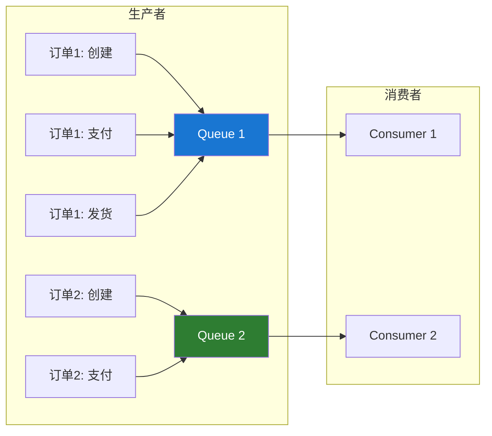
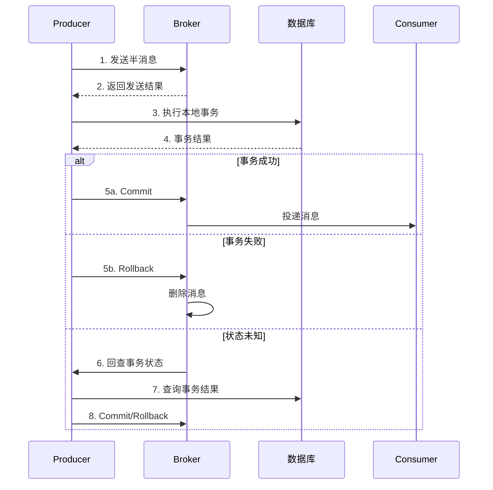
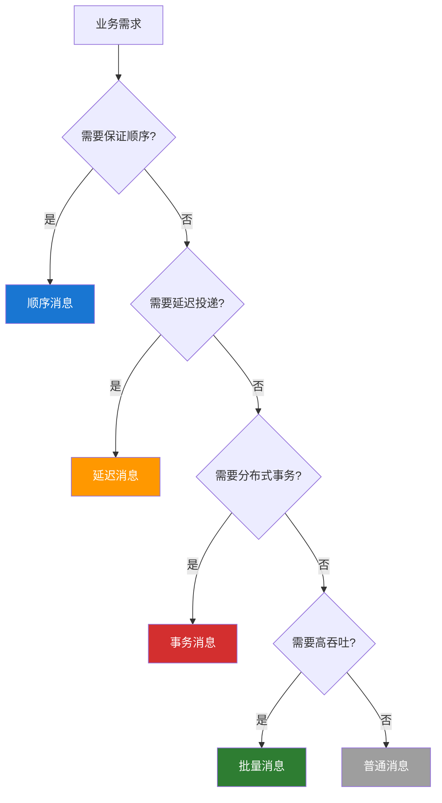

# RocketMQ 消息类型

RocketMQ 支持多种消息类型，满足不同业务场景的需求。

## 消息类型概览

| 类型     | 特点         | 使用场景           |
| -------- | ------------ | ------------------ |
| 普通消息 | 无特殊处理   | 一般业务消息       |
| 顺序消息 | 保证消费顺序 | 订单流程、状态变更 |
| 延迟消息 | 延迟投递     | 定时任务、超时处理 |
| 事务消息 | 分布式事务   | 跨服务数据一致性   |
| 批量消息 | 批量发送     | 高吞吐场景         |

## 普通消息

最基本的消息类型，无特殊处理逻辑。

### 发送示例

```java
Message msg = new Message(
    "TopicTest",           // Topic
    "TagA",                // Tag
    "OrderID001",          // Keys
    "Hello RocketMQ".getBytes()  // Body
);

SendResult result = producer.send(msg);
```

### 消费示例

```java
consumer.subscribe("TopicTest", "*");
consumer.registerMessageListener((MessageListenerConcurrently) (msgs, context) -> {
    for (MessageExt msg : msgs) {
        System.out.println("收到消息: " + new String(msg.getBody()));
    }
    return ConsumeConcurrentlyStatus.CONSUME_SUCCESS;
});
```

## 顺序消息

保证消息按照发送顺序被消费。

### 顺序类型

| 类型     | 说明                    | 实现方式        |
| -------- | ----------------------- | --------------- |
| 全局顺序 | 整个 Topic 只有一个队列 | 单 Queue        |
| 分区顺序 | 同一分区内有序          | 按业务 Key 路由 |

### 分区顺序示例

```java
// 生产者：同一订单发送到同一 Queue
public void sendOrderly(String orderId, String status) throws Exception {
    Message msg = new Message("OrderTopic", status,
        String.format("%s: %s", orderId, status).getBytes());

    // 根据 orderId 选择 Queue
    SendResult result = producer.send(msg, (mqs, message, arg) -> {
        String id = (String) arg;
        int index = Math.abs(id.hashCode() % mqs.size());
        return mqs.get(index);
    }, orderId);

    System.out.printf("订单 %s 状态 %s 发送成功%n", orderId, status);
}

// 发送订单流程消息
sendOrderly("ORDER_001", "created");
sendOrderly("ORDER_001", "paid");
sendOrderly("ORDER_001", "shipped");
sendOrderly("ORDER_001", "received");
```

### 顺序消费

```java
// 必须使用 MessageListenerOrderly
consumer.registerMessageListener((MessageListenerOrderly) (msgs, context) -> {
    for (MessageExt msg : msgs) {
        System.out.printf("Queue:%d, 消息:%s%n",
            msg.getQueueId(), new String(msg.getBody()));
    }
    return ConsumeOrderlyStatus.SUCCESS;
});
```

### 顺序消息流程



## 延迟消息

消息发送后不立即投递，而是延迟一定时间后才投递。

### 延迟级别

RocketMQ 开源版本支持 18 个延迟级别：

```
1s 5s 10s 30s 1m 2m 3m 4m 5m 6m 7m 8m 9m 10m 20m 30m 1h 2h
```

| 级别 | 时间 | 级别 | 时间 | 级别 | 时间 |
| ---- | ---- | ---- | ---- | ---- | ---- |
| 1    | 1s   | 7    | 3m   | 13   | 9m   |
| 2    | 5s   | 8    | 4m   | 14   | 10m  |
| 3    | 10s  | 9    | 5m   | 15   | 20m  |
| 4    | 30s  | 10   | 6m   | 16   | 30m  |
| 5    | 1m   | 11   | 7m   | 17   | 1h   |
| 6    | 2m   | 12   | 8m   | 18   | 2h   |

### 发送延迟消息

```java
Message msg = new Message("TopicTest", "TagA", "Delay Message".getBytes());

// 设置延迟级别 3 = 10 秒
msg.setDelayTimeLevel(3);

SendResult result = producer.send(msg);
System.out.println("延迟消息发送成功: " + result.getMsgId());
```

### 延迟消息应用场景

| 场景           | 延迟时间   | 说明               |
| -------------- | ---------- | ------------------ |
| 订单超时取消   | 30min      | 未支付订单自动取消 |
| 短信验证码过期 | 5min       | 验证码到期提醒     |
| 会议提醒       | 提前 10min | 会议开始前提醒     |
| 定时任务       | 自定义     | 替代部分定时任务   |

### 订单超时示例

```java
// 创建订单后发送延迟消息
public void createOrder(Order order) {
    // 1. 保存订单
    orderDao.save(order);

    // 2. 发送延迟消息（30分钟后检查）
    Message msg = new Message("OrderTimeoutTopic", "timeout",
        order.getOrderId().getBytes());
    msg.setDelayTimeLevel(16);  // 30 分钟

    producer.send(msg);
}

// 消费者检查订单状态
consumer.subscribe("OrderTimeoutTopic", "*");
consumer.registerMessageListener((MessageListenerConcurrently) (msgs, context) -> {
    for (MessageExt msg : msgs) {
        String orderId = new String(msg.getBody());
        Order order = orderDao.findById(orderId);

        if (order != null && order.getStatus().equals("unpaid")) {
            // 取消订单
            orderService.cancel(orderId);
        }
    }
    return ConsumeConcurrentlyStatus.CONSUME_SUCCESS;
});
```

## 事务消息

保证本地事务与消息发送的一致性。

### 事务消息流程



### 事务生产者

```java
TransactionMQProducer producer = new TransactionMQProducer("TransactionGroup");
producer.setNamesrvAddr("localhost:9876");

// 设置事务监听器
producer.setTransactionListener(new TransactionListener() {

    @Override
    public LocalTransactionState executeLocalTransaction(Message msg, Object arg) {
        // 执行本地事务
        String orderId = msg.getKeys();
        try {
            orderService.createOrder(orderId);
            return LocalTransactionState.COMMIT_MESSAGE;
        } catch (Exception e) {
            return LocalTransactionState.ROLLBACK_MESSAGE;
        }
    }

    @Override
    public LocalTransactionState checkLocalTransaction(MessageExt msg) {
        // 回查事务状态
        String orderId = msg.getKeys();
        Order order = orderDao.findById(orderId);

        if (order != null) {
            return LocalTransactionState.COMMIT_MESSAGE;
        } else {
            return LocalTransactionState.ROLLBACK_MESSAGE;
        }
    }
});

producer.start();

// 发送事务消息
Message msg = new Message("OrderTopic", "create",
    "Order created".getBytes());
msg.setKeys("ORDER_001");

TransactionSendResult result = producer.sendMessageInTransaction(msg, null);
```

### 事务消息最佳实践

1. **本地事务表**：记录事务执行状态，便于回查
2. **幂等处理**：消息可能重复投递
3. **超时设置**：合理设置回查超时时间

```java
// 本地事务表
CREATE TABLE transaction_log (
    id BIGINT PRIMARY KEY,
    msg_id VARCHAR(64) NOT NULL,
    status VARCHAR(16) NOT NULL,  -- PENDING, COMMITTED, ROLLED_BACK
    create_time TIMESTAMP DEFAULT CURRENT_TIMESTAMP
);
```

## 批量消息

一次发送多条消息，提高发送效率。

### 发送批量消息

```java
List<Message> messages = new ArrayList<>();

for (int i = 0; i < 100; i++) {
    messages.add(new Message("TopicTest", "TagA",
        ("Message " + i).getBytes()));
}

// 直接发送（注意总大小不超过 4MB）
SendResult result = producer.send(messages);
```

### 消息分割

当消息总大小超过限制时，需要分割发送：

```java
public class MessageSplitter implements Iterator<List<Message>> {
    private static final int MAX_SIZE = 4 * 1024 * 1024; // 4MB
    private final List<Message> messages;
    private int index;

    public MessageSplitter(List<Message> messages) {
        this.messages = messages;
    }

    @Override
    public boolean hasNext() {
        return index < messages.size();
    }

    @Override
    public List<Message> next() {
        int totalSize = 0;
        int start = index;

        while (index < messages.size()) {
            Message msg = messages.get(index);
            int size = msg.getBody().length + msg.getTopic().length() + 20;

            if (totalSize + size > MAX_SIZE) {
                break;
            }

            totalSize += size;
            index++;
        }

        return messages.subList(start, index);
    }
}

// 使用分割器
MessageSplitter splitter = new MessageSplitter(messages);
while (splitter.hasNext()) {
    List<Message> batch = splitter.next();
    producer.send(batch);
}
```

### 批量消息限制

| 限制       | 说明                         |
| ---------- | ---------------------------- |
| 同一 Topic | 批量消息必须发送到同一 Topic |
| 总大小     | 不超过 4MB                   |
| 不支持延迟 | 批量消息不支持延迟投递       |
| 不支持事务 | 批量消息不支持事务           |

## 消息类型选择指南



## 下一步

- 💻 [生产者详解](./producer.md) - 深入学习消息发送
- 📊 [消费者详解](./consumer.md) - 深入学习消息消费
- 📋 [快速参考](./quick-reference.md) - 常用 API 速查

## 参考资料

- [RocketMQ 消息类型官方文档](https://rocketmq.apache.org/docs/featureBehavior/)
