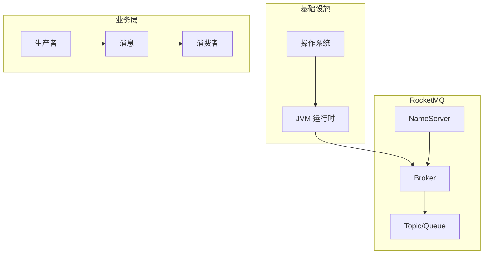
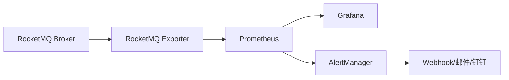

# RocketMQ 监控与运维

本文档介绍 RocketMQ 的监控体系建设、关键指标解读和日常运维操作。

## 监控概述

### 监控维度



### 监控工具选型

| 工具                 | 适用场景 | 特点                 |
| -------------------- | -------- | -------------------- |
| RocketMQ Dashboard   | 日常运维 | 官方控制台，功能全面 |
| Prometheus + Grafana | 生产监控 | 指标丰富，可视化强   |
| Skywalking/Zipkin    | 链路追踪 | 消息全链路追踪       |
| ELK                  | 日志分析 | 日志集中管理         |

## RocketMQ Dashboard

### 安装部署

```bash
# 方式1：Docker 部署
docker run -d --name rocketmq-dashboard \
    -e "JAVA_OPTS=-Drocketmq.namesrv.addr=192.168.1.1:9876" \
    -p 8080:8080 \
    apacherocketmq/rocketmq-dashboard:latest

# 方式2：源码编译
git clone https://github.com/apache/rocketmq-dashboard.git
cd rocketmq-dashboard
mvn clean package -DskipTests
java -jar target/rocketmq-dashboard-*.jar \
    --rocketmq.config.namesrvAddr=192.168.1.1:9876
```

访问地址：http://localhost:8080

### 核心功能

#### 1. 集群管理

- 查看集群状态
- Broker 列表和配置
- NameServer 状态

#### 2. Topic 管理

- Topic 列表和状态
- Queue 分布
- 消息统计

#### 3. 消费者管理

- 消费者组列表
- 消费进度查看
- 消费者连接状态

#### 4. 消息查询

- 按 MessageId 查询
- 按 Key 查询
- 按时间范围查询
- 消息轨迹

#### 5. 运维操作

- 重置消费位点
- 创建/删除 Topic
- 发送测试消息

## Prometheus + Grafana 监控

### 架构图



### RocketMQ Exporter 部署

```bash
# 下载 Exporter
git clone https://github.com/apache/rocketmq-exporter.git
cd rocketmq-exporter
mvn clean package -DskipTests

# 启动 Exporter
java -jar target/rocketmq-exporter-*.jar \
    --rocketmq.config.namesrvAddr=192.168.1.1:9876
```

**配置文件：**

```yaml
# application.yml
rocketmq:
  config:
    namesrvAddr: 192.168.1.1:9876;192.168.1.2:9876
    enableACL: false
    accessKey: admin
    secretKey: admin123

server:
  port: 5557
```

### Prometheus 配置

```yaml
# prometheus.yml
scrape_configs:
  - job_name: "rocketmq"
    static_configs:
      - targets: ["192.168.1.10:5557"]
    relabel_configs:
      - source_labels: [__address__]
        target_label: instance
```

### 关键监控指标

#### Broker 指标

| 指标                                              | 说明       | 告警阈值 |
| ------------------------------------------------- | ---------- | -------- |
| `rocketmq_broker_tps`                             | Broker TPS | -        |
| `rocketmq_broker_qps`                             | Broker QPS | -        |
| `rocketmq_broker_commitlog_disk_ratio`            | 磁盘使用率 | > 80%    |
| `rocketmq_broker_runtime_putmessage_failed_total` | 写入失败数 | > 0      |

#### Topic 指标

| 指标                             | 说明           | 告警阈值 |
| -------------------------------- | -------------- | -------- |
| `rocketmq_producer_tps`          | Topic 生产 TPS | -        |
| `rocketmq_consumer_tps`          | Topic 消费 TPS | -        |
| `rocketmq_producer_message_size` | 消息大小       | > 1MB    |

#### Consumer 指标

| 指标                       | 说明         | 告警阈值 |
| -------------------------- | ------------ | -------- |
| `rocketmq_consumer_offset` | 消费位点     | -        |
| `rocketmq_consumer_diff`   | 消息堆积量   | > 10000  |
| `rocketmq_consumer_online` | 在线消费者数 | < 1      |

### Grafana Dashboard

导入官方 Dashboard：

- Dashboard ID: `10477` (RocketMQ Dashboard)

或自定义 Dashboard：

```json
{
  "panels": [
    {
      "title": "消息堆积",
      "type": "graph",
      "targets": [
        {
          "expr": "sum(rocketmq_consumer_diff) by (topic, consumerGroup)",
          "legendFormat": "{{topic}} - {{consumerGroup}}"
        }
      ]
    },
    {
      "title": "TPS",
      "type": "graph",
      "targets": [
        {
          "expr": "sum(rate(rocketmq_producer_tps[1m])) by (topic)",
          "legendFormat": "生产: {{topic}}"
        },
        {
          "expr": "sum(rate(rocketmq_consumer_tps[1m])) by (topic)",
          "legendFormat": "消费: {{topic}}"
        }
      ]
    }
  ]
}
```

## 告警配置

### AlertManager 规则

```yaml
# alert.rules.yml
groups:
  - name: rocketmq
    rules:
      # 消息堆积告警
      - alert: RocketMQMessageBacklog
        expr: rocketmq_consumer_diff > 10000
        for: 5m
        labels:
          severity: warning
        annotations:
          summary: "消息堆积告警"
          description: "Topic: {{ $labels.topic }}, ConsumerGroup: {{ $labels.consumerGroup }}, 堆积: {{ $value }}"

      # Broker 磁盘告警
      - alert: RocketMQDiskUsageHigh
        expr: rocketmq_broker_commitlog_disk_ratio > 80
        for: 5m
        labels:
          severity: critical
        annotations:
          summary: "Broker 磁盘使用率过高"
          description: "Broker: {{ $labels.broker }}, 使用率: {{ $value }}%"

      # 消费者下线告警
      - alert: RocketMQConsumerOffline
        expr: rocketmq_consumer_online < 1
        for: 1m
        labels:
          severity: critical
        annotations:
          summary: "消费者下线"
          description: "ConsumerGroup: {{ $labels.consumerGroup }} 无在线消费者"

      # 发送失败告警
      - alert: RocketMQSendFailed
        expr: increase(rocketmq_broker_runtime_putmessage_failed_total[5m]) > 0
        labels:
          severity: warning
        annotations:
          summary: "消息发送失败"
          description: "Broker: {{ $labels.broker }}, 失败数: {{ $value }}"
```

### 钉钉告警配置

```yaml
# alertmanager.yml
receivers:
  - name: "dingtalk"
    webhook_configs:
      - url: "https://oapi.dingtalk.com/robot/send?access_token=xxx"
        send_resolved: true
```

## 日志管理

### 日志位置

```bash
# 默认日志路径
~/logs/rocketmqlogs/
├── namesrv.log          # NameServer 日志
├── broker.log           # Broker 主日志
├── broker_default.log   # Broker 业务日志
├── store.log            # 存储日志
├── remoting.log         # 网络通信日志
├── filter.log           # 消息过滤日志
├── transaction.log      # 事务日志
└── watermark.log        # 水位日志
```

### 日志配置

```xml
<!-- logback_broker.xml -->
<configuration>
    <appender name="BROKER" class="ch.qos.logback.core.rolling.RollingFileAppender">
        <file>${user.home}/logs/rocketmqlogs/broker.log</file>
        <rollingPolicy class="ch.qos.logback.core.rolling.TimeBasedRollingPolicy">
            <fileNamePattern>${user.home}/logs/rocketmqlogs/broker.%d{yyyy-MM-dd}.log</fileNamePattern>
            <maxHistory>30</maxHistory>
        </rollingPolicy>
        <encoder>
            <pattern>%d{yyyy-MM-dd HH:mm:ss.SSS} [%thread] %-5level %logger{50} - %msg%n</pattern>
        </encoder>
    </appender>

    <logger name="RocketmqBroker" level="INFO"/>
    <logger name="RocketmqRemoting" level="WARN"/>
</configuration>
```

### ELK 日志收集

```yaml
# filebeat.yml
filebeat.inputs:
  - type: log
    enabled: true
    paths:
      - /root/logs/rocketmqlogs/broker.log
    fields:
      service: rocketmq-broker
    multiline:
      pattern: "^[0-9]{4}-[0-9]{2}-[0-9]{2}"
      negate: true
      match: after

output.elasticsearch:
  hosts: ["elasticsearch:9200"]
  index: "rocketmq-%{+yyyy.MM.dd}"
```

## 日常运维操作

### 健康检查

```bash
#!/bin/bash
# health_check.sh

NAMESRV_ADDR="192.168.1.1:9876"

# 检查 NameServer
nc -zv 192.168.1.1 9876
if [ $? -ne 0 ]; then
    echo "NameServer 不可达"
    exit 1
fi

# 检查 Broker
sh bin/mqadmin clusterList -n $NAMESRV_ADDR
if [ $? -ne 0 ]; then
    echo "Broker 集群异常"
    exit 1
fi

# 检查消费进度
sh bin/mqadmin consumerProgress -n $NAMESRV_ADDR | grep -E "Diff:.*[0-9]{5,}"
if [ $? -eq 0 ]; then
    echo "存在消息堆积"
    exit 1
fi

echo "健康检查通过"
```

### 消息堆积处理

```bash
# 1. 查看堆积情况
sh bin/mqadmin consumerProgress -n localhost:9876 -g ConsumerGroup

# 2. 查看消费者连接
sh bin/mqadmin consumerConnection -n localhost:9876 -g ConsumerGroup

# 3. 临时增加 Queue（需要增加消费者）
sh bin/mqadmin updateTopic -n localhost:9876 -t TopicTest -r 16 -w 16

# 4. 跳过堆积（谨慎使用）
sh bin/mqadmin resetOffsetByTime -n localhost:9876 \
    -g ConsumerGroup -t TopicTest -s now
```

### 消息查询

```bash
# 按 MsgId 查询
sh bin/mqadmin queryMsgById -n localhost:9876 \
    -i 7F00000100001234000000000000ABCD

# 按 Key 查询
sh bin/mqadmin queryMsgByKey -n localhost:9876 \
    -t TopicTest -k ORDER_123

# 按时间范围查询
sh bin/mqadmin printMsgByQueue -n localhost:9876 \
    -t TopicTest -q 0 -b 0 -e 100
```

### 消息补发

```bash
# 重置消费位点到指定时间
sh bin/mqadmin resetOffsetByTime -n localhost:9876 \
    -g ConsumerGroup -t TopicTest -s "2024-01-01#00:00:00"

# 重置到最早
sh bin/mqadmin resetOffsetByTime -n localhost:9876 \
    -g ConsumerGroup -t TopicTest -s 0
```

### 死信队列处理

```bash
# 查看死信队列
sh bin/mqadmin topicList -n localhost:9876 | grep "%DLQ%"

# 查询死信消息
sh bin/mqadmin queryMsgByKey -n localhost:9876 \
    -t "%DLQ%ConsumerGroup" -k ""

# 重新投递死信消息
sh bin/mqadmin resendRocketMQ -n localhost:9876 \
    -t "%DLQ%ConsumerGroup" -g ConsumerGroup
```

## 故障排查指南

### 发送失败

```bash
# 1. 检查 NameServer 连接
ping namesrv-host
telnet namesrv-host 9876

# 2. 检查 Broker 状态
sh bin/mqadmin brokerStatus -n localhost:9876 -b broker-host:10911

# 3. 检查 Topic 是否存在
sh bin/mqadmin topicRoute -n localhost:9876 -t TopicTest

# 4. 查看 Broker 日志
tail -f ~/logs/rocketmqlogs/broker.log | grep -i error
```

### 消费延迟

```bash
# 1. 查看消费进度
sh bin/mqadmin consumerProgress -n localhost:9876 -g ConsumerGroup

# 2. 查看消费者连接
sh bin/mqadmin consumerConnection -n localhost:9876 -g ConsumerGroup

# 3. 检查消费者线程
# 在消费者应用中查看线程池状态

# 4. 检查业务处理耗时
# 添加消费耗时日志
```

### Broker 异常

```bash
# 1. 查看 Broker 状态
sh bin/mqadmin brokerStatus -n localhost:9876 -b broker-host:10911

# 2. 查看运行日志
tail -f ~/logs/rocketmqlogs/broker.log

# 3. 检查磁盘空间
df -h /data/rocketmq

# 4. 检查内存使用
free -h
jstat -gcutil <broker_pid> 1000
```

### 消息丢失排查

```bash
# 1. 确认发送成功
# 检查生产者日志中的 SendResult

# 2. 查询消息轨迹
sh bin/mqadmin queryMsgById -n localhost:9876 -i msgId

# 3. 检查消费进度
sh bin/mqadmin consumerProgress -n localhost:9876 -g ConsumerGroup

# 4. 检查死信队列
sh bin/mqadmin topicRoute -n localhost:9876 -t "%DLQ%ConsumerGroup"
```

## 巡检清单

### 每日巡检

- [ ] 检查集群状态
- [ ] 检查消息堆积
- [ ] 检查磁盘使用率
- [ ] 检查告警信息
- [ ] 检查死信队列

### 每周巡检

- [ ] 检查消费者连接数变化
- [ ] 分析 TPS 趋势
- [ ] 检查 GC 日志
- [ ] 备份配置文件

### 每月巡检

- [ ] 容量规划评估
- [ ] 性能测试
- [ ] 安全漏洞检查
- [ ] 版本升级评估

## 下一步

- ⚡ [性能优化](/docs/rocketmq/performance-optimization) - 提升系统性能
- 🏗️ [集群管理](/docs/rocketmq/cluster-management) - 集群部署与运维
- ✅ [最佳实践](/docs/rocketmq/best-practices) - 生产环境实践

## 参考资料

- [RocketMQ Dashboard](https://github.com/apache/rocketmq-dashboard)
- [RocketMQ Exporter](https://github.com/apache/rocketmq-exporter)
- [RocketMQ 运维文档](https://rocketmq.apache.org/docs/deploymentOperations/)
