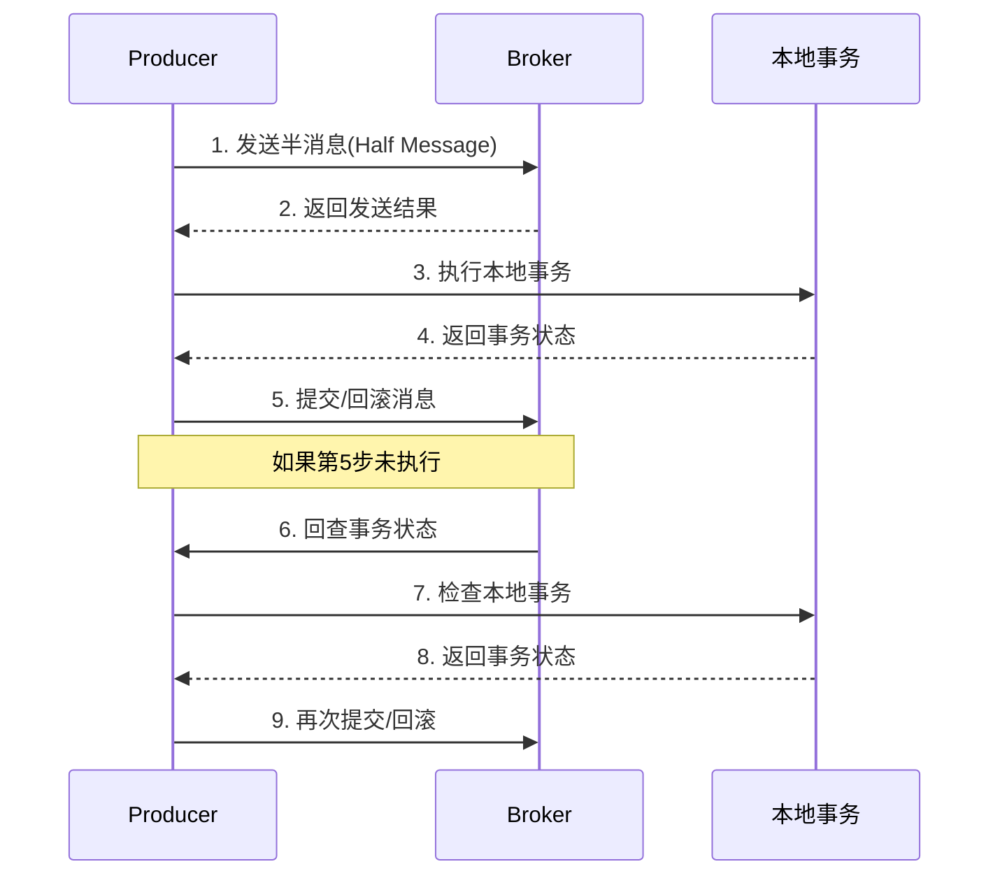

# RocketMQ 生产者详解

## 生产者概述

RocketMQ Producer 负责将消息发布到 Broker。生产者可以发送多种类型的消息，支持同步、异步和单向发送模式。

## 生产者类型

| 类型       | 类名                    | 特点                     |
| ---------- | ----------------------- | ------------------------ |
| 普通生产者 | `DefaultMQProducer`     | 最常用，支持多种发送方式 |
| 事务生产者 | `TransactionMQProducer` | 支持事务消息             |

## 基本配置

```java
DefaultMQProducer producer = new DefaultMQProducer("ProducerGroup");

// 必需配置
producer.setNamesrvAddr("localhost:9876");

// 可选配置
producer.setSendMsgTimeout(3000);           // 发送超时时间
producer.setRetryTimesWhenSendFailed(2);    // 同步发送失败重试次数
producer.setRetryTimesWhenSendAsyncFailed(2); // 异步发送失败重试次数
producer.setMaxMessageSize(4 * 1024 * 1024); // 最大消息大小 4MB
producer.setCompressMsgBodyOverHowmuch(4096); // 压缩阈值

producer.start();
```

## 发送消息的方式

### 1. 同步发送

```java
public SendResult syncSend() throws Exception {
    Message msg = new Message("TopicTest", "TagA", "Hello RocketMQ".getBytes());

    // 同步发送，等待 Broker 响应
    SendResult result = producer.send(msg);

    System.out.printf("发送结果: %s, msgId: %s%n",
        result.getSendStatus(), result.getMsgId());

    return result;
}
```

**发送状态说明：**

| 状态                  | 说明                   |
| --------------------- | ---------------------- |
| `SEND_OK`             | 发送成功               |
| `FLUSH_DISK_TIMEOUT`  | 刷盘超时（同步刷盘时） |
| `FLUSH_SLAVE_TIMEOUT` | 同步到 Slave 超时      |
| `SLAVE_NOT_AVAILABLE` | Slave 不可用           |

### 2. 异步发送

```java
public void asyncSend() throws Exception {
    Message msg = new Message("TopicTest", "TagA", "Hello RocketMQ".getBytes());

    producer.send(msg, new SendCallback() {
        @Override
        public void onSuccess(SendResult result) {
            System.out.printf("发送成功: %s%n", result.getMsgId());
        }

        @Override
        public void onException(Throwable e) {
            System.err.println("发送失败: " + e.getMessage());
        }
    });
}
```

### 3. 单向发送

```java
public void onewaySend() throws Exception {
    Message msg = new Message("TopicTest", "TagA", "Hello RocketMQ".getBytes());

    // 不等待响应，最高性能
    producer.sendOneway(msg);
}
```

### 发送方式对比

| 方式     | 可靠性 | 性能 | 使用场景             |
| -------- | ------ | ---- | -------------------- |
| 同步发送 | 高     | 低   | 重要消息、需要确认   |
| 异步发送 | 高     | 中   | 对响应时间敏感       |
| 单向发送 | 低     | 高   | 日志收集、不关心结果 |

## 消息属性

### 设置消息属性

```java
Message msg = new Message("TopicTest", "TagA", "Hello".getBytes());

// 设置 Key（用于消息查询）
msg.setKeys("ORDER_12345");

// 设置延迟级别
msg.setDelayTimeLevel(3);  // 延迟 10 秒

// 设置自定义属性
msg.putUserProperty("orderId", "12345");
msg.putUserProperty("userId", "user001");
```

### 延迟级别对照表

| 级别 | 延迟时间 | 级别 | 延迟时间 |
| ---- | -------- | ---- | -------- |
| 1    | 1s       | 10   | 6min     |
| 2    | 5s       | 11   | 7min     |
| 3    | 10s      | 12   | 8min     |
| 4    | 30s      | 13   | 9min     |
| 5    | 1min     | 14   | 10min    |
| 6    | 2min     | 15   | 20min    |
| 7    | 3min     | 16   | 30min    |
| 8    | 4min     | 17   | 1h       |
| 9    | 5min     | 18   | 2h       |

## 批量发送

```java
public void batchSend() throws Exception {
    List<Message> messages = new ArrayList<>();

    for (int i = 0; i < 100; i++) {
        messages.add(new Message("TopicTest", "TagA",
            ("Message " + i).getBytes()));
    }

    // 批量发送（注意：消息总大小不能超过 4MB）
    SendResult result = producer.send(messages);
    System.out.println("批量发送结果: " + result.getSendStatus());
}
```

### 消息分割器

```java
public class ListSplitter implements Iterator<List<Message>> {
    private final int SIZE_LIMIT = 1024 * 1024 * 4; // 4MB
    private final List<Message> messages;
    private int currIndex;

    public ListSplitter(List<Message> messages) {
        this.messages = messages;
    }

    @Override
    public boolean hasNext() {
        return currIndex < messages.size();
    }

    @Override
    public List<Message> next() {
        int nextIndex = currIndex;
        int totalSize = 0;

        for (; nextIndex < messages.size(); nextIndex++) {
            Message msg = messages.get(nextIndex);
            int msgSize = msg.getBody().length + msg.getTopic().length();

            if (totalSize + msgSize > SIZE_LIMIT) {
                break;
            }
            totalSize += msgSize;
        }

        List<Message> subList = messages.subList(currIndex, nextIndex);
        currIndex = nextIndex;
        return subList;
    }
}

// 使用分割器
ListSplitter splitter = new ListSplitter(messages);
while (splitter.hasNext()) {
    List<Message> batch = splitter.next();
    producer.send(batch);
}
```

## 顺序消息

```java
public void sendOrderly() throws Exception {
    String[] tags = {"create", "pay", "ship", "receive"};

    for (int orderId = 0; orderId < 10; orderId++) {
        for (String tag : tags) {
            Message msg = new Message("OrderTopic", tag,
                String.format("Order %d: %s", orderId, tag).getBytes());

            // 根据 orderId 选择 Queue，保证同一订单的消息发到同一个 Queue
            SendResult result = producer.send(msg, (mqs, message, arg) -> {
                int id = (int) arg;
                int index = id % mqs.size();
                return mqs.get(index);
            }, orderId);

            System.out.printf("Order %d, %s: %s%n",
                orderId, tag, result.getSendStatus());
        }
    }
}
```

## 事务消息

```java
public class TransactionProducerDemo {
    public static void main(String[] args) throws Exception {
        TransactionMQProducer producer = new TransactionMQProducer("TransactionGroup");
        producer.setNamesrvAddr("localhost:9876");

        // 设置事务监听器
        producer.setTransactionListener(new TransactionListener() {
            @Override
            public LocalTransactionState executeLocalTransaction(Message msg, Object arg) {
                // 执行本地事务
                try {
                    // 模拟业务操作
                    String orderId = msg.getUserProperty("orderId");
                    System.out.println("执行本地事务: " + orderId);

                    // 业务成功
                    return LocalTransactionState.COMMIT_MESSAGE;
                } catch (Exception e) {
                    // 业务失败
                    return LocalTransactionState.ROLLBACK_MESSAGE;
                }
            }

            @Override
            public LocalTransactionState checkLocalTransaction(MessageExt msg) {
                // 回查本地事务状态
                String orderId = msg.getUserProperty("orderId");
                System.out.println("回查事务状态: " + orderId);

                // 查询数据库判断事务是否成功
                boolean success = checkOrderStatus(orderId);

                if (success) {
                    return LocalTransactionState.COMMIT_MESSAGE;
                } else {
                    return LocalTransactionState.ROLLBACK_MESSAGE;
                }
            }

            private boolean checkOrderStatus(String orderId) {
                // 实际应查询数据库
                return true;
            }
        });

        producer.start();

        // 发送事务消息
        Message msg = new Message("TransactionTopic", "TagA", "Transaction Message".getBytes());
        msg.putUserProperty("orderId", "ORDER_001");

        TransactionSendResult result = producer.sendMessageInTransaction(msg, null);
        System.out.println("事务消息发送结果: " + result.getSendStatus());
    }
}
```

### 事务消息流程



## 延迟消息

```java
public void sendDelayMessage() throws Exception {
    Message msg = new Message("TopicTest", "TagA", "Delay Message".getBytes());

    // 设置延迟级别 3 = 10 秒
    msg.setDelayTimeLevel(3);

    SendResult result = producer.send(msg);
    System.out.println("延迟消息发送成功: " + result.getMsgId());
}
```

## 消息过滤

### Tag 过滤

```java
// 发送带 Tag 的消息
Message msg1 = new Message("FilterTopic", "TagA", "Message A".getBytes());
Message msg2 = new Message("FilterTopic", "TagB", "Message B".getBytes());
Message msg3 = new Message("FilterTopic", "TagC", "Message C".getBytes());
```

### SQL92 过滤

```java
// 发送带属性的消息
Message msg = new Message("FilterTopic", "TagA", "SQL Filter Message".getBytes());
msg.putUserProperty("age", "18");
msg.putUserProperty("name", "zhangsan");
msg.putUserProperty("price", "100.5");

producer.send(msg);
```

## 重试机制

### 配置重试

```java
// 同步发送重试次数（默认 2 次）
producer.setRetryTimesWhenSendFailed(3);

// 异步发送重试次数（默认 2 次）
producer.setRetryTimesWhenSendAsyncFailed(3);

// 发送失败是否重试其他 Broker
producer.setRetryAnotherBrokerWhenNotStoreOK(true);
```

### 手动重试

```java
public void sendWithRetry(Message msg, int maxRetries) {
    int retryCount = 0;
    SendResult result = null;

    while (retryCount < maxRetries) {
        try {
            result = producer.send(msg);
            if (result.getSendStatus() == SendStatus.SEND_OK) {
                System.out.println("发送成功: " + result.getMsgId());
                return;
            }
        } catch (Exception e) {
            retryCount++;
            System.err.printf("发送失败，重试 %d/%d%n", retryCount, maxRetries);

            try {
                Thread.sleep(1000 * retryCount);
            } catch (InterruptedException ie) {
                Thread.currentThread().interrupt();
            }
        }
    }

    throw new RuntimeException("消息发送失败，已重试 " + maxRetries + " 次");
}
```

## 最佳实践

### 1. 合理设置超时时间

```java
// 根据网络情况设置
producer.setSendMsgTimeout(5000);
```

### 2. 使用异步发送提高性能

```java
// 高吞吐量场景
CountDownLatch latch = new CountDownLatch(messageCount);

for (int i = 0; i < messageCount; i++) {
    producer.send(msg, new SendCallback() {
        @Override
        public void onSuccess(SendResult result) {
            latch.countDown();
        }

        @Override
        public void onException(Throwable e) {
            latch.countDown();
            // 记录失败消息
        }
    });
}

latch.await();
```

### 3. 正确关闭生产者

```java
try {
    // 发送消息
} finally {
    producer.shutdown();
}
```

### 4. 消息 Key 设计

```java
// 使用业务唯一标识作为 Key
msg.setKeys("ORDER_" + orderId);

// 多个 Key 使用空格分隔
msg.setKeys("ORDER_001 USER_123");
```

## 下一步

- 📊 [消费者详解](/docs/rocketmq/consumer) - 学习消息消费
- 🔄 [消息类型](/docs/rocketmq/message-types) - 了解各种消息类型
- 📋 [快速参考](/docs/rocketmq/quick-reference) - 常用 API 速查

## 参考资料

- [RocketMQ Producer 官方文档](https://rocketmq.apache.org/docs/producer/)
- [RocketMQ 最佳实践](https://rocketmq.apache.org/docs/bestPractice/)
