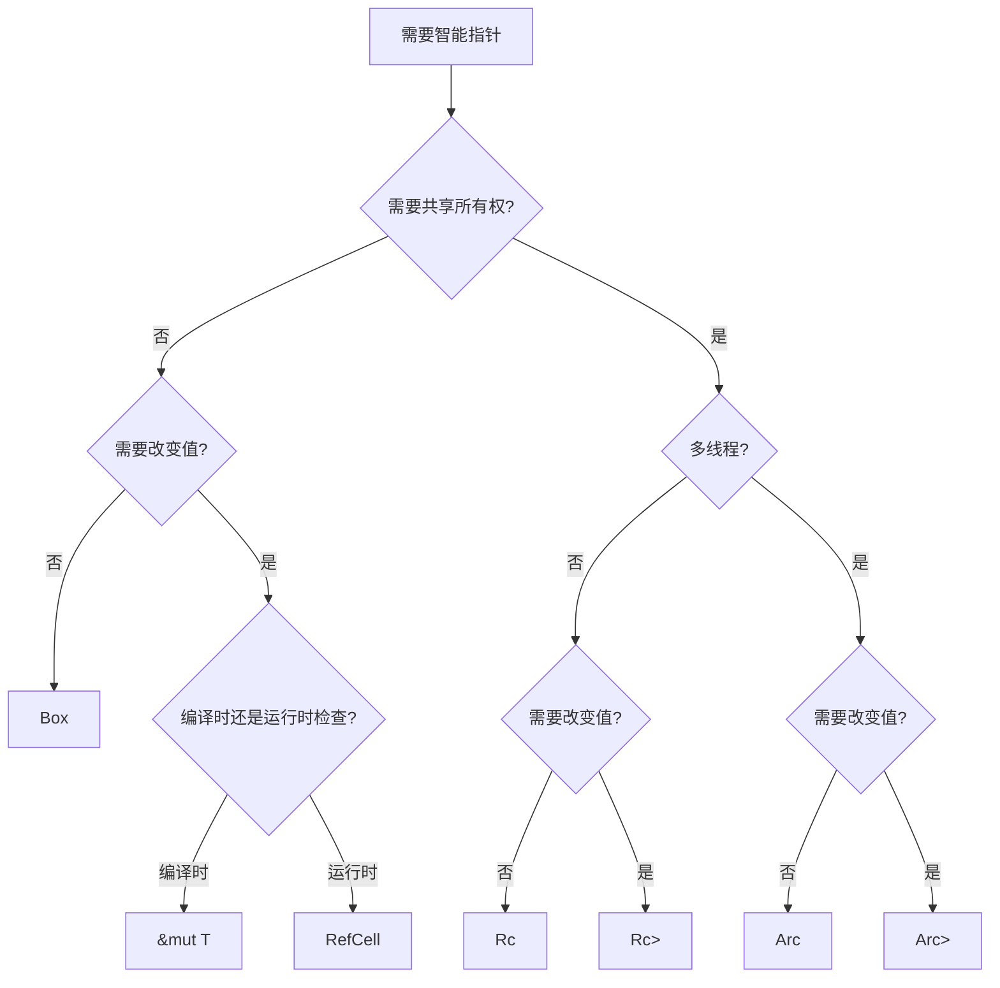

# 智能指针

智能指针是拥有数据所有权并提供额外功能的数据结构。与普通引用不同,智能指针通常拥有它们指向的数据,并在离开作用域时自动清理资源。

## 智能指针概述

### 什么是智能指针

智能指针是实现了 `Deref` 和 `Drop` trait 的结构体:

- **Deref trait** - 允许智能指针像引用一样被使用
- **Drop trait** - 允许自定义清理代码

### 智能指针 vs 引用

```rust
fn main() {
    // 普通引用:只借用数据
    let x = 5;
    let y = &x;
    
    // 智能指针:拥有数据
    let b = Box::new(5);
}
```

### 常见智能指针类型

| 类型 | 所有权 | 线程安全 | 用途 |
|------|--------|----------|------|
| `Box<T>` | 唯一 | 是 | 堆分配 |
| `Rc<T>` | 共享 | 否 | 单线程引用计数 |
| `Arc<T>` | 共享 | 是 | 多线程引用计数 |
| `RefCell<T>` | 唯一 | 否 | 内部可变性 |
| `Mutex<T>` | 唯一 | 是 | 线程安全的内部可变性 |

## `Box<T>` - 堆分配

### 基本使用

`Box<T>` 用于在堆上分配值,是最简单的智能指针。

```rust
fn main() {
    // 在堆上分配一个整数
    let b = Box::new(5);
    println!("b = {}", b);
    
    // 自动解引用
    let sum = *b + 1;
    println!("sum = {}", sum);
}  // b 离开作用域,堆上的数据被释放
```

### 使用场景

#### 1. 编译时大小未知的类型

```rust
// 递归类型必须使用 Box
enum List {
    Cons(i32, Box<List>),
    Nil,
}

use List::{Cons, Nil};

fn main() {
    let list = Cons(1, 
        Box::new(Cons(2, 
            Box::new(Cons(3, 
                Box::new(Nil))))));
}
```

#### 2. 转移大量数据的所有权

```rust
fn main() {
    // 大型数组在栈上可能导致栈溢出
    let large_array = [0; 1_000_000];
    
    // 使用 Box 在堆上分配
    let boxed_array = Box::new([0; 1_000_000]);
    
    // 转移所有权只需复制指针(8字节),而非整个数组
    let moved_box = boxed_array;
}
```

#### 3. Trait 对象

```rust
trait Draw {
    fn draw(&self);
}

struct Button {
    width: u32,
    height: u32,
}

impl Draw for Button {
    fn draw(&self) {
        println!("绘制按钮: {}x{}", self.width, self.height);
    }
}

struct TextField {
    placeholder: String,
}

impl Draw for TextField {
    fn draw(&self) {
        println!("绘制文本框: {}", self.placeholder);
    }
}

fn main() {
    // 使用 Box<dyn Trait> 存储不同类型
    let components: Vec<Box<dyn Draw>> = vec![
        Box::new(Button { width: 50, height: 10 }),
        Box::new(TextField { placeholder: String::from("输入...") }),
    ];
    
    for component in components.iter() {
        component.draw();
    }
}
```

### 实战示例:二叉树

```rust
#[derive(Debug)]
struct TreeNode {
    value: i32,
    left: Option<Box<TreeNode>>,
    right: Option<Box<TreeNode>>,
}

impl TreeNode {
    fn new(value: i32) -> Self {
        TreeNode {
            value,
            left: None,
            right: None,
        }
    }
    
    fn insert(&mut self, value: i32) {
        if value < self.value {
            match self.left {
                Some(ref mut node) => node.insert(value),
                None => self.left = Some(Box::new(TreeNode::new(value))),
            }
        } else {
            match self.right {
                Some(ref mut node) => node.insert(value),
                None => self.right = Some(Box::new(TreeNode::new(value))),
            }
        }
    }
    
    fn inorder(&self) {
        if let Some(ref left) = self.left {
            left.inorder();
        }
        print!("{} ", self.value);
        if let Some(ref right) = self.right {
            right.inorder();
        }
    }
}

fn main() {
    let mut root = TreeNode::new(5);
    root.insert(3);
    root.insert(7);
    root.insert(1);
    root.insert(9);
    
    print!("中序遍历: ");
    root.inorder();
    println!();
}
```

## `Rc<T>` - 引用计数

### 基本概念

`Rc<T>` (Reference Counted) 允许一个值有多个所有者,通过引用计数跟踪所有者数量。

```rust
use std::rc::Rc;

fn main() {
    let a = Rc::new(5);
    println!("引用计数: {}", Rc::strong_count(&a));  // 1
    
    let b = Rc::clone(&a);
    println!("引用计数: {}", Rc::strong_count(&a));  // 2
    
    {
        let c = Rc::clone(&a);
        println!("引用计数: {}", Rc::strong_count(&a));  // 3
    }
    
    println!("引用计数: {}", Rc::strong_count(&a));  // 2
}
```

### 注意事项

> [!WARNING]
> `Rc<T>` 只能用于单线程场景。多线程请使用 `Arc<T>`。

### 共享数据结构

```rust
use std::rc::Rc;

enum List {
    Cons(i32, Rc<List>),
    Nil,
}

use List::{Cons, Nil};

fn main() {
    let a = Rc::new(Cons(5, Rc::new(Cons(10, Rc::new(Nil)))));
    println!("a 引用计数: {}", Rc::strong_count(&a));
    
    // b 和 c 共享 a 的所有权
    let b = Cons(3, Rc::clone(&a));
    println!("a 引用计数: {}", Rc::strong_count(&a));
    
    let c = Cons(4, Rc::clone(&a));
    println!("a 引用计数: {}", Rc::strong_count(&a));
}
```

### 实战示例:图数据结构

```rust
use std::rc::Rc;
use std::cell::RefCell;

#[derive(Debug)]
struct Node {
    value: i32,
    neighbors: RefCell<Vec<Rc<Node>>>,
}

impl Node {
    fn new(value: i32) -> Rc<Self> {
        Rc::new(Node {
            value,
            neighbors: RefCell::new(Vec::new()),
        })
    }
    
    fn add_neighbor(&self, neighbor: Rc<Node>) {
        self.neighbors.borrow_mut().push(neighbor);
    }
}

fn main() {
    let node1 = Node::new(1);
    let node2 = Node::new(2);
    let node3 = Node::new(3);
    
    // 建立图的连接
    node1.add_neighbor(Rc::clone(&node2));
    node1.add_neighbor(Rc::clone(&node3));
    node2.add_neighbor(Rc::clone(&node3));
    
    println!("节点1的邻居数: {}", node1.neighbors.borrow().len());
    println!("节点2的引用计数: {}", Rc::strong_count(&node2));
}
```

## `RefCell<T>` - 内部可变性

### 内部可变性模式

`RefCell<T>` 允许在拥有不可变引用的情况下修改数据,借用规则在**运行时**检查。

```rust
use std::cell::RefCell;

fn main() {
    let x = RefCell::new(5);
    
    // 获取可变引用
    *x.borrow_mut() += 1;
    
    // 获取不可变引用
    println!("x = {:?}", x.borrow());
}
```

### 借用规则(运行时检查)

```rust
use std::cell::RefCell;

fn main() {
    let x = RefCell::new(5);
    
    // 同时有多个不可变借用:OK
    let a = x.borrow();
    let b = x.borrow();
    println!("a = {}, b = {}", a, b);
    
    drop(a);
    drop(b);
    
    // 可变借用与不可变借用同时存在:运行时 panic
    // let c = x.borrow();
    // let d = x.borrow_mut();  // panic!
}
```

### `Rc<RefCell<T>>` 组合

```rust
use std::cell::RefCell;
use std::rc::Rc;

#[derive(Debug)]
enum List {
    Cons(Rc<RefCell<i32>>, Rc<List>),
    Nil,
}

use List::{Cons, Nil};

fn main() {
    let value = Rc::new(RefCell::new(5));
    
    let a = Rc::new(Cons(Rc::clone(&value), Rc::new(Nil)));
    let b = Cons(Rc::new(RefCell::new(6)), Rc::clone(&a));
    let c = Cons(Rc::new(RefCell::new(10)), Rc::clone(&a));
    
    // 修改共享的值
    *value.borrow_mut() += 10;
    
    println!("a = {:?}", a);
    println!("b = {:?}", b);
    println!("c = {:?}", c);
}
```

### Mock 对象示例

```rust
use std::cell::RefCell;

pub trait Messenger {
    fn send(&self, msg: &str);
}

pub struct LimitTracker<'a, T: Messenger> {
    messenger: &'a T,
    value: usize,
    max: usize,
}

impl<'a, T> LimitTracker<'a, T>
where
    T: Messenger,
{
    pub fn new(messenger: &'a T, max: usize) -> LimitTracker<'a, T> {
        LimitTracker {
            messenger,
            value: 0,
            max,
        }
    }
    
    pub fn set_value(&mut self, value: usize) {
        self.value = value;
        
        let percentage = self.value as f64 / self.max as f64;
        
        if percentage >= 1.0 {
            self.messenger.send("错误: 超过配额!");
        } else if percentage >= 0.9 {
            self.messenger.send("警告: 已使用 90% 配额");
        } else if percentage >= 0.75 {
            self.messenger.send("警告: 已使用 75% 配额");
        }
    }
}

#[cfg(test)]
mod tests {
    use super::*;
    
    struct MockMessenger {
        sent_messages: RefCell<Vec<String>>,
    }
    
    impl MockMessenger {
        fn new() -> MockMessenger {
            MockMessenger {
                sent_messages: RefCell::new(vec![]),
            }
        }
    }
    
    impl Messenger for MockMessenger {
        fn send(&self, message: &str) {
            // 在不可变引用中修改数据
            self.sent_messages.borrow_mut().push(String::from(message));
        }
    }
    
    #[test]
    fn it_sends_an_over_75_percent_warning_message() {
        let mock_messenger = MockMessenger::new();
        let mut limit_tracker = LimitTracker::new(&mock_messenger, 100);
        
        limit_tracker.set_value(80);
        
        assert_eq!(mock_messenger.sent_messages.borrow().len(), 1);
    }
}
```

## `Arc<T>` - 原子引用计数

### 多线程共享所有权

`Arc<T>` (Atomic Reference Counted) 是线程安全版本的 `Rc<T>`。

```rust
use std::sync::Arc;
use std::thread;

fn main() {
    let data = Arc::new(vec![1, 2, 3, 4, 5]);
    let mut handles = vec![];
    
    for i in 0..5 {
        let data = Arc::clone(&data);
        let handle = thread::spawn(move || {
            println!("线程 {} 的数据: {:?}", i, data);
        });
        handles.push(handle);
    }
    
    for handle in handles {
        handle.join().unwrap();
    }
}
```

### `Arc<Mutex<T>>` 组合

```rust
use std::sync::{Arc, Mutex};
use std::thread;

fn main() {
    let counter = Arc::new(Mutex::new(0));
    let mut handles = vec![];
    
    for _ in 0..10 {
        let counter = Arc::clone(&counter);
        let handle = thread::spawn(move || {
            let mut num = counter.lock().unwrap();
            *num += 1;
        });
        handles.push(handle);
    }
    
    for handle in handles {
        handle.join().unwrap();
    }
    
    println!("结果: {}", *counter.lock().unwrap());
}
```

### Arc vs Rc 对比

```rust
use std::rc::Rc;
use std::sync::Arc;

fn main() {
    // Rc: 单线程,性能更好
    let rc = Rc::new(5);
    let rc2 = Rc::clone(&rc);
    
    // Arc: 多线程,使用原子操作
    let arc = Arc::new(5);
    let arc2 = Arc::clone(&arc);
    
    // Rc 不能跨线程
    // thread::spawn(move || {
    //     println!("{}", rc);  // 错误: Rc 未实现 Send
    // });
    
    // Arc 可以跨线程
    thread::spawn(move || {
        println!("{}", arc);  // 正确
    });
}
```

## `Weak<T>` - 弱引用

### 避免循环引用

`Weak<T>` 是弱引用,不增加引用计数,用于避免循环引用导致的内存泄漏。

```rust
use std::cell::RefCell;
use std::rc::{Rc, Weak};

#[derive(Debug)]
struct Node {
    value: i32,
    parent: RefCell<Weak<Node>>,
    children: RefCell<Vec<Rc<Node>>>,
}

fn main() {
    let leaf = Rc::new(Node {
        value: 3,
        parent: RefCell::new(Weak::new()),
        children: RefCell::new(vec![]),
    });
    
    println!("leaf 强引用计数: {}", Rc::strong_count(&leaf));
    println!("leaf 弱引用计数: {}", Rc::weak_count(&leaf));
    
    {
        let branch = Rc::new(Node {
            value: 5,
            parent: RefCell::new(Weak::new()),
            children: RefCell::new(vec![Rc::clone(&leaf)]),
        });
        
        // 建立父子关系
        *leaf.parent.borrow_mut() = Rc::downgrade(&branch);
        
        println!("branch 强引用计数: {}", Rc::strong_count(&branch));
        println!("branch 弱引用计数: {}", Rc::weak_count(&branch));
        
        println!("leaf 强引用计数: {}", Rc::strong_count(&leaf));
        println!("leaf 弱引用计数: {}", Rc::weak_count(&leaf));
    }
    
    // branch 离开作用域被释放
    println!("leaf parent: {:?}", leaf.parent.borrow().upgrade());
}
```

### 树结构实现

```rust
use std::cell::RefCell;
use std::rc::{Rc, Weak};

#[derive(Debug)]
struct TreeNode {
    value: String,
    parent: RefCell<Weak<TreeNode>>,
    children: RefCell<Vec<Rc<TreeNode>>>,
}

impl TreeNode {
    fn new(value: String) -> Rc<Self> {
        Rc::new(TreeNode {
            value,
            parent: RefCell::new(Weak::new()),
            children: RefCell::new(Vec::new()),
        })
    }
    
    fn add_child(parent: &Rc<TreeNode>, child: Rc<TreeNode>) {
        *child.parent.borrow_mut() = Rc::downgrade(parent);
        parent.children.borrow_mut().push(child);
    }
}

fn main() {
    let root = TreeNode::new(String::from("root"));
    let child1 = TreeNode::new(String::from("child1"));
    let child2 = TreeNode::new(String::from("child2"));
    
    TreeNode::add_child(&root, child1);
    TreeNode::add_child(&root, child2);
    
    println!("Root 子节点数: {}", root.children.borrow().len());
}
```

## 智能指针选择指南

### 决策树



### 使用场景对比

| 场景 | 推荐方案 | 原因 |
|------|----------|------|
| 堆分配大对象 | `Box<T>` | 避免栈溢出 |
| 递归数据结构 | `Box<T>` | 确定大小 |
| Trait 对象 | `Box<dyn Trait>` | 动态分发 |
| 单线程共享只读数据 | `Rc<T>` | 多个所有者 |
| 单线程共享可变数据 | `Rc<RefCell<T>>` | 内部可变性 |
| 多线程共享只读数据 | `Arc<T>` | 线程安全 |
| 多线程共享可变数据 | `Arc<Mutex<T>>` | 线程安全的可变性 |
| 避免循环引用 | `Weak<T>` | 不增加引用计数 |

### 性能考量

```rust
use std::rc::Rc;
use std::sync::Arc;

fn main() {
    // Box: 无运行时开销
    let b = Box::new(5);
    
    // Rc: 非原子引用计数,性能较好
    let rc = Rc::new(5);
    
    // Arc: 原子引用计数,性能略差
    let arc = Arc::new(5);
    
    // RefCell: 运行时借用检查,有少量开销
    use std::cell::RefCell;
    let cell = RefCell::new(5);
}
```

## 实战案例

### 案例1: DOM 树结构

```rust
use std::cell::RefCell;
use std::rc::{Rc, Weak};

#[derive(Debug)]
struct DomNode {
    tag: String,
    attributes: RefCell<Vec<(String, String)>>,
    parent: RefCell<Weak<DomNode>>,
    children: RefCell<Vec<Rc<DomNode>>>,
}

impl DomNode {
    fn new(tag: &str) -> Rc<Self> {
        Rc::new(DomNode {
            tag: tag.to_string(),
            attributes: RefCell::new(Vec::new()),
            parent: RefCell::new(Weak::new()),
            children: RefCell::new(Vec::new()),
        })
    }
    
    fn append_child(parent: &Rc<DomNode>, child: Rc<DomNode>) {
        *child.parent.borrow_mut() = Rc::downgrade(parent);
        parent.children.borrow_mut().push(child);
    }
    
    fn set_attribute(&self, name: &str, value: &str) {
        self.attributes.borrow_mut().push((name.to_string(), value.to_string()));
    }
    
    fn render(&self, indent: usize) {
        let spaces = " ".repeat(indent);
        print!("{}<{}", spaces, self.tag);
        
        for (name, value) in self.attributes.borrow().iter() {
            print!(" {}=\"{}\"", name, value);
        }
        
        if self.children.borrow().is_empty() {
            println!(" />");
        } else {
            println!(">");
            for child in self.children.borrow().iter() {
                child.render(indent + 2);
            }
            println!("{}</{}>", spaces, self.tag);
        }
    }
}

fn main() {
    let root = DomNode::new("div");
    root.set_attribute("class", "container");
    
    let header = DomNode::new("h1");
    header.set_attribute("id", "title");
    
    let paragraph = DomNode::new("p");
    paragraph.set_attribute("class", "content");
    
    DomNode::append_child(&root, header);
    DomNode::append_child(&root, paragraph);
    
    root.render(0);
}
```

### 案例2: 观察者模式

```rust
use std::cell::RefCell;
use std::rc::Rc;

trait Observer {
    fn update(&self, value: i32);
}

struct Subject {
    observers: RefCell<Vec<Rc<dyn Observer>>>,
    value: RefCell<i32>,
}

impl Subject {
    fn new() -> Self {
        Subject {
            observers: RefCell::new(Vec::new()),
            value: RefCell::new(0),
        }
    }
    
    fn attach(&self, observer: Rc<dyn Observer>) {
        self.observers.borrow_mut().push(observer);
    }
    
    fn set_value(&self, value: i32) {
        *self.value.borrow_mut() = value;
        self.notify();
    }
    
    fn notify(&self) {
        let value = *self.value.borrow();
        for observer in self.observers.borrow().iter() {
            observer.update(value);
        }
    }
}

struct ConcreteObserver {
    id: i32,
}

impl Observer for ConcreteObserver {
    fn update(&self, value: i32) {
        println!("观察者 {} 收到更新: {}", self.id, value);
    }
}

fn main() {
    let subject = Subject::new();
    
    let observer1 = Rc::new(ConcreteObserver { id: 1 });
    let observer2 = Rc::new(ConcreteObserver { id: 2 });
    
    subject.attach(observer1);
    subject.attach(observer2);
    
    subject.set_value(42);
    subject.set_value(100);
}
```

## 最佳实践

### 1. 优先使用 `Box<T>`

```rust
// 好: 简单明了
let data = Box::new(vec![1, 2, 3]);

// 避免: 不必要的复杂性
use std::rc::Rc;
let data = Rc::new(vec![1, 2, 3]);  // 如果不需要共享所有权
```

### 2. 避免循环引用

```rust
use std::rc::{Rc, Weak};

// 好: 使用 Weak 打破循环
struct Node {
    parent: Weak<Node>,  // 弱引用
    children: Vec<Rc<Node>>,  // 强引用
}

// 避免: 循环强引用导致内存泄漏
// struct BadNode {
//     parent: Rc<BadNode>,
//     children: Vec<Rc<BadNode>>,
// }
```

### 3. 单线程用 Rc,多线程用 Arc

```rust
use std::rc::Rc;
use std::sync::Arc;
use std::thread;

// 单线程
fn single_thread() {
    let data = Rc::new(vec![1, 2, 3]);
}

// 多线程
fn multi_thread() {
    let data = Arc::new(vec![1, 2, 3]);
    
    for i in 0..3 {
        let data = Arc::clone(&data);
        thread::spawn(move || {
            println!("线程 {}: {:?}", i, data);
        });
    }
}
```

### 4. 谨慎使用 RefCell

```rust
use std::cell::RefCell;

// 好: 必要时使用
struct Cache {
    data: RefCell<Vec<i32>>,
}

impl Cache {
    fn get_or_insert(&self) -> i32 {
        if self.data.borrow().is_empty() {
            self.data.borrow_mut().push(42);
        }
        self.data.borrow()[0]
    }
}

// 避免: 能用编译时检查就不用运行时检查
// let mut data = vec![1, 2, 3];  // 更好
// let data = RefCell::new(vec![1, 2, 3]);  // 不必要
```

## 常见错误

### 错误1: RefCell 借用冲突

```rust
use std::cell::RefCell;

fn main() {
    let x = RefCell::new(5);
    
    let a = x.borrow();
    // let b = x.borrow_mut();  // panic: 已有不可变借用
    
    drop(a);  // 释放借用
    let b = x.borrow_mut();  // 正确
}
```

### 错误2: 循环引用内存泄漏

```rust
use std::rc::Rc;
use std::cell::RefCell;

#[derive(Debug)]
struct Node {
    next: RefCell<Option<Rc<Node>>>,
}

fn main() {
    let a = Rc::new(Node { next: RefCell::new(None) });
    let b = Rc::new(Node { next: RefCell::new(Some(Rc::clone(&a))) });
    
    // 创建循环引用
    *a.next.borrow_mut() = Some(Rc::clone(&b));
    
    // 内存泄漏: a 和 b 的引用计数永远不会为 0
    println!("a 引用计数: {}", Rc::strong_count(&a));
    println!("b 引用计数: {}", Rc::strong_count(&b));
}
```

## 总结

本文详细介绍了 Rust 的智能指针:

- ✅ `Box<T>` - 堆分配,唯一所有权
- ✅ `Rc<T>` - 单线程引用计数,共享所有权
- ✅ `RefCell<T>` - 内部可变性,运行时借用检查
- ✅ `Arc<T>` - 多线程引用计数,原子操作
- ✅ `Weak<T>` - 弱引用,避免循环引用
- ✅ 智能指针选择指南和最佳实践
- ✅ 实战案例: DOM 树、观察者模式

**关键要点:**

1. `Box<T>` 适用于堆分配和递归类型
2. `Rc<T>` 用于单线程共享所有权
3. `Arc<T>` 用于多线程共享所有权
4. `RefCell<T>` 提供内部可变性
5. `Weak<T>` 避免循环引用导致的内存泄漏

掌握智能指针后,继续学习 [并发编程](/docs/rust/concurrency) 和 [生命周期](/docs/rust/lifetimes)。
