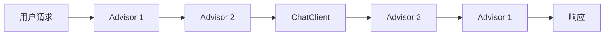

# Advisor 机制

Advisor 是 Spring AI 中用于拦截和增强 ChatClient 请求/响应的组件，类似于 Spring AOP 的切面概念。

## 核心概念



Advisor 形成一个链，可以在请求发送前和响应返回后进行处理。

## RequestResponseAdvisor 接口

```java
public interface RequestResponseAdvisor {

    // 处理请求（发送给模型前）
    default AdvisedRequest adviseRequest(AdvisedRequest request, Map<String, Object> context) {
        return request;
    }

    // 处理响应（模型返回后）
    default ChatResponse adviseResponse(ChatResponse response, Map<String, Object> context) {
        return response;
    }
}
```

## 内置 Advisor

### MessageChatMemoryAdvisor

自动管理对话历史记录：

```java
@Configuration
public class MemoryConfig {

    @Bean
    public ChatClient chatClient(ChatClient.Builder builder) {
        return builder
                .defaultAdvisors(new MessageChatMemoryAdvisor(new InMemoryChatMemory()))
                .build();
    }
}
```

使用：

```java
@GetMapping("/chat")
public String chat(@RequestParam String message, @RequestParam String sessionId) {
    return chatClient.prompt()
            .user(message)
            .advisors(advisor -> advisor
                .param(MessageChatMemoryAdvisor.CHAT_MEMORY_CONVERSATION_ID_KEY, sessionId))
            .call()
            .content();
}
```

### QuestionAnswerAdvisor

集成 RAG 功能：

```java
@Bean
public ChatClient chatClient(ChatClient.Builder builder, VectorStore vectorStore) {
    return builder
            .defaultAdvisors(new QuestionAnswerAdvisor(vectorStore))
            .build();
}
```

用户提问时自动检索相关文档并增强提示词。

### SafeGuardAdvisor

内容安全过滤：

```java
@Bean
public ChatClient chatClient(ChatClient.Builder builder) {
    return builder
            .defaultAdvisors(new SafeGuardAdvisor(List.of(
                "password", "secret", "api_key", "credit card"
            )))
            .build();
}
```

## 自定义 Advisor

### 日志 Advisor

```java
@Slf4j
public class LoggingAdvisor implements RequestResponseAdvisor {

    @Override
    public AdvisedRequest adviseRequest(AdvisedRequest request, Map<String, Object> context) {
        String requestId = UUID.randomUUID().toString().substring(0, 8);
        context.put("requestId", requestId);
        context.put("startTime", System.currentTimeMillis());

        log.info("[{}] 发送请求: {}", requestId,
                 request.userText().substring(0, Math.min(100, request.userText().length())));

        return request;
    }

    @Override
    public ChatResponse adviseResponse(ChatResponse response, Map<String, Object> context) {
        String requestId = (String) context.get("requestId");
        long startTime = (Long) context.get("startTime");
        long duration = System.currentTimeMillis() - startTime;

        log.info("[{}] 收到响应, 耗时: {}ms, tokens: {}",
                 requestId, duration, response.getMetadata().getUsage().getTotalTokens());

        return response;
    }
}
```

### 重试 Advisor

```java
public class RetryAdvisor implements RequestResponseAdvisor {

    private final int maxRetries;
    private final Duration delay;

    public RetryAdvisor(int maxRetries, Duration delay) {
        this.maxRetries = maxRetries;
        this.delay = delay;
    }

    @Override
    public ChatResponse adviseResponse(ChatResponse response, Map<String, Object> context) {
        // 可以在这里检查响应质量，如果不满足条件则触发重试逻辑
        return response;
    }
}
```

### Prompt 增强 Advisor

```java
public class SystemPromptAdvisor implements RequestResponseAdvisor {

    private final String systemPrompt;

    public SystemPromptAdvisor(String systemPrompt) {
        this.systemPrompt = systemPrompt;
    }

    @Override
    public AdvisedRequest adviseRequest(AdvisedRequest request, Map<String, Object> context) {
        // 在所有请求前添加系统提示词
        List<Message> messages = new ArrayList<>();
        messages.add(new SystemMessage(systemPrompt));
        messages.addAll(request.messages());

        return AdvisedRequest.from(request)
                .withMessages(messages)
                .build();
    }
}
```

### Token 使用监控 Advisor

```java
public class TokenMetricsAdvisor implements RequestResponseAdvisor {

    private final MeterRegistry meterRegistry;

    public TokenMetricsAdvisor(MeterRegistry meterRegistry) {
        this.meterRegistry = meterRegistry;
    }

    @Override
    public ChatResponse adviseResponse(ChatResponse response, Map<String, Object> context) {
        Usage usage = response.getMetadata().getUsage();

        meterRegistry.counter("ai.tokens.prompt").increment(usage.getPromptTokens());
        meterRegistry.counter("ai.tokens.completion").increment(usage.getGenerationTokens());
        meterRegistry.counter("ai.tokens.total").increment(usage.getTotalTokens());

        return response;
    }
}
```

## 组合多个 Advisor

```java
@Bean
public ChatClient chatClient(ChatClient.Builder builder,
                              VectorStore vectorStore,
                              MeterRegistry meterRegistry) {
    return builder
            .defaultAdvisors(
                new LoggingAdvisor(),
                new TokenMetricsAdvisor(meterRegistry),
                new MessageChatMemoryAdvisor(new InMemoryChatMemory()),
                new QuestionAnswerAdvisor(vectorStore),
                new SafeGuardAdvisor(sensitiveWords)
            )
            .build();
}
```

执行顺序：

1. LoggingAdvisor (请求)
2. TokenMetricsAdvisor (请求)
3. MessageChatMemoryAdvisor (请求)
4. QuestionAnswerAdvisor (请求)
5. SafeGuardAdvisor (请求)
6. **ChatClient 调用模型**
7. SafeGuardAdvisor (响应)
8. QuestionAnswerAdvisor (响应)
9. MessageChatMemoryAdvisor (响应)
10. TokenMetricsAdvisor (响应)
11. LoggingAdvisor (响应)

## 动态添加 Advisor

```java
@GetMapping("/chat/rag")
public String chatWithRag(@RequestParam String message) {
    return chatClient.prompt()
            .user(message)
            .advisors(new QuestionAnswerAdvisor(vectorStore))  // 仅此请求使用
            .call()
            .content();
}

@GetMapping("/chat/simple")
public String simpleChat(@RequestParam String message) {
    return chatClient.prompt()
            .user(message)
            // 不添加额外 Advisor
            .call()
            .content();
}
```

## 最佳实践

### 1. 保持 Advisor 轻量

```java
// ✅ 好：快速执行，不阻塞
public AdvisedRequest adviseRequest(AdvisedRequest request, Map<String, Object> context) {
    context.put("startTime", System.nanoTime());
    return request;
}

// ❌ 差：耗时操作
public AdvisedRequest adviseRequest(AdvisedRequest request, Map<String, Object> context) {
    // 不要在这里做耗时的数据库查询或网络请求
    return request;
}
```

### 2. 使用 context 传递状态

```java
@Override
public AdvisedRequest adviseRequest(AdvisedRequest request, Map<String, Object> context) {
    context.put("userId", getCurrentUserId());
    return request;
}

@Override
public ChatResponse adviseResponse(ChatResponse response, Map<String, Object> context) {
    String userId = (String) context.get("userId");
    // 使用 userId 进行后续处理
    return response;
}
```

### 3. 异常处理

```java
@Override
public ChatResponse adviseResponse(ChatResponse response, Map<String, Object> context) {
    try {
        // 可能抛出异常的逻辑
        return processResponse(response);
    } catch (Exception e) {
        log.error("Advisor 处理失败", e);
        return response;  // 返回原始响应，不影响整体流程
    }
}
```

## 下一步

- [ChatClient 详解](/docs/spring-ai/chat-client) - ChatClient 的更多用法
- [最佳实践](/docs/spring-ai/best-practices) - 生产环境配置
