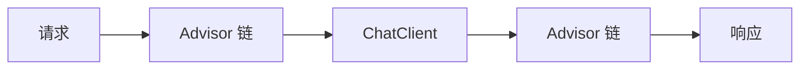

# 核心概念

深入了解 Spring AI 的关键组件和概念。

## Models (模型)

Spring AI 支持多种类型的 AI 模型：

- **Chat Models**: 用于对话式交互，输入文本，输出文本（通常是对话形式）。
- **Embedding Models**: 将文本转换为向量（数字列表），用于语义搜索和 RAG。
- **Image Models**: 根据文本描述生成图像 (例如 DALL-E)。

## Prompts (提示词)

Prompt 是与 AI 模型交互的基础。Spring AI 提供了 `Prompt` 类来封装发送给模型的消息。

### Prompt Template

类似于 Spring 的 `JdbcTemplate` 或 `RestTemplate`，`PromptTemplate` 允许你创建带有占位符的提示词：

```java
PromptTemplate promptTemplate = new PromptTemplate("Tell me a {adjective} joke about {topic}");
Prompt prompt = promptTemplate.create(Map.of("adjective", "funny", "topic", "cows"));
```

## Output Parsers (输出解析器)

AI 模型通常返回字符串。`OutputParser` 接口负责将这些字符串结构化为 Java 对象 (POJO)。

例如，使用 `BeanOutputParser`：

```java
record ActorsFilms(String actor, List<String> movies) {}

BeanOutputParser<ActorsFilms> parser = new BeanOutputParser<>(ActorsFilms.class);
String format = parser.getFormat();

PromptTemplate template = new PromptTemplate("""
    Generate the filmography for the actor {actor}.
    {format}
    """);
// ... 发送请求 ...
ActorsFilms actorsFilms = parser.parse(response);
```

## Vector Databases (向量数据库)

为了支持 RAG (Retrieval Augmented Generation)，Spring AI 提供了对向量数据库的抽象 `VectorStore`。它允许你存储和查询文档嵌入。

支持的实现包括：

- Chroma
- Milvus
- Pinecone
- Redis
- Neo4j
- PGvector

## Advisors (增强器)

Advisor 是 Spring AI 中用于拦截和增强 ChatClient 请求/响应的组件，类似于 Spring AOP 的切面概念。



常用内置 Advisor：

- **MessageChatMemoryAdvisor**: 自动管理对话历史
- **QuestionAnswerAdvisor**: 集成 RAG 功能
- **SafeGuardAdvisor**: 内容安全过滤

```java
ChatClient client = ChatClient.builder(chatModel)
    .defaultAdvisors(
        new MessageChatMemoryAdvisor(new InMemoryChatMemory()),
        new QuestionAnswerAdvisor(vectorStore)
    )
    .build();
```

详见 [Advisor 机制](/docs/spring-ai/advisors)。

## Memory (记忆)

Memory 用于在多轮对话中保持上下文。Spring AI 提供 `ChatMemory` 接口：

```java
public interface ChatMemory {
    void add(String conversationId, List<Message> messages);
    List<Message> get(String conversationId, int lastN);
    void clear(String conversationId);
}
```

常用实现：

- **InMemoryChatMemory**: 内存存储，适合开发测试
- **CassandraChatMemory**: Cassandra 持久化
- **自定义实现**: 可以基于 Redis、数据库等实现

配合 `MessageChatMemoryAdvisor` 使用：

```java
ChatClient client = ChatClient.builder(chatModel)
    .defaultAdvisors(new MessageChatMemoryAdvisor(new InMemoryChatMemory()))
    .build();

// 使用时指定会话 ID
client.prompt()
    .user("你好")
    .advisors(a -> a.param(CHAT_MEMORY_CONVERSATION_ID_KEY, "session-123"))
    .call()
    .content();
```

## Multimodality (多模态)

Spring AI 支持多模态输入，即在一个请求中同时发送文本和图像：

```java
// 发送图像和文本
UserMessage userMessage = new UserMessage(
    "描述这张图片",
    List.of(new Media(MimeTypeUtils.IMAGE_PNG, imageResource))
);

String response = chatClient.prompt()
    .messages(userMessage)
    .call()
    .content();
```

支持多模态的模型：

- GPT-4 Vision (OpenAI)
- Claude 3 (Anthropic)
- Gemini (Google)

## Function Calling (函数调用)

允许 AI 模型调用预定义的函数获取外部信息：

```java
@Bean
@Description("获取天气信息")
public Function<WeatherRequest, WeatherResponse> getWeather() {
    return request -> weatherService.get(request.city());
}
```

详见 [函数调用](/docs/spring-ai/function-calling)。
