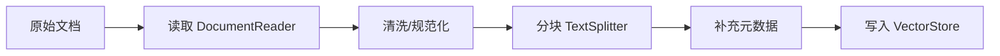

# 文档摄取与向量化（Ingestion）

RAG（检索增强生成）想要稳定、可控，关键不止是“查向量库”，还包括“怎么把文档变成可检索的知识”。

一个典型的摄取（Ingestion）流水线：



Spring AI 在 RAG 场景里通常使用：

- `Document`：文档/分块后的内容载体
- `TextReader` / `JsonReader` / `PagePdfDocumentReader`：读取不同类型内容
- `TokenTextSplitter`：基于 token 的分块
- `VectorStore`：存储并用于后续相似度搜索

## 1. 读取文档

### 文本文件（TextReader）

```java
TextReader reader = new TextReader(resource);
List<Document> documents = reader.get();
```

### JSON（JsonReader）

```java
JsonReader reader = new JsonReader(jsonResource, "content", "metadata");
List<Document> documents = reader.get();
```

### PDF（PagePdfDocumentReader）

```java
PagePdfDocumentReader reader = new PagePdfDocumentReader(pdfResource);
List<Document> documents = reader.get();
```

## 2. 文本清洗（可选但推荐）

建议在分块前做基础清洗：

- 去除多余空白
- 去除页眉页脚（PDF 常见）
- 统一换行/编码

通常你可以对 `Document.getContent()` 做处理后再写回。

## 3. 分块（Chunking）

大模型上下文有限、向量检索也更偏好语义单元一致的片段。一般推荐：

- **块大小**：500~1000 tokens
- **重叠**：50~150 tokens

```java
TokenTextSplitter splitter = new TokenTextSplitter(
    500,    // chunk size
    100,    // min chunk size
    50,     // overlap
    10000,  // max chunks
    true
);

List<Document> chunks = splitter.apply(documents);
```

## 4. 元数据（Metadata）

元数据是“可运营”的关键：

- 你可以按来源过滤（仅查某个文档/某个系统）
- 可以支持权限控制（ABAC/RBAC）
- 可以用于可观测性（命中来源统计）

```java
documents.forEach(doc -> {
    doc.getMetadata().put("source", resource.getFilename());
    doc.getMetadata().put("category", "manual");
    doc.getMetadata().put("ingested_at", Instant.now().toString());
});
```

## 5. 写入 VectorStore

```java
vectorStore.add(chunks);
```

后续查询时可以使用过滤表达式：

```java
List<Document> results = vectorStore.similaritySearch(
    SearchRequest.query(question)
        .withTopK(5)
        .withSimilarityThreshold(0.7)
        .withFilterExpression("source == 'manual.pdf'")
);
```

## 常见坑与建议

- **分块太大**：召回的内容太散，模型不易利用
- **分块太小**：语义不完整，召回片段碎片化
- **无元数据**：后期排障困难、无法做权限/来源分析
- **重复摄取**：应避免重复写入（需要你在业务侧做幂等/版本管理）

## 下一步

- [RAG 应用](/docs/spring-ai/rag)
- [嵌入模型](/docs/spring-ai/embedding)
- [可观测性](/docs/spring-ai/observability)
