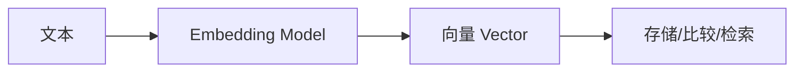

# 嵌入模型 (Embedding)

嵌入模型将文本转换为向量（数字列表），使计算机能够理解和比较文本的语义含义。这是实现语义搜索和 RAG 应用的基础。

## 核心概念



**向量**是一个数字列表，例如 `[0.12, -0.34, 0.56, ...]`，通常有 384 到 4096 个维度。语义相似的文本会产生相近的向量。

## EmbeddingClient 基础

### 注入使用

```java
@RestController
public class EmbeddingController {

    private final EmbeddingClient embeddingClient;

    public EmbeddingController(EmbeddingClient embeddingClient) {
        this.embeddingClient = embeddingClient;
    }

    @GetMapping("/embed")
    public List<Double> embed(@RequestParam String text) {
        return embeddingClient.embed(text);
    }
}
```

### 批量嵌入

```java
@GetMapping("/embed/batch")
public EmbeddingResponse embedBatch(@RequestBody List<String> texts) {
    return embeddingClient.embedForResponse(texts);
}
```

## 模型配置

### OpenAI

```xml
<dependency>
    <groupId>org.springframework.ai</groupId>
    <artifactId>spring-ai-openai-spring-boot-starter</artifactId>
</dependency>
```

```yaml
spring:
  ai:
    openai:
      api-key: ${OPENAI_API_KEY}
      embedding:
        options:
          model: text-embedding-3-small # 或 text-embedding-3-large
```

| 模型                   | 维度 | 性能 | 成本 |
| ---------------------- | ---- | ---- | ---- |
| text-embedding-3-small | 1536 | 良好 | 低   |
| text-embedding-3-large | 3072 | 最佳 | 中   |
| text-embedding-ada-002 | 1536 | 良好 | 较低 |

### Ollama (本地)

```xml
<dependency>
    <groupId>org.springframework.ai</groupId>
    <artifactId>spring-ai-ollama-spring-boot-starter</artifactId>
</dependency>
```

```yaml
spring:
  ai:
    ollama:
      base-url: http://localhost:11434
      embedding:
        options:
          model: nomic-embed-text # 或 mxbai-embed-large
```

```bash
# 拉取嵌入模型
ollama pull nomic-embed-text
```

### HuggingFace

```xml
<dependency>
    <groupId>org.springframework.ai</groupId>
    <artifactId>spring-ai-transformers-spring-boot-starter</artifactId>
</dependency>
```

```yaml
spring:
  ai:
    embedding:
      transformer:
        onnx:
          model-uri: https://huggingface.co/sentence-transformers/all-MiniLM-L6-v2
```

## 语义搜索实战

### 计算相似度

```java
@Service
public class SemanticSearchService {

    private final EmbeddingClient embeddingClient;

    public double cosineSimilarity(String text1, String text2) {
        List<Double> v1 = embeddingClient.embed(text1);
        List<Double> v2 = embeddingClient.embed(text2);

        double dotProduct = 0.0;
        double norm1 = 0.0;
        double norm2 = 0.0;

        for (int i = 0; i < v1.size(); i++) {
            dotProduct += v1.get(i) * v2.get(i);
            norm1 += v1.get(i) * v1.get(i);
            norm2 += v2.get(i) * v2.get(i);
        }

        return dotProduct / (Math.sqrt(norm1) * Math.sqrt(norm2));
    }

    public List<String> findSimilar(String query, List<String> candidates, int topK) {
        List<Double> queryVector = embeddingClient.embed(query);

        return candidates.stream()
                .map(text -> Map.entry(text, cosineSimilarity(query, text)))
                .sorted((a, b) -> Double.compare(b.getValue(), a.getValue()))
                .limit(topK)
                .map(Map.Entry::getKey)
                .collect(Collectors.toList());
    }
}
```

### 配合 VectorStore

```java
@Service
public class DocumentSearchService {

    private final VectorStore vectorStore;
    private final EmbeddingClient embeddingClient;

    public void indexDocuments(List<String> documents) {
        List<Document> docs = documents.stream()
                .map(content -> new Document(content))
                .collect(Collectors.toList());

        vectorStore.add(docs);
    }

    public List<Document> search(String query, int topK) {
        return vectorStore.similaritySearch(
            SearchRequest.query(query)
                .withTopK(topK)
                .withSimilarityThreshold(0.7)
        );
    }
}
```

## 最佳实践

### 1. 分块策略

对于长文本，先分块再嵌入：

```java
public List<Document> chunkAndEmbed(String longText) {
    TokenTextSplitter splitter = new TokenTextSplitter(
        500,   // 块大小
        100,   // 最小大小
        50,    // 重叠
        10000, // 最大块数
        true   // 保留分隔符
    );

    Document doc = new Document(longText);
    return splitter.apply(List.of(doc));
}
```

### 2. 缓存嵌入结果

```java
@Service
public class CachedEmbeddingService {

    private final EmbeddingClient embeddingClient;
    private final Cache<String, List<Double>> cache;

    public CachedEmbeddingService(EmbeddingClient embeddingClient) {
        this.embeddingClient = embeddingClient;
        this.cache = Caffeine.newBuilder()
                .maximumSize(10000)
                .expireAfterWrite(Duration.ofDays(7))
                .build();
    }

    public List<Double> embed(String text) {
        String key = DigestUtils.md5Hex(text);
        return cache.get(key, k -> embeddingClient.embed(text));
    }
}
```

### 3. 模型选择建议

| 场景      | 推荐模型                  |
| --------- | ------------------------- |
| 生产环境  | text-embedding-3-small    |
| 高精度    | text-embedding-3-large    |
| 本地/隐私 | nomic-embed-text (Ollama) |
| 多语言    | multilingual-e5-large     |

## 下一步

- [RAG 应用](/docs/spring-ai/rag) - 使用嵌入构建检索增强生成应用
- [模型提供商](/docs/spring-ai/model-providers) - 了解更多模型选择
