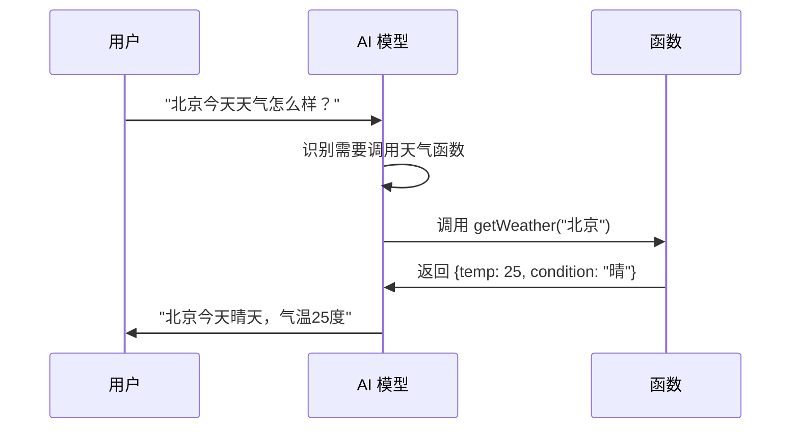

# 函数调用 (Function Calling)

函数调用允许 AI 模型识别何时需要调用外部函数来获取信息或执行操作，然后将函数结果整合到回答中。

## 工作原理



## 基础用法

### 1. 定义函数

```java
@Configuration
public class FunctionConfig {

    @Bean
    @Description("获取指定城市的当前天气信息")
    public Function<WeatherRequest, WeatherResponse> getWeather() {
        return request -> {
            // 调用真实的天气 API
            return weatherService.getCurrentWeather(request.city());
        };
    }

    public record WeatherRequest(String city) {}
    public record WeatherResponse(String city, String condition, int temperature) {}
}
```

### 2. 调用函数

```java
@RestController
public class WeatherController {

    private final ChatClient chatClient;

    @GetMapping("/weather")
    public String askWeather(@RequestParam String question) {
        return chatClient.prompt()
                .user(question)
                .functions("getWeather")
                .call()
                .content();
    }
}
```

## 多函数调用

### 定义多个函数

```java
@Configuration
public class MultiFunctionConfig {

    @Bean
    @Description("获取天气信息")
    public Function<WeatherRequest, WeatherResponse> getWeather() {
        return request -> weatherService.get(request.city());
    }

    @Bean
    @Description("查询航班信息")
    public Function<FlightRequest, FlightResponse> searchFlights() {
        return request -> flightService.search(request.from(), request.to(), request.date());
    }

    @Bean
    @Description("预订酒店")
    public Function<HotelRequest, HotelResponse> bookHotel() {
        return request -> hotelService.book(request.city(), request.checkIn(), request.checkOut());
    }

    public record FlightRequest(String from, String to, String date) {}
    public record FlightResponse(List<Flight> flights) {}

    public record HotelRequest(String city, String checkIn, String checkOut) {}
    public record HotelResponse(List<Hotel> hotels, String confirmationCode) {}
}
```

### 注册多个函数

```java
@GetMapping("/travel")
public String planTravel(@RequestParam String query) {
    return chatClient.prompt()
            .user(query)
            .functions("getWeather", "searchFlights", "bookHotel")
            .call()
            .content();
}
```

用户可以问："帮我查一下下周去上海的机票，顺便看看天气"，AI 会自动调用多个函数。

## 函数参数验证

### 使用 Bean Validation

```java
public record OrderRequest(
    @NotNull @Size(min = 1) String productId,
    @Min(1) @Max(100) int quantity,
    @Email String customerEmail
) {}

@Bean
@Description("创建订单")
public Function<OrderRequest, OrderResponse> createOrder(Validator validator) {
    return request -> {
        Set<ConstraintViolation<OrderRequest>> violations = validator.validate(request);
        if (!violations.isEmpty()) {
            throw new IllegalArgumentException("参数验证失败: " + violations);
        }
        return orderService.create(request);
    };
}
```

## 异步函数

```java
@Bean
@Description("执行长时间运行的分析任务")
public Function<AnalysisRequest, AnalysisResponse> runAnalysis() {
    return request -> {
        CompletableFuture<AnalysisResult> future = analysisService.analyzeAsync(request.data());
        // 等待结果或返回任务ID
        try {
            AnalysisResult result = future.get(30, TimeUnit.SECONDS);
            return new AnalysisResponse("completed", result);
        } catch (TimeoutException e) {
            String taskId = UUID.randomUUID().toString();
            return new AnalysisResponse("processing", taskId);
        }
    };
}
```

## 实战案例

### 数据库查询助手

```java
@Configuration
public class DatabaseAssistant {

    @Bean
    @Description("根据条件查询用户信息，支持按用户名、邮箱、注册日期筛选")
    public Function<UserQueryRequest, UserQueryResponse> queryUsers(UserRepository userRepo) {
        return request -> {
            Specification<User> spec = buildSpec(request);
            List<User> users = userRepo.findAll(spec, PageRequest.of(0, 10)).getContent();
            return new UserQueryResponse(users, users.size());
        };
    }

    @Bean
    @Description("获取系统统计数据，如用户总数、订单总额、日活用户等")
    public Function<StatsRequest, StatsResponse> getStats(StatsService statsService) {
        return request -> statsService.getStats(request.metrics(), request.period());
    }

    public record UserQueryRequest(
        String username,
        String email,
        String registeredAfter
    ) {}

    public record UserQueryResponse(List<User> users, int total) {}
}
```

### 使用

```java
@GetMapping("/db-assistant")
public String queryDatabase(@RequestParam String question) {
    return chatClient.prompt()
            .system("""
                你是一个数据库查询助手。
                根据用户的自然语言问题，调用合适的函数获取数据。
                以清晰的格式展示查询结果。
                """)
            .user(question)
            .functions("queryUsers", "getStats")
            .call()
            .content();
}
```

用户可以问："查一下上周注册的所有用户" 或 "这个月的销售额是多少"。

### 外部 API 集成

```java
@Bean
@Description("搜索新闻文章")
public Function<NewsRequest, NewsResponse> searchNews(WebClient newsClient) {
    return request -> {
        return newsClient.get()
                .uri(builder -> builder
                        .path("/search")
                        .queryParam("q", request.query())
                        .queryParam("limit", request.limit())
                        .build())
                .retrieve()
                .bodyToMono(NewsResponse.class)
                .block();
    };
}
```

## 错误处理

```java
@Bean
@Description("执行敏感操作")
public Function<SensitiveRequest, SensitiveResponse> sensitiveOperation() {
    return request -> {
        try {
            return doSensitiveWork(request);
        } catch (AuthorizationException e) {
            return new SensitiveResponse(false, "权限不足: " + e.getMessage());
        } catch (ValidationException e) {
            return new SensitiveResponse(false, "参数错误: " + e.getMessage());
        } catch (Exception e) {
            log.error("函数执行失败", e);
            return new SensitiveResponse(false, "操作失败，请稍后重试");
        }
    };
}
```

## 支持情况

| 提供商       | Function Calling |
| ------------ | :--------------: |
| OpenAI       |        ✅        |
| Azure OpenAI |        ✅        |
| Anthropic    |        ✅        |
| Ollama       |        🔶        |
| Vertex AI    |        ✅        |

> 🔶 Ollama 支持取决于具体模型

## 下一步

- [ChatClient 详解](/docs/spring-ai/chat-client) - ChatClient 的更多用法
- [最佳实践](/docs/spring-ai/best-practices) - 生产环境最佳实践
