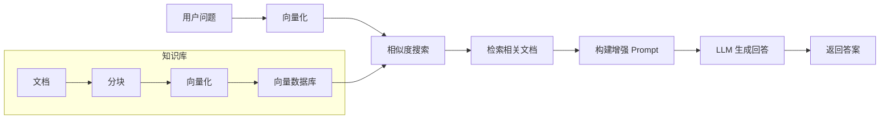

# RAG 应用 (检索增强生成)

RAG (Retrieval Augmented Generation) 通过检索相关文档来增强 AI 模型的回答，使其能够基于特定知识库提供更准确的答案。

## 核心概念



## 向量数据库集成

### 添加依赖

以 PGvector 为例：

```xml
<dependency>
    <groupId>org.springframework.ai</groupId>
    <artifactId>spring-ai-pgvector-store-spring-boot-starter</artifactId>
</dependency>
```

### 配置

```yaml
spring:
  ai:
    vectorstore:
      pgvector:
        index-type: HNSW
        distance-type: COSINE_DISTANCE
        dimensions: 1536
  datasource:
    url: jdbc:postgresql://localhost:5432/vectordb
    username: postgres
    password: password
```

### 支持的向量数据库

| 数据库   | Starter                                        |
| -------- | ---------------------------------------------- |
| Chroma   | `spring-ai-chroma-store-spring-boot-starter`   |
| Milvus   | `spring-ai-milvus-store-spring-boot-starter`   |
| Pinecone | `spring-ai-pinecone-store-spring-boot-starter` |
| Redis    | `spring-ai-redis-store-spring-boot-starter`    |
| PGvector | `spring-ai-pgvector-store-spring-boot-starter` |
| Weaviate | `spring-ai-weaviate-store-spring-boot-starter` |

## 文档加载与处理

### 文档读取器

Spring AI 提供多种文档读取器：

```java
@Service
public class DocumentLoaderService {

    // PDF 文档
    public List<Document> loadPdf(Resource pdfResource) {
        PagePdfDocumentReader reader = new PagePdfDocumentReader(pdfResource);
        return reader.get();
    }

    // 文本文件
    public List<Document> loadText(Resource textResource) {
        TextReader reader = new TextReader(textResource);
        return reader.get();
    }

    // JSON 文件
    public List<Document> loadJson(Resource jsonResource) {
        JsonReader reader = new JsonReader(jsonResource, "content", "metadata");
        return reader.get();
    }
}
```

### 文档分块

大文档需要分割成小块以便处理：

```java
@Service
public class DocumentChunkingService {

    public List<Document> chunkDocuments(List<Document> documents) {
        TokenTextSplitter splitter = new TokenTextSplitter(
            500,    // 默认块大小 (tokens)
            100,    // 最小块大小
            50,     // 块重叠
            10000,  // 最大块数
            true    // 保留分隔符
        );

        return splitter.apply(documents);
    }
}
```

## 完整 RAG 实现

### 知识库构建

```java
@Service
public class KnowledgeBaseService {

    private final VectorStore vectorStore;
    private final EmbeddingClient embeddingClient;

    public KnowledgeBaseService(VectorStore vectorStore, EmbeddingClient embeddingClient) {
        this.vectorStore = vectorStore;
        this.embeddingClient = embeddingClient;
    }

    public void ingestDocuments(Resource... resources) {
        for (Resource resource : resources) {
            // 1. 读取文档
            TextReader reader = new TextReader(resource);
            List<Document> documents = reader.get();

            // 2. 添加元数据
            documents.forEach(doc -> {
                doc.getMetadata().put("source", resource.getFilename());
                doc.getMetadata().put("ingested_at", Instant.now().toString());
            });

            // 3. 分块
            TokenTextSplitter splitter = new TokenTextSplitter();
            List<Document> chunks = splitter.apply(documents);

            // 4. 存储到向量数据库
            vectorStore.add(chunks);
        }
    }
}
```

### RAG 查询服务

```java
@Service
public class RagQueryService {

    private final VectorStore vectorStore;
    private final ChatClient chatClient;

    private static final String RAG_PROMPT_TEMPLATE = """
        基于以下上下文信息回答用户问题。如果上下文中没有相关信息，请诚实地说不知道，不要编造答案。

        上下文信息：
        {context}

        用户问题：{question}

        请提供详细且准确的回答：
        """;

    public RagQueryService(VectorStore vectorStore, ChatClient.Builder chatClientBuilder) {
        this.vectorStore = vectorStore;
        this.chatClient = chatClientBuilder.build();
    }

    public String query(String question) {
        // 1. 检索相关文档
        List<Document> relevantDocs = vectorStore.similaritySearch(
            SearchRequest.query(question)
                .withTopK(5)
                .withSimilarityThreshold(0.7)
        );

        // 2. 构建上下文
        String context = relevantDocs.stream()
                .map(Document::getContent)
                .collect(Collectors.joining("\n\n---\n\n"));

        // 3. 构建增强 Prompt
        PromptTemplate promptTemplate = new PromptTemplate(RAG_PROMPT_TEMPLATE);
        Prompt prompt = promptTemplate.create(Map.of(
            "context", context,
            "question", question
        ));

        // 4. 调用 LLM
        return chatClient.prompt(prompt).call().content();
    }
}
```

### REST API

```java
@RestController
@RequestMapping("/api/rag")
public class RagController {

    private final KnowledgeBaseService knowledgeBaseService;
    private final RagQueryService ragQueryService;

    @PostMapping("/ingest")
    public ResponseEntity<String> ingestDocument(@RequestParam("file") MultipartFile file) {
        try {
            Resource resource = file.getResource();
            knowledgeBaseService.ingestDocuments(resource);
            return ResponseEntity.ok("文档已成功导入知识库");
        } catch (Exception e) {
            return ResponseEntity.badRequest().body("导入失败: " + e.getMessage());
        }
    }

    @PostMapping("/query")
    public String query(@RequestBody QueryRequest request) {
        return ragQueryService.query(request.question());
    }

    public record QueryRequest(String question) {}
}
```

## 高级配置

### 混合搜索

结合关键词搜索和语义搜索：

```java
@Service
public class HybridSearchService {

    private final VectorStore vectorStore;

    public List<Document> hybridSearch(String query, List<String> keywords) {
        // 语义搜索
        List<Document> semanticResults = vectorStore.similaritySearch(
            SearchRequest.query(query).withTopK(10)
        );

        // 过滤包含关键词的文档
        return semanticResults.stream()
                .filter(doc -> keywords.stream()
                        .anyMatch(keyword -> doc.getContent().toLowerCase()
                                .contains(keyword.toLowerCase())))
                .limit(5)
                .collect(Collectors.toList());
    }
}
```

### 元数据过滤

```java
List<Document> results = vectorStore.similaritySearch(
    SearchRequest.query(question)
        .withTopK(5)
        .withFilterExpression("source == 'technical-docs' && year >= 2023")
);
```

## 下一步

- [模型提供商](./model-providers) - 了解支持的 AI 提供商
- [最佳实践](./best-practices) - 生产环境最佳实践
