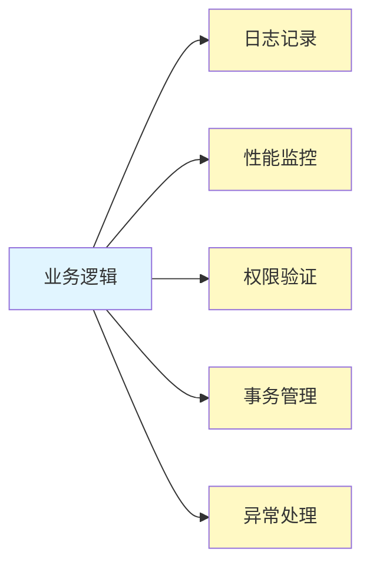
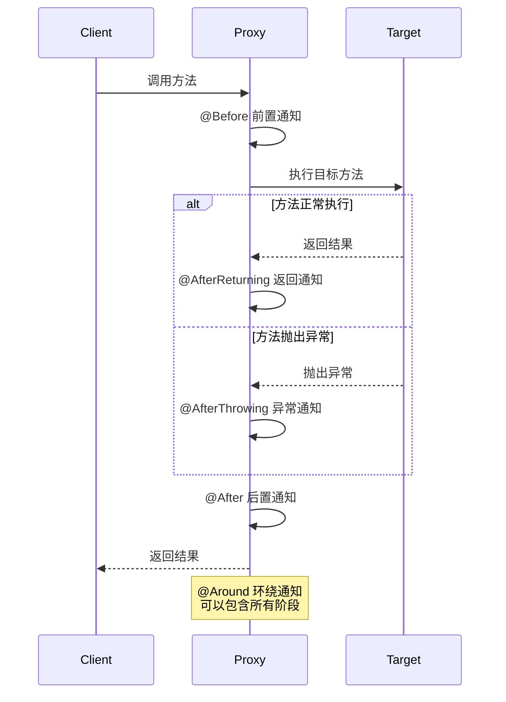

# AOP 面向切面编程

> [!TIP]
> **AOP 的威力**: AOP 让你能够在不修改业务代码的情况下，为应用添加日志、性能监控、权限控制、事务管理等横切关注点，实现代码的解耦和复用。

## AOP 核心概念

### 什么是 AOP？

**AOP (Aspect-Oriented Programming)** 面向切面编程是一种编程范式，它允许我们将横切关注点（Cross-cutting Concerns）从业务逻辑中分离出来。



### 核心术语

| 术语 | 说明 | 示例 |
|------|------|------|
| **Aspect（切面）** | 横切关注点的模块化 | 日志切面、性能监控切面 |
| **Join Point（连接点）** | 程序执行的某个点 | 方法调用、方法执行 |
| **Pointcut（切点）** | 连接点的集合 | 所有 Controller 方法 |
| **Advice（通知）** | 在切点执行的动作 | Before、After、Around |
| **Target（目标对象）** | 被代理的对象 | 业务服务类 |
| **Weaving（织入）** | 将切面应用到目标对象 | 编译期、类加载期、运行期 |

### 通知类型



## 启用 AOP

### 依赖

```xml
<dependency>
    <groupId>org.springframework.boot</groupId>
    <artifactId>spring-boot-starter-aop</artifactId>
</dependency>
```

### 启用配置

Spring Boot 自动启用 AOP，无需额外配置。如需手动启用：

```java
import org.springframework.context.annotation.Configuration;
import org.springframework.context.annotation.EnableAspectJAutoProxy;

@Configuration
@EnableAspectJAutoProxy
public class AopConfig {
}
```

## 创建切面

### 基本切面

```java
package com.example.aspect;

import org.aspectj.lang.annotation.Aspect;
import org.aspectj.lang.annotation.Before;
import org.aspectj.lang.annotation.After;
import org.aspectj.lang.annotation.AfterReturning;
import org.aspectj.lang.annotation.AfterThrowing;
import org.aspectj.lang.annotation.Around;
import org.aspectj.lang.ProceedingJoinPoint;
import org.aspectj.lang.JoinPoint;
import org.springframework.stereotype.Component;
import lombok.extern.slf4j.Slf4j;

@Aspect
@Component
@Slf4j
public class LoggingAspect {
    
    // 前置通知
    @Before("execution(* com.example.service.*.*(..))")
    public void logBefore(JoinPoint joinPoint) {
        log.info("执行方法: {}", joinPoint.getSignature().getName());
        log.info("方法参数: {}", joinPoint.getArgs());
    }
    
    // 后置通知（无论方法是否成功）
    @After("execution(* com.example.service.*.*(..))")
    public void logAfter(JoinPoint joinPoint) {
        log.info("方法执行完成: {}", joinPoint.getSignature().getName());
    }
    
    // 返回通知（方法正常返回后）
    @AfterReturning(
        pointcut = "execution(* com.example.service.*.*(..))",
        returning = "result"
    )
    public void logAfterReturning(JoinPoint joinPoint, Object result) {
        log.info("方法返回值: {}", result);
    }
    
    // 异常通知（方法抛出异常后）
    @AfterThrowing(
        pointcut = "execution(* com.example.service.*.*(..))",
        throwing = "error"
    )
    public void logAfterThrowing(JoinPoint joinPoint, Throwable error) {
        log.error("方法抛出异常: {}, 异常信息: {}", 
            joinPoint.getSignature().getName(), error.getMessage());
    }
}
```

### 环绕通知（最强大）

```java
@Aspect
@Component
@Slf4j
public class PerformanceAspect {
    
    @Around("execution(* com.example.service.*.*(..))")
    public Object logExecutionTime(ProceedingJoinPoint joinPoint) throws Throwable {
        long startTime = System.currentTimeMillis();
        
        String className = joinPoint.getTarget().getClass().getSimpleName();
        String methodName = joinPoint.getSignature().getName();
        
        log.info("开始执行: {}.{}", className, methodName);
        
        try {
            // 执行目标方法
            Object result = joinPoint.proceed();
            
            long executionTime = System.currentTimeMillis() - startTime;
            log.info("执行完成: {}.{}, 耗时: {}ms", 
                className, methodName, executionTime);
            
            return result;
        } catch (Throwable ex) {
            long executionTime = System.currentTimeMillis() - startTime;
            log.error("执行异常: {}.{}, 耗时: {}ms, 异常: {}", 
                className, methodName, executionTime, ex.getMessage());
            throw ex;
        }
    }
}
```

## 切点表达式

### 基本语法

```java
// execution 表达式语法
execution(modifiers? return-type declaring-type? method-name(params) throws?)
```

### 常用切点表达式

```java
@Aspect
@Component
public class PointcutExpressions {
    
    // 1. 匹配所有 public 方法
    @Pointcut("execution(public * *(..))")
    public void allPublicMethods() {}
    
    // 2. 匹配特定包下的所有方法
    @Pointcut("execution(* com.example.service.*.*(..))")
    public void serviceLayer() {}
    
    // 3. 匹配特定包及其子包下的所有方法
    @Pointcut("execution(* com.example.service..*.*(..))")
    public void serviceLayerAndSubPackages() {}
    
    // 4. 匹配特定类的所有方法
    @Pointcut("execution(* com.example.service.UserService.*(..))")
    public void userServiceMethods() {}
    
    // 5. 匹配特定方法名
    @Pointcut("execution(* com.example.service.*.save*(..))")
    public void saveMethods() {}
    
    // 6. 匹配特定参数类型
    @Pointcut("execution(* com.example.service.*.*(Long, ..))")
    public void methodsWithLongFirstParam() {}
    
    // 7. 匹配特定返回类型
    @Pointcut("execution(com.example.entity.User com.example.service.*.*(..))")
    public void methodsReturningUser() {}
    
    // 8. 组合切点（使用 && || !）
    @Pointcut("serviceLayer() && !saveMethods()")
    public void serviceLayerExceptSave() {}
    
    // 9. 匹配带有特定注解的方法
    @Pointcut("@annotation(com.example.annotation.LogExecutionTime)")
    public void annotatedWithLogExecutionTime() {}
    
    // 10. 匹配带有特定注解的类中的所有方法
    @Pointcut("@within(org.springframework.stereotype.Service)")
    public void inServiceAnnotatedClass() {}
    
    // 11. 匹配特定注解的参数
    @Pointcut("execution(* com.example.service.*.*(..)) && args(user,..)")
    public void methodsWithUserParam(User user) {}
}
```

### within 和 target

```java
// within - 匹配特定类型内的方法执行
@Pointcut("within(com.example.service.*)")
public void withinServicePackage() {}

// target - 匹配特定类型的代理对象
@Pointcut("target(com.example.service.UserService)")
public void targetUserService() {}

// this - 匹配特定类型的 Spring AOP 代理
@Pointcut("this(com.example.service.UserService)")
public void thisUserService() {}
```

## 实战场景

### 1. 统一日志记录

```java
@Aspect
@Component
@Slf4j
public class LoggingAspect {
    
    @Around("@annotation(org.springframework.web.bind.annotation.RequestMapping) " +
            "|| @annotation(org.springframework.web.bind.annotation.GetMapping) " +
            "|| @annotation(org.springframework.web.bind.annotation.PostMapping) " +
            "|| @annotation(org.springframework.web.bind.annotation.PutMapping) " +
            "|| @annotation(org.springframework.web.bind.annotation.DeleteMapping)")
    public Object logApiCalls(ProceedingJoinPoint joinPoint) throws Throwable {
        HttpServletRequest request = 
            ((ServletRequestAttributes) RequestContextHolder.currentRequestAttributes())
                .getRequest();
        
        String uri = request.getRequestURI();
        String method = request.getMethod();
        String ip = getClientIp(request);
        
        log.info("API调用开始 - URI: {}, Method: {}, IP: {}, Args: {}", 
            uri, method, ip, joinPoint.getArgs());
        
        long startTime = System.currentTimeMillis();
        Object result = joinPoint.proceed();
        long duration = System.currentTimeMillis() - startTime;
        
        log.info("API调用完成 - URI: {}, 耗时: {}ms", uri, duration);
        
        return result;
    }
    
    private String getClientIp(HttpServletRequest request) {
        String ip = request.getHeader("X-Forwarded-For");
        if (ip == null || ip.isEmpty()) {
            ip = request.getRemoteAddr();
        }
        return ip;
    }
}
```

### 2. 性能监控

```java
@Aspect
@Component
@Slf4j
public class PerformanceMonitorAspect {
    
    private static final long SLOW_THRESHOLD = 1000; // 1秒
    
    @Around("@within(org.springframework.stereotype.Service)")
    public Object monitorPerformance(ProceedingJoinPoint joinPoint) throws Throwable {
        String methodName = joinPoint.getSignature().toShortString();
        long startTime = System.currentTimeMillis();
        
        try {
            Object result = joinPoint.proceed();
            long executionTime = System.currentTimeMillis() - startTime;
            
            if (executionTime > SLOW_THRESHOLD) {
                log.warn("慢方法警告 - {}, 执行时间: {}ms", methodName, executionTime);
                // 可以发送告警、记录到监控系统等
            } else {
                log.debug("方法执行 - {}, 执行时间: {}ms", methodName, executionTime);
            }
            
            return result;
        } catch (Throwable ex) {
            long executionTime = System.currentTimeMillis() - startTime;
            log.error("方法异常 - {}, 执行时间: {}ms", methodName, executionTime, ex);
            throw ex;
        }
    }
}
```

### 3. 权限控制

```java
// 自定义注解
@Target(ElementType.METHOD)
@Retention(RetentionPolicy.RUNTIME)
public @interface RequirePermission {
    String value();
}

// AOP 切面
@Aspect
@Component
@Slf4j
public class PermissionAspect {
    
    @Autowired
    private UserService userService;
    
    @Before("@annotation(requirePermission)")
    public void checkPermission(JoinPoint joinPoint, RequirePermission requirePermission) {
        String requiredPermission = requirePermission.value();
        
        // 获取当前用户
        String currentUser = SecurityContextHolder.getContext()
            .getAuthentication().getName();
        
        // 检查权限
        if (!userService.hasPermission(currentUser, requiredPermission)) {
            log.warn("用户 {} 尝试访问需要 {} 权限的方法 {}", 
                currentUser, requiredPermission, joinPoint.getSignature().getName());
            throw new AccessDeniedException("权限不足");
        }
        
        log.info("权限验证通过 - 用户: {}, 权限: {}", currentUser, requiredPermission);
    }
}

// 使用示例
@Service
public class AdminService {
    
    @RequirePermission("ADMIN")
    public void deleteUser(Long userId) {
        // 只有拥有 ADMIN 权限的用户才能执行
    }
}
```

### 4. 异常处理与重试

```java
@Aspect
@Component
@Slf4j
public class RetryAspect {
    
    private static final int MAX_RETRIES = 3;
    
    @Around("@annotation(com.example.annotation.Retry)")
    public Object retry(ProceedingJoinPoint joinPoint) throws Throwable {
        int attempts = 0;
        Throwable lastException = null;
        
        while (attempts < MAX_RETRIES) {
            try {
                attempts++;
                log.info("第 {} 次尝试执行方法: {}", 
                    attempts, joinPoint.getSignature().getName());
                
                return joinPoint.proceed();
                
            } catch (Exception ex) {
                lastException = ex;
                log.warn("第 {} 次执行失败: {}", attempts, ex.getMessage());
                
                if (attempts < MAX_RETRIES) {
                    Thread.sleep(1000 * attempts); // 递增等待时间
                }
            }
        }
        
        log.error("方法执行失败，已重试 {} 次", MAX_RETRIES);
        throw lastException;
    }
}

// 自定义重试注解
@Target(ElementType.METHOD)
@Retention(RetentionPolicy.RUNTIME)
public @interface Retry {
    int maxAttempts() default 3;
    long delay() default 1000;
}
```

### 5. 缓存切面

```java
@Aspect
@Component
@Slf4j
public class CacheAspect {
    
    private final Map<String, Object> cache = new ConcurrentHashMap<>();
    
    @Around("@annotation(cacheable)")
    public Object cache(ProceedingJoinPoint joinPoint, Cacheable cacheable) throws Throwable {
        String key = generateKey(joinPoint);
        
        // 尝试从缓存获取
        if (cache.containsKey(key)) {
            log.info("缓存命中 - Key: {}", key);
            return cache.get(key);
        }
        
        // 执行方法并缓存结果
        Object result = joinPoint.proceed();
        cache.put(key, result);
        log.info("缓存结果 - Key: {}", key);
        
        return result;
    }
    
    private String generateKey(ProceedingJoinPoint joinPoint) {
        return joinPoint.getSignature().toString() + 
               Arrays.toString(joinPoint.getArgs());
    }
}

// 使用 Spring 自带的 @Cacheable 更好
@Service
public class UserService {
    
    @Cacheable("users")
    public User findById(Long id) {
        // 方法会被缓存
        return userRepository.findById(id).orElse(null);
    }
}
```

### 6. 参数验证

```java
@Aspect
@Component
@Slf4j
public class ValidationAspect {
    
    @Before("execution(* com.example.service.*.*(..)) && args(user,..)")
    public void validateUser(JoinPoint joinPoint, User user) {
        if (user == null) {
            throw new IllegalArgumentException("User cannot be null");
        }
        
        if (user.getUsername() == null || user.getUsername().isEmpty()) {
            throw new IllegalArgumentException("Username cannot be empty");
        }
        
        if (user.getEmail() == null || !user.getEmail().contains("@")) {
            throw new IllegalArgumentException("Invalid email format");
        }
        
        log.info("参数验证通过 - User: {}", user.getUsername());
    }
}
```

### 7. 数据脱敏

```java
@Aspect
@Component
@Slf4j
public class DataMaskingAspect {
    
    @AfterReturning(
        pointcut = "execution(* com.example.service.UserService.findById(..))",
        returning = "user"
    )
    public void maskSensitiveData(User user) {
        if (user != null) {
            // 脱敏手机号：138****1234
            if (user.getPhone() != null) {
                user.setPhone(maskPhone(user.getPhone()));
            }
            
            // 脱敏身份证：340***********1234
            if (user.getIdCard() != null) {
                user.setIdCard(maskIdCard(user.getIdCard()));
            }
            
            log.info("敏感数据已脱敏 - User ID: {}", user.getId());
        }
    }
    
    private String maskPhone(String phone) {
        if (phone.length() == 11) {
            return phone.substring(0, 3) + "****" + phone.substring(7);
        }
        return phone;
    }
    
    private String maskIdCard(String idCard) {
        if (idCard.length() == 18) {
            return idCard.substring(0, 3) + "***********" + idCard.substring(14);
        }
        return idCard;
    }
}
```

## 自定义注解 + AOP

### 定义注解

```java
@Target(ElementType.METHOD)
@Retention(RetentionPolicy.RUNTIME)
@Documented
public @interface LogExecutionTime {
    String description() default "";
}

@Target(ElementType.METHOD)
@Retention(RetentionPolicy.RUNTIME)
@Documented
public @interface AuditLog {
    String operation();
    String module();
}
```

### 实现切面

```java
@Aspect
@Component
@Slf4j
public class CustomAnnotationAspect {
    
    // 处理 @LogExecutionTime
    @Around("@annotation(logExecutionTime)")
    public Object logTime(ProceedingJoinPoint joinPoint, 
                         LogExecutionTime logExecutionTime) throws Throwable {
        long startTime = System.currentTimeMillis();
        String description = logExecutionTime.description();
        
        log.info("开始执行: {}", description.isEmpty() ? 
            joinPoint.getSignature().getName() : description);
        
        Object result = joinPoint.proceed();
        
        long duration = System.currentTimeMillis() - startTime;
        log.info("执行完成: {}, 耗时: {}ms", description, duration);
        
        return result;
    }
    
    // 处理 @AuditLog
    @AfterReturning(
        pointcut = "@annotation(auditLog)",
        returning = "result"
    )
    public void auditLog(JoinPoint joinPoint, AuditLog auditLog, Object result) {
        String username = SecurityContextHolder.getContext()
            .getAuthentication().getName();
        
        AuditLogEntity log = AuditLogEntity.builder()
            .username(username)
            .operation(auditLog.operation())
            .module(auditLog.module())
            .method(joinPoint.getSignature().getName())
            .args(Arrays.toString(joinPoint.getArgs()))
            .result(result != null ? result.toString() : null)
            .timestamp(LocalDateTime.now())
            .build();
        
        // 保存审计日志
        auditLogRepository.save(log);
    }
}
```

### 使用注解

```java
@Service
public class UserService {
    
    @LogExecutionTime(description = "查找用户")
    @AuditLog(operation = "查询", module = "用户管理")
    public User findById(Long id) {
        return userRepository.findById(id).orElse(null);
    }
    
    @LogExecutionTime(description = "创建用户")
    @AuditLog(operation = "创建", module = "用户管理")
    @RequirePermission("USER_CREATE")
    public User createUser(User user) {
        return userRepository.save(user);
    }
}
```

## 切面执行顺序

### 使用 @Order

```java
@Aspect
@Component
@Order(1) // 数字越小，优先级越高
public class FirstAspect {
    @Before("execution(* com.example.service.*.*(..))")
    public void before() {
        log.info("第一个切面 - Before");
    }
}

@Aspect
@Component
@Order(2)
public class SecondAspect {
    @Before("execution(* com.example.service.*.*(..))")
    public void before() {
        log.info("第二个切面 - Before");
    }
}
```

执行结果：

```
第一个切面 - Before
第二个切面 - Before
目标方法执行
```

## 注意事项

> [!WARNING]
> **AOP 的局限性**：
>
> 1. **自调用问题** - 同一个类内部方法调用不会触发 AOP（因为没有经过代理）
> 2. **性能开销** - 过度使用 AOP 会影响性能
> 3. **调试困难** - AOP 代码不直观，需要理解代理机制
> 4. **private/final 方法** - 无法被代理，AOP 不生效

### 解决自调用问题

```java
@Service
public class UserService {
    
    @Autowired
    private ApplicationContext context;
    
    public void method1() {
        // 错误：直接调用不会触发 AOP
        this.method2();
        
        // 正确：通过代理对象调用
        UserService proxy = context.getBean(UserService.class);
        proxy.method2();
    }
    
    @LogExecutionTime
    public void method2() {
        // ...
    }
}
```

## 最佳实践

1. **精确的切点表达式** - 避免过于宽泛的切点，影响性能
2. **合理使用通知类型** - 优先使用更精确的通知类型（Before/After）而非 Around
3. **异常处理** - 在 Around 通知中正确处理异常
4. **避免状态** - 切面应该是无状态的
5. **文档注释** - 为切面和切点添加清晰的注释
6. **性能监控** - 监控 AOP 对性能的影响

## 总结

- **AOP 核心概念** - Aspect、Pointcut、Advice、JoinPoint
- **通知类型** - Before、After、AfterReturning、AfterThrowing、Around
- **切点表达式** - execution、within、target、@annotation
- **实战场景** - 日志、性能监控、权限控制、异常处理
- **自定义注解** - 注解 + AOP 实现优雅的横切逻辑

下一步学习 [事务管理](./transaction)。
