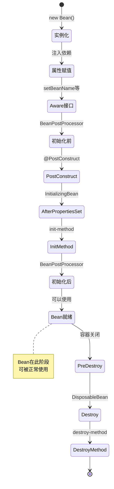

# 核心概念

## Spring Boot 是什么？

Spring Boot 是一个基于 Spring Framework 的快速开发框架，旨在简化 Spring 应用的初始搭建和开发过程。它通过约定优于配置的原则，让开发者能够快速创建生产级别的应用程序。

> [!IMPORTANT]
> **Spring Boot 的核心价值**: 通过自动配置和约定优于配置的设计理念，让开发者专注于业务逻辑而非繁琐的配置工作。

### 核心特性

1. **开箱即用** - 自动配置绝大多数常用功能
2. **独立运行** - 内嵌应用服务器，无需部署 WAR 文件
3. **零配置** - 通过约定和默认值消除样板代码
4. **生产级特性** - 内置监控、管理、安全等特性
5. **微服务友好** - 与 Spring Cloud 无缝集成

## 核心原理

### 1. @SpringBootApplication

```java
@SpringBootApplication
public class Application {
    public static void main(String[] args) {
        SpringApplication.run(Application.class, args);
    }
}
```

`@SpringBootApplication` 是一个组合注解，等价于：

```java
@Configuration
@EnableAutoConfiguration
@ComponentScan
public class Application {
    // ...
}
```

- `@Configuration` - 标记为配置类
- `@EnableAutoConfiguration` - 启用自动配置
- `@ComponentScan` - 组件扫描

### 2. 自动配置机制

Spring Boot 使用 `@ConditionalOnClass`、`@ConditionalOnProperty` 等条件注解实现自动配置：

```java
@Configuration
@ConditionalOnClass(DataSource.class)
@ConditionalOnProperty(name = "spring.datasource.url")
public class DataSourceAutoConfiguration {
    
    @Bean
    @ConditionalOnMissingBean
    public DataSource dataSource() {
        // 自动创建数据源
        return createDataSource();
    }
}
```

### 3. Spring Application

`SpringApplication` 类负责应用启动：

```java
// 基本用法
SpringApplication.run(Application.class, args);

// 自定义配置
SpringApplication app = new SpringApplication(Application.class);
app.setWebEnvironmentType(WebApplicationType.SERVLET);
app.run(args);

// 使用构建器
SpringApplication.from(Application.class)
    .with(new CustomConfiguration())
    .run(args);
```

## 应用生命周期

```mermaid
sequenceDiagram
    participant Main as main()
    participant App as SpringApplication
    participant Context as ApplicationContext
    participant AutoConfig as AutoConfiguration
    participant Runners as Runners
    
    Main->>App: run()
    App->>App: 加载配置和属性
    App->>Context: 创建ApplicationContext
    Context->>AutoConfig: 自动配置Beans
    AutoConfig-->>Context: Beans就绪
    Context->>Runners: 调用Runners
    Note over Runners: ApplicationRunner<br/>CommandLineRunner
    Runners-->>App: 启动完成
    App-->>Main: 应用运行中
    
    style App fill:#e1f5ff
    style Context fill:#c8e6c9
    style AutoConfig fill:#fff9c4
```

> [!NOTE]
> **启动流程说明:**
>
> 1. `SpringApplication.run()` 触发启动流程
> 2. 加载 application.properties/yml 配置
> 3. 创建并刷新 ApplicationContext
> 4. 执行自动配置，创建所需的 Beans
> 5. 调用 ApplicationRunner 和 CommandLineRunner
> 6. 应用启动完成，开始接收请求

## 配置体系

### 配置文件加载顺序

1. `application.properties` / `application.yml` （项目根目录）
2. `application-{profile}.properties` / `application-{profile}.yml` （指定环境）
3. 环境变量
4. 命令行参数
5. 系统属性

### 配置优先级（高到低）

```
命令行参数
  ↓
系统环境变量
  ↓
application-{profile}.properties
  ↓
application.properties
  ↓
默认值
```

### 配置示例

`application.properties`:

```properties
server.port=8080
server.servlet.context-path=/api
spring.datasource.url=jdbc:mysql://localhost:3306/mydb
spring.datasource.username=root
spring.datasource.password=password
spring.jpa.hibernate.ddl-auto=update
logging.level.root=INFO
```

`application.yml`:

```yaml
server:
  port: 8080
  servlet:
    context-path: /api

spring:
  datasource:
    url: jdbc:mysql://localhost:3306/mydb
    username: root
    password: password
  jpa:
    hibernate:
      ddl-auto: update

logging:
  level:
    root: INFO
```

## Profile（环境隔离）

### 使用 Profile

创建 `application-dev.properties` 和 `application-prod.properties`：

```properties
# application-dev.properties
server.port=8080
logging.level.root=DEBUG
spring.datasource.url=jdbc:mysql://localhost:3306/mydb_dev

# application-prod.properties
server.port=8443
logging.level.root=WARN
spring.datasource.url=jdbc:mysql://prod-db:3306/mydb
```

激活 Profile：

```bash
# 命令行
java -jar app.jar --spring.profiles.active=prod

# 环境变量
export SPRING_PROFILES_ACTIVE=prod

# application.properties
spring.profiles.active=dev
```

### Profile 相关代码

```java
@Configuration
@Profile("dev")
public class DevConfig {
    // 开发环境配置
}

@Configuration
@Profile("prod")
public class ProdConfig {
    // 生产环境配置
}

@Component
public class EnvironmentService {
    
    @Autowired
    private Environment environment;
    
    public void printActiveProfile() {
        String[] profiles = environment.getActiveProfiles();
        System.out.println("Active profiles: " + Arrays.toString(profiles));
    }
}
```

## 核心注解

| 注解 | 说明 |
|------|------|
| `@SpringBootApplication` | 启动类注解 |
| `@Configuration` | 配置类 |
| `@Bean` | 定义 Bean |
| `@Component` | 组件 |
| `@Service` | 服务类 |
| `@Repository` | 数据访问层 |
| `@Controller` | 控制层 |
| `@RestController` | RESTful 控制器 |
| `@RequestMapping` | 请求映射 |
| `@GetMapping` | GET 请求映射 |
| `@PostMapping` | POST 请求映射 |
| `@Autowired` | 自动注入 |
| `@Value` | 注入配置值 |
| `@ConfigurationProperties` | 配置属性类 |
| `@Profile` | 环境配置 |
| `@Conditional` | 条件装配 |

## 依赖注入

### 构造器注入（推荐）

```java
@Service
public class UserService {
    private final UserRepository userRepository;
    
    // 构造器注入
    public UserService(UserRepository userRepository) {
        this.userRepository = userRepository;
    }
}
```

### Setter 注入

```java
@Service
public class UserService {
    private UserRepository userRepository;
    
    @Autowired
    public void setUserRepository(UserRepository userRepository) {
        this.userRepository = userRepository;
    }
}
```

### 字段注入

```java
@Service
public class UserService {
    @Autowired
    private UserRepository userRepository;
}
```

## Bean 的生命周期



> [!TIP]
> **生命周期回调顺序记忆法:**
>
> - **初始化**: @PostConstruct → InitializingBean → init-method
> - **销毁**: @PreDestroy → DisposableBean → destroy-method
> - 推荐使用 @PostConstruct 和 @PreDestroy 注解（JSR-250标准）

### 生命周期示例

```java
@Component
public class BeanLifecycleDemo implements InitializingBean, DisposableBean {
    
    @PostConstruct
    public void init() {
        System.out.println("@PostConstruct 初始化");
    }
    
    @Override
    public void afterPropertiesSet() throws Exception {
        System.out.println("InitializingBean 初始化");
    }
    
    @PreDestroy
    public void preDestroy() {
        System.out.println("@PreDestroy 销毁");
    }
    
    @Override
    public void destroy() throws Exception {
        System.out.println("DisposableBean 销毁");
    }
}
```

## 条件装配

```java
// 条件注解
@Bean
@ConditionalOnClass(DataSource.class)
public DataSource dataSource() {
    // 当 classpath 中存在 DataSource 类时，创建该 Bean
}

@Bean
@ConditionalOnProperty(name = "app.cache.enabled", havingValue = "true")
public CacheManager cacheManager() {
    // 当配置属性 app.cache.enabled=true 时，创建该 Bean
}

@Bean
@ConditionalOnMissingBean
public UserService userService() {
    // 当不存在 UserService Bean 时，创建该 Bean
}
```

## 核心流程

```java
public class SpringApplication {
    
    public static void main(String[] args) {
        // 1. 创建 SpringApplication 实例
        SpringApplication app = new SpringApplication(Application.class);
        
        // 2. 加载配置
        app.setDefaultProperties(properties);
        
        // 3. 运行应用
        ConfigurableApplicationContext context = app.run(args);
        
        // 4. 获取 Bean
        UserService userService = context.getBean(UserService.class);
        
        // 5. 使用 Bean
        userService.doSomething();
    }
}
```

## 总结

Spring Boot 通过以下机制简化了应用开发：

1. **自动配置** - 智能检测并配置常用功能
2. **约定优于配置** - 遵循约定消除大量配置代码
3. **嵌入式服务器** - 无需外部应用服务器
4. **开箱即用** - 完整的生产级特性
5. **灵活可扩展** - 支持自定义配置和扩展

下一步学习 [自动配置详解](/docs/springboot/auto-configuration)。
