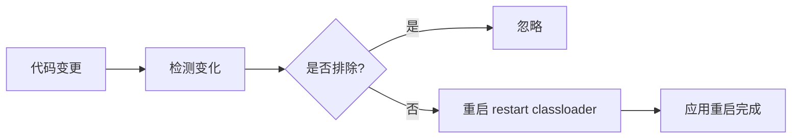

# 开发者工具（DevTools）

> [!TIP] > **DevTools 的作用**: Spring Boot DevTools 提供了快速重启、LiveReload、远程调试等功能，大幅提升开发效率。生产环境会自动禁用 DevTools。

## 添加依赖

```xml
<dependency>
    <groupId>org.springframework.boot</groupId>
    <artifactId>spring-boot-devtools</artifactId>
    <scope>runtime</scope>
    <optional>true</optional>
</dependency>
```

> [!NOTE] > **为什么使用 `optional`？**
> 设置 `<optional>true</optional>` 可以防止 DevTools 被传递到依赖此项目的其他模块，确保只在开发时使用。

**Gradle 配置**：

```groovy
dependencies {
    developmentOnly 'org.springframework.boot:spring-boot-devtools'
}
```

## 核心功能

### 1. 属性默认值

DevTools 会自动应用一些开发友好的属性默认值：

| 属性                                | 默认值   | 说明                 |
| ----------------------------------- | -------- | -------------------- |
| `spring.thymeleaf.cache`            | `false`  | 禁用模板缓存         |
| `spring.freemarker.cache`           | `false`  | 禁用 FreeMarker 缓存 |
| `spring.mustache.cache`             | `false`  | 禁用 Mustache 缓存   |
| `spring.groovy.template.cache`      | `false`  | 禁用 Groovy 模板缓存 |
| `server.error.include-stacktrace`   | `always` | 显示完整堆栈跟踪     |
| `server.servlet.session.persistent` | `true`   | 重启后保持会话       |

### 2. 自动重启

当 classpath 文件发生变化时，应用会自动重启。

```yaml
spring:
  devtools:
    restart:
      enabled: true
      additional-paths: src/main/resources
      exclude: static/**,public/**,META-INF/maven/**,META-INF/resources/**
      poll-interval: 1s
      quiet-period: 400ms
```

**配置说明**：

| 配置项             | 说明                 |
| ------------------ | -------------------- |
| `enabled`          | 是否启用自动重启     |
| `additional-paths` | 额外监控的路径       |
| `exclude`          | 排除不触发重启的路径 |
| `poll-interval`    | 轮询间隔             |
| `quiet-period`     | 检测到变化后的静默期 |

**工作原理**：



- DevTools 使用两个类加载器
- **base classloader**: 加载不变的类（第三方 jar）
- **restart classloader**: 加载开发中的类
- 重启时只重新创建 restart classloader，速度快

### 3. 触发文件

可以配置触发文件，只有当该文件被修改时才触发重启：

```yaml
spring:
  devtools:
    restart:
      trigger-file: .reloadtrigger
```

创建触发文件后，只需修改（touch）该文件即可触发重启：

```bash
# Linux/Mac
touch .reloadtrigger

# Windows
copy /b .reloadtrigger +,,
```

这对于频繁保存但不想每次都重启的场景非常有用。

### 4. LiveReload

自动刷新浏览器页面，无需手动按 F5。

```yaml
spring:
  devtools:
    livereload:
      enabled: true
      port: 35729
```

**安装浏览器插件**：

- **Chrome**: [LiveReload Extension](https://chrome.google.com/webstore/detail/livereload)
- **Firefox**: [LiveReload Add-on](https://addons.mozilla.org/firefox/addon/livereload-web-extension/)
- **Edge**: LiveReload Extension

> [!WARNING]
> 同一时间只能运行一个 LiveReload 服务器。如果多个应用同时启动，只有第一个会启用 LiveReload。

### 5. 全局配置

在用户主目录创建 `.spring-boot-devtools.properties`：

```properties
# Windows: C:\Users\username\.spring-boot-devtools.properties
# Linux/Mac: ~/.spring-boot-devtools.properties

# 全局配置（所有 Spring Boot 项目生效）
spring.devtools.restart.additional-paths=../other-project/src/main/java
spring.devtools.restart.exclude=static/**,public/**
spring.devtools.livereload.enabled=true
```

也可以使用 YAML 格式（`.spring-boot-devtools.yaml`）：

```yaml
spring:
  devtools:
    restart:
      additional-paths: ../other-project/src/main/java
      exclude: static/**,public/**
    livereload:
      enabled: true
```

## 远程开发

DevTools 支持远程开发，可以在远程服务器上运行应用并在本地进行开发。

### 配置远程应用

```yaml
spring:
  devtools:
    remote:
      secret: my-secure-secret-key
      restart:
        enabled: true
      proxy:
        host: 127.0.0.1
        port: 8080
```

> [!CAUTION] > **安全警告**: 远程 DevTools 存在安全风险，切勿在生产环境启用！`secret` 应该使用强密码。

### 启动远程应用

```bash
# 在远程服务器上启动应用
java -jar myapp.jar --spring.devtools.remote.secret=my-secure-secret-key
```

### 连接远程应用

**方法一：使用 IDE**

在 IntelliJ IDEA 中创建启动配置：

1. **Run** → **Edit Configurations**
2. 添加 **Application**
3. **Main class**: `org.springframework.boot.devtools.RemoteSpringApplication`
4. **Program arguments**: `http://远程服务器地址:端口`
5. 设置环境变量或系统属性：`spring.devtools.remote.secret=my-secure-secret-key`

**方法二：使用命令行**

```bash
java -cp myapp.jar \
  -Dspring.devtools.remote.secret=my-secure-secret-key \
  org.springframework.boot.devtools.RemoteSpringApplication \
  http://remote-server:8080
```

### 远程文件更新

远程 DevTools 可以推送本地代码变更到远程服务器：

```
本地开发 → 检测变更 → 推送到远程 → 远程重启
```

## IDE 配置

### IntelliJ IDEA

**启用自动编译**：

1. **Settings** → **Build, Execution, Deployment** → **Compiler**
2. 勾选 **Build project automatically**

**启用运行时自动编译**（IDEA 2021.2+）：

1. **Settings** → **Advanced Settings**
2. 勾选 **Allow auto-make to start even if developed application is currently running**

**旧版本 IDEA**：

1. **Help** → **Find Action** (Ctrl+Shift+A / Cmd+Shift+A)
2. 搜索 **Registry**
3. 勾选 **compiler.automake.allow.when.app.running**

### VS Code

在 `.vscode/settings.json` 中添加：

```json
{
  "java.autobuild.enabled": true,
  "java.compile.nullAnalysis.mode": "automatic"
}
```

安装推荐扩展：

- **Language Support for Java(TM) by Red Hat**
- **Spring Boot Extension Pack**

### Eclipse

Eclipse 默认启用了自动编译，无需额外配置。确保：

- **Project** → **Build Automatically** 已勾选

## 禁用 DevTools

### 完全禁用

```yaml
spring:
  devtools:
    restart:
      enabled: false
    livereload:
      enabled: false
```

### 使用系统属性禁用

```bash
java -Dspring.devtools.restart.enabled=false -jar myapp.jar
```

### 生产环境自动禁用

DevTools 在以下情况自动禁用：

1. 使用 `java -jar` 运行打包的 JAR
2. 从特殊类加载器（如大多数应用服务器）启动
3. 设置 `spring.devtools.restart.enabled=false`

## 常见问题

### Q: DevTools 不生效？

**可能的原因**：

1. **依赖未正确添加** - 检查 pom.xml 或 build.gradle
2. **IDE 未启用自动编译** - 按上述配置 IDE
3. **生产环境运行** - DevTools 在生产环境自动禁用

### Q: 重启太慢？

**优化方案**：

```yaml
spring:
  devtools:
    restart:
      # 排除不需要监控的路径
      exclude: static/**,public/**,templates/**
      # 使用触发文件
      trigger-file: .reloadtrigger
```

### Q: 类加载器问题？

某些库可能与 DevTools 的双类加载器不兼容。解决方案：

```properties
# 在 META-INF/spring-devtools.properties 中配置
restart.include.my-lib=/my-lib-[\w\d-.]+\.jar
restart.exclude.companycommons=/company-[\w\d-.]+\.jar
```

### Q: 与 Lombok 冲突？

使用最新版本的 Lombok 和 DevTools 通常不会有问题。如有问题：

1. 更新 Lombok 到最新版本
2. 确保 IDE 安装了 Lombok 插件

## 最佳实践

> [!TIP] > **DevTools 使用技巧**：
>
> 1. **仅在开发环境使用** - 生产环境自动禁用
> 2. **合理配置排除路径** - 排除静态资源、配置文件等
> 3. **使用触发文件** - 避免频繁不必要的重启
> 4. **配合 LiveReload** - 前端开发时自动刷新浏览器
> 5. **IDE 正确配置** - 确保自动编译已启用
> 6. **远程开发谨慎使用** - 注意安全风险

## 完整配置示例

```yaml
spring:
  devtools:
    # 自动重启配置
    restart:
      enabled: true
      poll-interval: 1s
      quiet-period: 400ms
      additional-paths:
        - src/main/resources
      exclude:
        - static/**
        - public/**
        - META-INF/maven/**
        - META-INF/resources/**
        - "**/*.html"
        - "**/*.css"
        - "**/*.js"
      # trigger-file: .reloadtrigger

    # LiveReload 配置
    livereload:
      enabled: true
      port: 35729

    # 远程开发配置（仅开发环境）
    # remote:
    #   secret: my-secure-secret-key
```

## 总结

| 功能           | 说明                 | 适用场景     |
| -------------- | -------------------- | ------------ |
| **属性默认值** | 自动禁用模板缓存等   | 模板开发     |
| **自动重启**   | 修改代码自动重启应用 | 后端开发     |
| **LiveReload** | 自动刷新浏览器       | 前端开发     |
| **触发文件**   | 按需触发重启         | 频繁保存场景 |
| **远程开发**   | 调试远程应用         | 远程调试     |

📖 **下一步学习**：[快速参考](/docs/springboot/quick-reference) - 常用注解和配置速查
