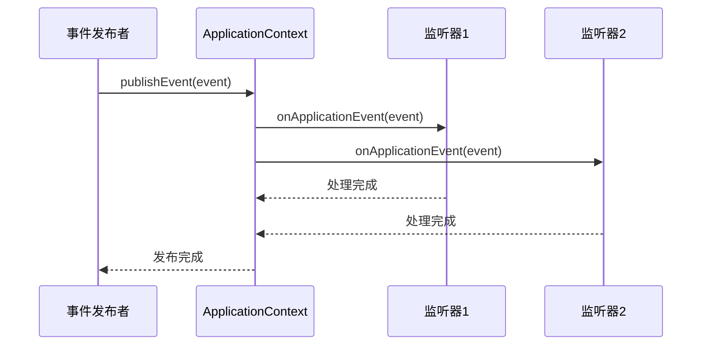

# 事件机制

> [!TIP]
> **事件驱动的优势**: 事件机制能够有效解耦业务逻辑，让不同模块之间通过事件进行通信，提高代码的可维护性和可扩展性。

## Spring 事件模型

Spring 提供了一套完整的事件发布-订阅机制，基于观察者模式实现。



## 基本用法

### 1. 定义事件

```java
import org.springframework.context.ApplicationEvent;
import lombok.Getter;

// 方式1：继承 ApplicationEvent（传统方式）
@Getter
public class UserRegisteredEvent extends ApplicationEvent {
    private final User user;
    
    public UserRegisteredEvent(Object source, User user) {
        super(source);
        this.user = user;
    }
}

// 方式2：使用普通的 POJO（Spring 4.2+，推荐）
@Getter
@AllArgsConstructor
public class OrderCreatedEvent {
    private final Order order;
    private final LocalDateTime createdAt;
}

@Getter
@AllArgsConstructor
public class PaymentCompletedEvent {
    private final Long orderId;
    private final BigDecimal amount;
    private final String paymentMethod;
}
```

### 2. 发布事件

```java
import org.springframework.context.ApplicationEventPublisher;
import org.springframework.stereotype.Service;

@Service
public class UserService {
    
    @Autowired
    private ApplicationEventPublisher eventPublisher;
    
    @Autowired
    private UserRepository userRepository;
    
    public User register(User user) {
        // 1. 保存用户
        User savedUser = userRepository.save(user);
        
        // 2. 发布事件
        eventPublisher.publishEvent(new UserRegisteredEvent(this, savedUser));
        
        return savedUser;
    }
}

@Service
public class OrderService {
    
    @Autowired
    private ApplicationEventPublisher eventPublisher;
    
    @Transactional
    public Order createOrder(Order order) {
        // 1. 创建订单
        Order savedOrder = orderRepository.save(order);
        
        // 2. 发布事件（使用 POJO）
        eventPublisher.publishEvent(
            new OrderCreatedEvent(savedOrder, LocalDateTime.now())
        );
        
        return savedOrder;
    }
    
    public void completePayment(Long orderId, BigDecimal amount, String method) {
        // 处理支付逻辑
        
        // 发布支付完成事件
        eventPublisher.publishEvent(
            new PaymentCompletedEvent(orderId, amount, method)
        );
    }
}
```

### 3. 监听事件

```java
import org.springframework.context.event.EventListener;
import org.springframework.stereotype.Component;
import lombok.extern.slf4j.Slf4j;

@Component
@Slf4j
public class UserEventListener {
    
    @Autowired
    private EmailService emailService;
    
    @Autowired
    private CouponService couponService;
    
    // 方式1：使用 @EventListener 注解（推荐）
    @EventListener
    public void handleUserRegistered(UserRegisteredEvent event) {
        User user = event.getUser();
        log.info("用户注册事件 - 用户: {}", user.getUsername());
        
        // 1. 发送欢迎邮件
        emailService.sendWelcomeEmail(user.getEmail());
        
        // 2. 赠送新用户优惠券
        couponService.giveNewUserCoupon(user.getId());
        
        // 3. 初始化用户积分
        pointService.initializePoints(user.getId());
    }
}

@Component
@Slf4j
public class OrderEventListener {
    
    @EventListener
    public void handleOrderCreated(OrderCreatedEvent event) {
        Order order = event.getOrder();
        log.info("订单创建事件 - 订单ID: {}", order.getId());
        
        // 1. 发送订单确认邮件
        emailService.sendOrderConfirmation(order);
        
        // 2. 更新库存
        inventoryService.reserveStock(order);
        
        // 3. 记录审计日志
        auditService.logOrderCreation(order);
    }
    
    @EventListener
    public void handlePaymentCompleted(PaymentCompletedEvent event) {
        log.info("支付完成事件 - 订单ID: {}, 金额: {}", 
            event.getOrderId(), event.getAmount());
        
        // 1. 更新订单状态
        orderService.updateOrderStatus(event.getOrderId(), OrderStatus.PAID);
        
        // 2. 发送支付成功通知
        notificationService.sendPaymentSuccess(event.getOrderId());
        
        // 3. 触发发货流程
        shippingService.initiateShipping(event.getOrderId());
    }
}
```

### 4. 实现 ApplicationListener 接口（传统方式）

```java
import org.springframework.context.ApplicationListener;
import org.springframework.stereotype.Component;

@Component
@Slf4j
public class TraditionalEventListener implements ApplicationListener<UserRegisteredEvent> {
    
    @Override
    public void onApplicationEvent(UserRegisteredEvent event) {
        User user = event.getUser();
        log.info("传统方式监听 - 用户注册: {}", user.getUsername());
        
        // 处理逻辑
    }
}
```

## 高级特性

### 1. 异步事件监听

```java
@Component
@Slf4j
public class AsyncEventListener {
    
    // 异步处理事件
    @EventListener
    @Async
    public void handleOrderCreatedAsync(OrderCreatedEvent event) {
        log.info("异步处理订单创建事件, 线程: {}", 
            Thread.currentThread().getName());
        
        // 耗时操作：发送邮件、调用外部API等
        emailService.sendOrderConfirmation(event.getOrder());
    }
    
    @EventListener
    @Async("emailExecutor") // 使用指定的线程池
    public void sendEmailAsync(UserRegisteredEvent event) {
        log.info("异步发送欢迎邮件, 线程: {}", 
            Thread.currentThread().getName());
        
        emailService.sendWelcomeEmail(event.getUser().getEmail());
    }
}
```

### 2. 事务事件监听

```java
import org.springframework.transaction.event.TransactionalEventListener;
import org.springframework.transaction.event.TransactionPhase;

@Component
@Slf4j
public class TransactionalEventListener {
    
    // 事务提交后执行（默认）
    @TransactionalEventListener(phase = TransactionPhase.AFTER_COMMIT)
    public void handleOrderCreatedAfterCommit(OrderCreatedEvent event) {
        log.info("事务提交后处理订单创建事件");
        
        // 只有在事务成功提交后才执行
        // 适用于发送通知、调用外部服务等
        emailService.sendOrderConfirmation(event.getOrder());
    }
    
    // 事务回滚后执行
    @TransactionalEventListener(phase = TransactionPhase.AFTER_ROLLBACK)
    public void handleOrderCreationFailed(OrderCreatedEvent event) {
        log.warn("订单创建失败，事务已回滚");
        
        // 记录失败日志、发送告警等
        alertService.sendOrderCreationFailedAlert(event.getOrder());
    }
    
    // 事务完成后执行（无论提交还是回滚）
    @TransactionalEventListener(phase = TransactionPhase.AFTER_COMPLETION)
    public void handleOrderProcessCompleted(OrderCreatedEvent event) {
        log.info("订单处理完成（无论成功或失败）");
        
        // 清理资源、记录统计等
        metricsService.recordOrderProcessing(event.getOrder());
    }
    
    // 事务提交前执行
    @TransactionalEventListener(phase = TransactionPhase.BEFORE_COMMIT)
    public void handleBeforeCommit(OrderCreatedEvent event) {
        log.info("事务提交前处理");
        
        // 在提交前执行的逻辑
        // 注意：此时事务还未提交，如果抛出异常会导致回滚
    }
}
```

### 3. 条件监听

```java
@Component
@Slf4j
public class ConditionalEventListener {
    
    // 使用 SpEL 表达式过滤事件
    @EventListener(condition = "#event.order.amount > 1000")
    public void handleLargeOrder(OrderCreatedEvent event) {
        log.info("大订单事件 - 金额: {}", event.getOrder().getAmount());
        
        // 只处理金额大于1000的订单
        vipService.notifyLargeOrder(event.getOrder());
    }
    
    @EventListener(condition = "#event.user.vip == true")
    public void handleVipUserRegistered(UserRegisteredEvent event) {
        log.info("VIP用户注册事件");
        
        // 只处理VIP用户注册
        vipService.sendVipWelcome(event.getUser());
    }
    
    @EventListener(condition = "#event.order.status.name() == 'COMPLETED'")
    public void handleCompletedOrder(OrderStatusChangedEvent event) {
        log.info("订单完成事件");
        
        // 只处理已完成的订单
        rewardService.giveCompletionReward(event.getOrder());
    }
}
```

### 4. 监听器顺序

```java
import org.springframework.core.annotation.Order;

@Component
@Slf4j
public class OrderedEventListeners {
    
    @EventListener
    @Order(1) // 最先执行
    public void firstListener(OrderCreatedEvent event) {
        log.info("第一个监听器");
    }
    
    @EventListener
    @Order(2)
    public void secondListener(OrderCreatedEvent event) {
        log.info("第二个监听器");
    }
    
    @EventListener
    @Order(3)
    public void thirdListener(OrderCreatedEvent event) {
        log.info("第三个监听器");
    }
}
```

### 5. 泛型事件

```java
// 定义泛型事件
@Getter
@AllArgsConstructor
public class EntityCreatedEvent<T> {
    private final T entity;
    private final LocalDateTime createdAt;
}

// 发布泛型事件
@Service
public class GenericEventPublisher {
    
    @Autowired
    private ApplicationEventPublisher eventPublisher;
    
    public void createUser(User user) {
        userRepository.save(user);
        eventPublisher.publishEvent(
            new EntityCreatedEvent<>(user, LocalDateTime.now())
        );
    }
    
    public void createProduct(Product product) {
        productRepository.save(product);
        eventPublisher.publishEvent(
            new EntityCreatedEvent<>(product, LocalDateTime.now())
        );
    }
}

// 监听特定类型的泛型事件
@Component
@Slf4j
public class GenericEventListener {
    
    @EventListener
    public void handleUserCreated(EntityCreatedEvent<User> event) {
        log.info("用户创建: {}", event.getEntity().getUsername());
    }
    
    @EventListener
    public void handleProductCreated(EntityCreatedEvent<Product> event) {
        log.info("产品创建: {}", event.getEntity().getName());
    }
}
```

## 内置事件

Spring 提供了一些内置的应用上下文事件：

```java
@Component
@Slf4j
public class BuiltInEventListener {
    
    // 应用启动完成
    @EventListener
    public void handleContextRefreshed(ContextRefreshedEvent event) {
        log.info("应用上下文刷新完成");
        // 初始化数据、启动定时任务等
    }
    
    // 应用启动
    @EventListener
    public void handleContextStarted(ContextStartedEvent event) {
        log.info("应用上下文启动");
    }
    
    // 应用停止
    @EventListener
    public void handleContextStopped(ContextStoppedEvent event) {
        log.info("应用上下文停止");
        // 清理资源
    }
    
    // 应用关闭
    @EventListener
    public void handleContextClosed(ContextClosedEvent event) {
        log.info("应用上下文关闭");
        // 保存状态、释放资源等
    }
}
```

## 实战场景

### 1. 用户注册流程解耦

```java
// 传统方式：耦合
@Service
public class UserServiceCoupled {
    public User register(User user) {
        User savedUser = userRepository.save(user);
        
        // 所有逻辑都在这里，高度耦合
        emailService.sendWelcomeEmail(user.getEmail());
        couponService.giveNewUserCoupon(user.getId());
        pointService.initializePoints(user.getId());
        auditService.logUserRegistration(user);
        statisticsService.incrementUserCount();
        
        return savedUser;
    }
}

// 事件驱动方式：解耦
@Service
public class UserServiceDecoupled {
    @Autowired
    private ApplicationEventPublisher eventPublisher;
    
    public User register(User user) {
        User savedUser = userRepository.save(user);
        
        // 只发布事件，具体处理由监听器完成
        eventPublisher.publishEvent(new UserRegisteredEvent(this, savedUser));
        
        return savedUser;
    }
}

// 各个模块独立监听
@Component
class EmailListener {
    @EventListener
    @Async
    public void sendWelcomeEmail(UserRegisteredEvent event) {
        emailService.sendWelcomeEmail(event.getUser().getEmail());
    }
}

@Component
class CouponListener {
    @EventListener
    public void giveCoupon(UserRegisteredEvent event) {
        couponService.giveNewUserCoupon(event.getUser().getId());
    }
}

@Component
class PointListener {
    @EventListener
    public void initializePoints(UserRegisteredEvent event) {
        pointService.initializePoints(event.getUser().getId());
    }
}
```

### 2. 订单处理流水线

```java
// 定义订单事件
@Getter
@AllArgsConstructor
public class OrderStatusChangedEvent {
    private final Order order;
    private final OrderStatus oldStatus;
    private final OrderStatus newStatus;
}

// 订单服务
@Service
public class OrderService {
    
    @Autowired
    private ApplicationEventPublisher eventPublisher;
    
    @Transactional
    public void updateOrderStatus(Long orderId, OrderStatus newStatus) {
        Order order = orderRepository.findById(orderId).orElseThrow();
        OrderStatus oldStatus = order.getStatus();
        
        order.setStatus(newStatus);
        orderRepository.save(order);
        
        // 发布状态变更事件
        eventPublisher.publishEvent(
            new OrderStatusChangedEvent(order, oldStatus, newStatus)
        );
    }
}

// 监听器处理不同状态
@Component
@Slf4j
public class OrderStatusListener {
    
    @EventListener(condition = "#event.newStatus.name() == 'PAID'")
    @TransactionalEventListener(phase = TransactionPhase.AFTER_COMMIT)
    public void handleOrderPaid(OrderStatusChangedEvent event) {
        log.info("订单已支付，准备发货");
        shippingService.prepareShipping(event.getOrder());
    }
    
    @EventListener(condition = "#event.newStatus.name() == 'SHIPPED'")
    @Async
    public void handleOrderShipped(OrderStatusChangedEvent event) {
        log.info("订单已发货，发送通知");
        notificationService.notifyShipping(event.getOrder());
    }
    
    @EventListener(condition = "#event.newStatus.name() == 'DELIVERED'")
    public void handleOrderDelivered(OrderStatusChangedEvent event) {
        log.info("订单已送达，请求评价");
        reviewService.requestReview(event.getOrder());
    }
    
    @EventListener(condition = "#event.newStatus.name() == 'CANCELLED'")
    public void handleOrderCancelled(OrderStatusChangedEvent event) {
        log.info("订单已取消，退款处理");
        refundService.processRefund(event.getOrder());
        inventoryService.restoreStock(event.getOrder());
    }
}
```

### 3. 审计日志

```java
@Getter
@AllArgsConstructor
public class AuditEvent {
    private final String action;
    private final String entityType;
    private final Long entityId;
    private final String username;
    private final LocalDateTime timestamp;
    private final Map<String, Object> details;
}

@Component
@Slf4j
public class AuditEventListener {
    
    @Autowired
    private AuditLogRepository auditLogRepository;
    
    @EventListener
    @Async("auditExecutor")
    @TransactionalEventListener(phase = TransactionPhase.AFTER_COMMIT)
    public void handleAuditEvent(AuditEvent event) {
        log.info("记录审计日志 - 操作: {}, 实体: {}", 
            event.getAction(), event.getEntityType());
        
        AuditLog auditLog = AuditLog.builder()
            .action(event.getAction())
            .entityType(event.getEntityType())
            .entityId(event.getEntityId())
            .username(event.getUsername())
            .timestamp(event.getTimestamp())
            .details(new ObjectMapper().writeValueAsString(event.getDetails()))
            .build();
        
        auditLogRepository.save(auditLog);
    }
}

// 使用
@Service
public class UserService {
    
    @Autowired
    private ApplicationEventPublisher eventPublisher;
    
    public void updateUser(Long userId, User updates) {
        User user = userRepository.findById(userId).orElseThrow();
        
        // 更新用户
        user.setName(updates.getName());
        user.setEmail(updates.getEmail());
        userRepository.save(user);
        
        // 发布审计事件
        Map<String, Object> details = new HashMap<>();
        details.put("oldName", user.getName());
        details.put("newName", updates.getName());
        
        eventPublisher.publishEvent(new AuditEvent(
            "UPDATE",
            "User",
            userId,
            getCurrentUsername(),
            LocalDateTime.now(),
            details
        ));
    }
}
```

## 最佳实践

> [!TIP]
> **事件机制最佳实践**：
>
> 1. **事件命名** - 使用过去时态（UserRegisteredEvent，不是UserRegisterEvent）
> 2. **事件不可变** - 事件对象应该是不可变的（使用 final 字段）
> 3. **合理使用异步** - 不紧急的操作使用异步监听
> 4. **事务边界** - 使用 @TransactionalEventListener 控制事务边界
> 5. **避免循环事件** - 防止事件监听器发布导致循环的事件
> 6. **监控事件** - 记录事件发布和处理的日志
> 7. **错误处理** - 监听器中的异常不应影响发布者

## 总结

- **ApplicationEventPublisher** - 发布事件
- **@EventListener** - 监听事件（推荐方式）
- **@Async** - 异步事件处理
- **@TransactionalEventListener** - 事务感知的事件监听
- **解耦业务逻辑** - 通过事件机制实现模块解耦

下一步学习 [WebSocket 实时通信](./websocket)。
