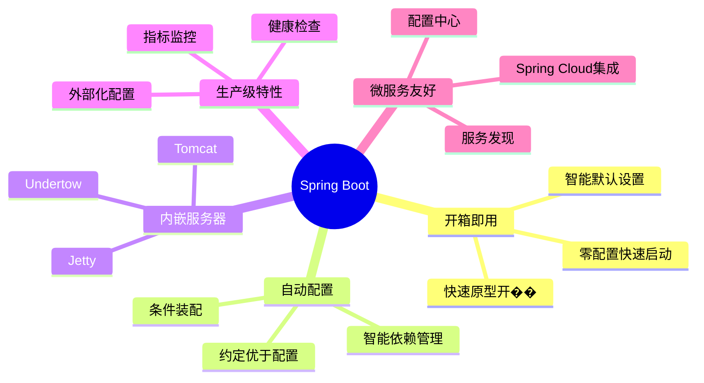

# Spring Boot 学习指南

欢迎来到 Spring Boot 学习文档！本指南涵盖了 Spring Boot 从入门到精通的全部内容。

> [!TIP]
> **快速上手**: 如果你是第一次使用 Spring Boot，建议先阅读 [快速开始](./quick-start.md)，5分钟内即可创建并运行第一个应用！

## 🎯 学习路径图

## 📚 文档导航

### 🔰 基础知识

- **[快速开始](./quick-start.md)** - 5分钟搭建第一个 Spring Boot 应用
- **[核心概念](./core-concepts.md)** - Spring Boot 的基本原理和设计思想
- **[自动配置](./auto-configuration.md)** - 理解 Spring Boot 的自动配置机制

### 🎓 开发指南

- **[项目结构与配置](./project-structure-config.md)** - 标准的项目组织方式和配置方法
- **[依赖管理](./dependency-management.md)** - Spring Boot Starter 和依赖版本管理
- **[Web 开发](./web-development.md)** - 构建 RESTful API 和 Web 应用
- **[数据访问](./data-access.md)** - 数据库集成、JPA、MyBatis 等

### 🚀 进阶特性

- **[缓存管理](./cache-management.md)** - Spring Cache 和缓存集成
- **[消息队列](./message-queue.md)** - 集成 RabbitMQ、Kafka 等消息中间件
- **[定时任务](./scheduling.md)** - @Scheduled 定时任务和异步执行

### 💼 生产级特性

- **[健康检查与监控](./health-monitoring.md)** - Actuator 和监控指标
- **[性能优化](./performance-optimization.md)** - 应用性能调优
- **[安全认证](./security.md)** - Spring Security 集成
- **[部署上线](./deployment.md)** - 应用打包、部署和运维

### 📖 实战与最佳实践

- **[常见问题解答](./faq.md)** - 常见问题和解决方案
- **[最佳实践](./best-practices.md)** - 生产环境经验和最佳实践
- **[快速参考](./quick-reference.md)** - 常用注解、配置和代码片段

## 📅 分阶段学习建议

### 第一阶段：入门（1-2周）

1. 📖 [快速开始](./quick-start.md) - 快速创建并运行第一个应用
2. 📖 [核心概念](./core-concepts.md) - 理解 Spring Boot 的基本原理
3. 📖 [项目结构与配置](./project-structure-config.md) - 学习标准的项目组织方式

### 第二阶段：进阶（2-4周）

1. 📖 [自动配置](./auto-configuration.md) - 深入理解自动配置机制
2. 📖 [Web 开发](./web-development.md) - 构建 RESTful API
3. 📖 [数据访问](./data-access.md) - 集成数据库

### 第三阶段：高级（4周以上）

1. 📖 缓存、消息队列等进阶特性
2. 📖 健康检查、监控和性能优化
3. 📖 安全认证和部署上线

## 💡 核心特点

> [!IMPORTANT]
> **Spring Boot vs Spring Framework**
>
> - **Spring Framework**: 提供核心功能（IoC、AOP）
> - **Spring Boot**: 简化配置和部署，提供开箱即用的体验
> - **Spring Cloud**: 构建微服务，基于 Spring Boot

## 🚀 快速导航

### 想要快速上手？

→ [快速开始](./quick-start.md) - 5分钟创建第一个应用

### 需要查找特定功能？  

→ [快速参考](./quick-reference.md) - 快速找到所需的注解和配置

### 遇到问题？  

→ [常见问题解答](./faq.md) - 获取解决方案

## 📖 官方资源

- [Spring Boot 官方文档](https://spring.io/projects/spring-boot)
- [Spring Boot GitHub 仓库](https://github.com/spring-projects/spring-boot)
- [Spring 社区论坛](https://spring.io/community)
- [Spring Boot Guides](https://spring.io/guides)

---

> [!NOTE]
> **学习建议**: 每个文档都包含详细的示例代码和实战应用场景，建议边学边练，加深理解。推荐使用 Spring Initializr (<https://start.spring.io/>) 快速创建项目。
