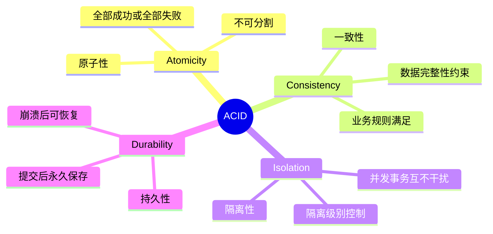
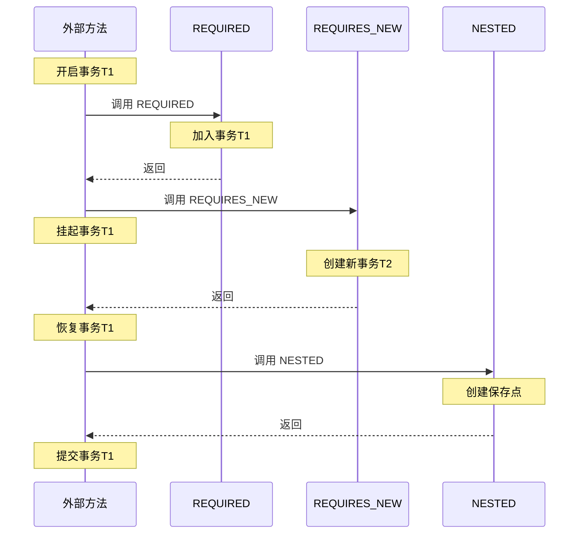
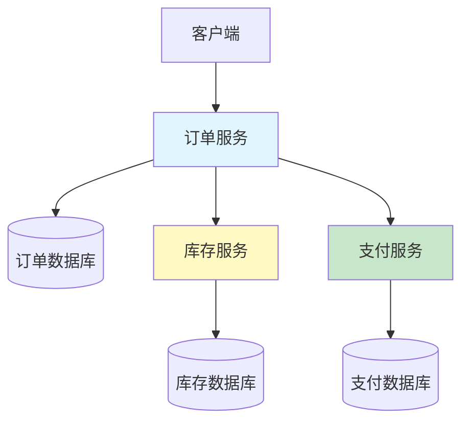

# 事务管理

> [!IMPORTANT]
> **事务的重要性**: 事务是保证数据一致性的核心机制。理解事务的传播行为、隔离级别和回滚机制对于开发可靠的应用至关重要。

## 什么是事务？

**事务（Transaction）** 是一组操作的集合，这些操作要么全部成功，要么全部失败，保证数据的一致性。

### ACID 特性



## Spring 事务管理

### 启用事务

Spring Boot 自动启用事务管理，无需额外配置。如需手动启用：

```java
import org.springframework.context.annotation.Configuration;
import org.springframework.transaction.annotation.EnableTransactionManagement;

@Configuration
@EnableTransactionManagement
public class TransactionConfig {
}
```

### @Transactional 基本用法

```java
import org.springframework.stereotype.Service;
import org.springframework.transaction.annotation.Transactional;

@Service
public class UserService {
    
    @Autowired
    private UserRepository userRepository;
    
    @Autowired
    private AccountRepository accountRepository;
    
    // 方法级别的事务
    @Transactional
    public void createUser(User user) {
        userRepository.save(user);
        // 任何异常都会导致事务回滚
    }
    
    // 只读事务（性能优化）
    @Transactional(readOnly = true)
    public User findById(Long id) {
        return userRepository.findById(id).orElse(null);
    }
    
    // 转账示例 - 事务保证原子性
    @Transactional
    public void transfer(Long fromId, Long toId, BigDecimal amount) {
        Account fromAccount = accountRepository.findById(fromId)
            .orElseThrow(() -> new AccountNotFoundException("源账户不存在"));
        Account toAccount = accountRepository.findById(toId)
            .orElseThrow(() -> new AccountNotFoundException("目标账户不存在"));
        
        // 扣款
        if (fromAccount.getBalance().compareTo(amount) < 0) {
            throw new InsufficientBalanceException("余额不足");
        }
        fromAccount.setBalance(fromAccount.getBalance().subtract(amount));
        accountRepository.save(fromAccount);
        
        // 加款
        toAccount.setBalance(toAccount.getBalance().add(amount));
        accountRepository.save(toAccount);
        
        // 如果任何一步失败，整个事务回滚
    }
}
```

### 类级别事务

```java
@Service
@Transactional // 类中所有 public 方法都有事务
public class OrderService {
    
    public void createOrder(Order order) {
        // 自动有事务
    }
    
    @Transactional(readOnly = true) // 方法级别的注解会覆盖类级别
    public Order findById(Long id) {
        return orderRepository.findById(id).orElse(null);
    }
}
```

## 事务传播行为

### 传播行为类型

```java
import org.springframework.transaction.annotation.Propagation;

@Service
public class PropagationExamples {
    
    // 1. REQUIRED（默认）- 如果有事务则加入，没有则创建新事务
    @Transactional(propagation = Propagation.REQUIRED)
    public void required() {
        // 最常用的传播行为
    }
    
    // 2. REQUIRES_NEW - 总是创建新事务，挂起当前事务
    @Transactional(propagation = Propagation.REQUIRES_NEW)
    public void requiresNew() {
        // 独立的事务，不受外部事务影响
    }
    
    // 3. SUPPORTS - 如果有事务则加入，没有则以非事务方式执行
    @Transactional(propagation = Propagation.SUPPORTS)
    public void supports() {
        // 可选事务
    }
    
    // 4. NOT_SUPPORTED - 以非事务方式执行，如果有事务则挂起
    @Transactional(propagation = Propagation.NOT_SUPPORTED)
    public void notSupported() {
        // 强制非事务
    }
    
    // 5. MANDATORY - 必须在事务中执行，否则抛出异常
    @Transactional(propagation = Propagation.MANDATORY)
    public void mandatory() {
        // 必须有外部事务
    }
    
    // 6. NEVER - 必须在非事务中执行，否则抛出异常
    @Transactional(propagation = Propagation.NEVER)
    public void never() {
        // 不允许事务
    }
    
    // 7. NESTED - 嵌套事务（保存点机制）
    @Transactional(propagation = Propagation.NESTED)
    public void nested() {
        // 嵌套事务，可以独立回滚
    }
}
```

### 传播行为详解



### 传播行为实战示例

```java
@Service
public class OrderService {
    
    @Autowired
    private LogService logService;
    
    // 外部事务
    @Transactional
    public void createOrder(Order order) {
        // 1. 保存订单
        orderRepository.save(order);
        
        // 2. 记录日志（使用 REQUIRES_NEW）
        // 即使订单创建失败，日志也会保存
        logService.log("创建订单: " + order.getId());
        
        // 3. 发送通知（使用 NOT_SUPPORTED）
        // 不需要事务，避免长时间持有连接
        notificationService.sendOrderConfirmation(order);
    }
}

@Service
public class LogService {
    
    // 独立事务，不受外部事务影响
    @Transactional(propagation = Propagation.REQUIRES_NEW)
    public void log(String message) {
        AuditLog log = new AuditLog(message, LocalDateTime.now());
        auditLogRepository.save(log);
        // 即使外部事务回滚，这条日志也会保存
    }
}

@Service
public class NotificationService {
    
    // 非事务执行，避免占用数据库连接
    @Transactional(propagation = Propagation.NOT_SUPPORTED)
    public void sendOrderConfirmation(Order order) {
        emailService.send(order.getEmail(), "订单确认", "...");
        // 发送邮件不需要数据库事务
    }
}
```

## 事务隔离级别

### 隔离级别类型

```java
import org.springframework.transaction.annotation.Isolation;

@Service
public class IsolationExamples {
    
    // 1. DEFAULT - 使用数据库默认隔离级别（MySQL 默认 REPEATABLE_READ）
    @Transactional(isolation = Isolation.DEFAULT)
    public void defaultIsolation() { }
    
    // 2. READ_UNCOMMITTED - 读未提交（最低级别，可能脏读）
    @Transactional(isolation = Isolation.READ_UNCOMMITTED)
    public void readUncommitted() { }
    
    // 3. READ_COMMITTED - 读已提交（Oracle 默认）
    @Transactional(isolation = Isolation.READ_COMMITTED)
    public void readCommitted() { }
    
    // 4. REPEATABLE_READ - 可重复读（MySQL 默认）
    @Transactional(isolation = Isolation.REPEATABLE_READ)
    public void repeatableRead() { }
    
    // 5. SERIALIZABLE - 串行化（最高级别，性能最差）
    @Transactional(isolation = Isolation.SERIALIZABLE)
    public void serializable() { }
}
```

### 并发问题

| 隔离级别 | 脏读 | 不可重复读 | 幻读 |
|---------|------|----------|------|
| READ_UNCOMMITTED | ✗ | ✗ | ✗ |
| READ_COMMITTED | ✓ | ✗ | ✗ |
| REPEATABLE_READ | ✓ | ✓ | ✗ (MySQL InnoDB ✓) |
| SERIALIZABLE | ✓ | ✓ | ✓ |

### 隔离级别示例

```java
@Service
public class AccountService {
    
    // 转账使用 REPEATABLE_READ，防止不可重复读
    @Transactional(isolation = Isolation.REPEATABLE_READ)
    public void transfer(Long fromId, Long toId, BigDecimal amount) {
        // 多次读取账户余额，保证数据一致
        Account account = accountRepository.findById(fromId).orElseThrow();
        // ... 业务逻辑
        Account accountAgain = accountRepository.findById(fromId).orElseThrow();
        // 两次读取的余额应该相同
    }
    
    // 统计报表使用 READ_COMMITTED，提高并发性能
    @Transactional(isolation = Isolation.READ_COMMITTED, readOnly = true)
    public BigDecimal getTotalBalance() {
        return accountRepository.sumAllBalances();
    }
}
```

## 事务回滚

### 默认回滚规则

```java
@Service
public class RollbackExamples {
    
    @Transactional
    public void defaultRollback() {
        // 默认情况：
        // - RuntimeException 和 Error 会回滚
        // - 检查异常（Checked Exception）不会回滚
        
        throw new RuntimeException("会回滚");
        // throw new Exception("不会回滚"); // 需要显式配置
    }
}
```

### 自定义回滚规则

```java
@Service
public class CustomRollbackService {
    
    // 指定回滚的异常类型
    @Transactional(rollbackFor = Exception.class)
    public void rollbackForAllExceptions() throws Exception {
        // 所有异常都会回滚
        throw new Exception("会回滚");
    }
    
    // 指定不回滚的异常类型
    @Transactional(noRollbackFor = BusinessException.class)
    public void noRollbackForBusinessException() {
        // BusinessException 不会导致回滚
        throw new BusinessException("不会回滚");
    }
    
    // 组合使用
    @Transactional(
        rollbackFor = {SQLException.class, IOException.class},
        noRollbackFor = {BusinessException.class}
    )
    public void combinedRollbackRules() {
        // SQLException 和 IOException 回滚
        // BusinessException 不回滚
    }
}
```

### 编程式回滚

```java
@Service
public class ProgrammaticRollbackService {
    
    @Transactional
    public void manualRollback() {
        try {
            // 业务逻辑
            orderRepository.save(order);
            
            if (someCondition) {
                // 手动标记为回滚
                TransactionAspectSupport.currentTransactionStatus()
                    .setRollbackOnly();
            }
        } catch (Exception e) {
            // 也可以在 catch 块中标记回滚
            TransactionAspectSupport.currentTransactionStatus()
                .setRollbackOnly();
            throw e;
        }
    }
}
```

## 事务超时

```java
@Service
public class TimeoutService {
    
    // 设置事务超时时间（秒）
    @Transactional(timeout = 30)
    public void operationWithTimeout() {
        // 如果事务执行超过 30 秒，会抛出异常并回滚
        // 适用于防止长事务占用资源
    }
    
    // 批量处理，设置较长的超时时间
    @Transactional(timeout = 300) // 5 分钟
    public void batchProcess(List<Order> orders) {
        for (Order order : orders) {
            processOrder(order);
        }
    }
}
```

## 编程式事务

### TransactionTemplate

```java
import org.springframework.transaction.support.TransactionTemplate;

@Service
public class ProgrammaticTransactionService {
    
    @Autowired
    private TransactionTemplate transactionTemplate;
    
    public void executeInTransaction() {
        transactionTemplate.execute(status -> {
            try {
                // 事务内的操作
                userRepository.save(user);
                accountRepository.save(account);
                return null;
            } catch (Exception e) {
                // 标记回滚
                status.setRollbackOnly();
                throw e;
            }
        });
    }
    
    // 带返回值的事务
    public User createUserWithTransaction(User user) {
        return transactionTemplate.execute(status -> {
            return userRepository.save(user);
        });
    }
    
    // 配置事务属性
    public void customTransaction() {
        TransactionTemplate template = new TransactionTemplate(transactionManager);
        template.setIsolation(TransactionDefinition.ISOLATION_READ_COMMITTED);
        template.setPropagationBehavior(TransactionDefinition.PROPAGATION_REQUIRES_NEW);
        template.setTimeout(30);
        
        template.execute(status -> {
            // 自定义事务操作
            return null;
        });
    }
}
```

### PlatformTransactionManager

```java
import org.springframework.transaction.PlatformTransactionManager;
import org.springframework.transaction.TransactionDefinition;
import org.springframework.transaction.TransactionStatus;
import org.springframework.transaction.support.DefaultTransactionDefinition;

@Service
public class LowLevelTransactionService {
    
    @Autowired
    private PlatformTransactionManager transactionManager;
    
    public void manualTransaction() {
        // 定义事务属性
        DefaultTransactionDefinition def = new DefaultTransactionDefinition();
        def.setIsolationLevel(TransactionDefinition.ISOLATION_READ_COMMITTED);
        def.setPropagationBehavior(TransactionDefinition.PROPAGATION_REQUIRED);
        
        // 开启事务
        TransactionStatus status = transactionManager.getTransaction(def);
        
        try {
            // 执行业务逻辑
            userRepository.save(user);
            accountRepository.save(account);
            
            // 提交事务
            transactionManager.commit(status);
        } catch (Exception e) {
            // 回滚事务
            transactionManager.rollback(status);
            throw e;
        }
    }
}
```

## 分布式事务

### 什么是分布式事务？

在微服务架构中，一个业务可能涉及多个服务和数据库，需要保证多个数据库的操作同时成功或失败。



### Seata 分布式事务

```xml
<dependency>
    <groupId>com.alibaba.cloud</groupId>
    <artifactId>spring-cloud-starter-alibaba-seata</artifactId>
</dependency>
```

配置：

```yaml
seata:
  enabled: true
  application-id: order-service
  tx-service-group: my-tx-group
  service:
    vgroup-mapping:
      my-tx-group: default
    grouplist:
      default: 127.0.0.1:8091
```

使用：

```java
import io.seata.spring.annotation.GlobalTransactional;

@Service
public class OrderService {
    
    @Autowired
    private InventoryFeignClient inventoryClient;
    
    @Autowired
    private PaymentFeignClient paymentClient;
    
    @GlobalTransactional(name = "create-order", rollbackFor = Exception.class)
    public void createOrder(Order order) {
        // 1. 创建订单
        orderRepository.save(order);
        
        // 2. 扣减库存（调用库存服务）
        inventoryClient.deductInventory(order.getProductId(), order.getQuantity());
        
        // 3. 扣款（调用支付服务）
        paymentClient.deductBalance(order.getUserId(), order.getAmount());
        
        // 任何一步失败，所有服务都会回滚
    }
}
```

## 常见问题与最佳实践

### 1. 事务不生效的原因

> [!WARNING]
> **事务失效的常见场景**：

```java
@Service
public class TransactionIssues {
    
    @Autowired
    private UserRepository userRepository;
    
    // ❌ 问题1：方法不是 public
    @Transactional
    private void privateMethod() {
        // 事务不生效
    }
    
    // ❌ 问题2：方法是 final
    @Transactional
    public final void finalMethod() {
        // 事务不生效（JDK 动态代理）
    }
    
    // ❌ 问题3：自调用
    public void outerMethod() {
        this.innerMethod(); // 事务不生效
    }
    
    @Transactional
    public void innerMethod() {
        userRepository.save(user);
    }
    
    // ✓ 解决方案1：注入自己
    @Autowired
    private UserService self;
    
    public void outerMethodFixed() {
        self.innerMethod(); // 通过代理调用，事务生效
    }
    
    // ✓ 解决方案2：拆分到不同的类
    @Autowired
    private UserTransactionService transactionService;
    
    public void outerMethod2() {
        transactionService.innerMethod(); // 事务生效
    }
    
    // ❌ 问题4：异常被捕获
    @Transactional
    public void catchException() {
        try {
            userRepository.save(user);
            throw new RuntimeException();
        } catch (Exception e) {
            // 异常被捕获，事务不回滚
        }
    }
    
    // ✓ 解决方案：手动标记回滚
    @Transactional
    public void catchExceptionFixed() {
        try {
            userRepository.save(user);
            throw new RuntimeException();
        } catch (Exception e) {
            TransactionAspectSupport.currentTransactionStatus()
                .setRollbackOnly();
            // 记录日志等
        }
    }
}
```

### 2. 大事务问题

```java
// ❌ 避免：大事务
@Transactional
public void bigTransaction() {
    // 1. 查询大量数据
    List<Order> orders = orderRepository.findAll(); // 可能几十万条
    
    // 2. 复杂计算
    for (Order order : orders) {
        calculateOrderStatistics(order); // 耗时操作
    }
    
    // 3. 外部调用
    emailService.sendEmails(orders); // 调用外部服务
    
    // 4. 批量更新
    orderRepository.saveAll(orders);
    
    // 问题：事务时间过长，占用数据库连接，可能导致锁等待
}

// ✓ 优化：拆分事务
public void optimizedTransaction() {
    // 1. 查询数据（只读，不需要事务或使用短事务）
    List<Order> orders = findOrders();
    
    // 2. 复杂计算（不需要事务）
    Map<Long, Statistics> stats = new HashMap<>();
    for (Order order : orders) {
        stats.put(order.getId(), calculateOrderStatistics(order));
    }
    
    // 3. 外部调用（不需要事务）
    emailService.sendEmails(orders);
    
    // 4. 批量更新（使用短事务）
    updateOrdersInBatches(orders, stats);
}

@Transactional
public void updateOrdersInBatches(List<Order> orders, Map<Long, Statistics> stats) {
    // 只在真正需要写数据库时开启事务
    for (Order order : orders) {
        order.setStatistics(stats.get(order.getId()));
    }
    orderRepository.saveAll(orders);
}
```

### 3. 只读事务优化

```java
@Service
public class QueryService {
    
    // ✓ 查询使用只读事务
    @Transactional(readOnly = true)
    public List<User> findAllUsers() {
        return userRepository.findAll();
        // 优点：
        // 1. 提示数据库优化只读操作
        // 2. Hibernate 跳过脏检查
        // 3. 某些数据库可以选择只读从库
    }
    
    // ✓ 大量查询可以不使用事务
    public List<User> findAllUsersNoTransaction() {
        return userRepository.findAll();
        // 适用于统计报表等纯查询场景
    }
}
```

### 4. 事务最佳实践

> [!TIP]
> **事务最佳实践**：
>
> 1. **保持事务短小** - 只在必要时开启事务，尽快提交
> 2. **只读事务** - 查询操作使用 readOnly = true
> 3. **避免大事务** - 拆分长事务，减少锁等待
> 4. **正确的传播行为** - 理解并正确使用传播行为
> 5. **异常处理** - 明确哪些异常需要回滚
> 6. **避免自调用** - 通过其他 Bean 调用事务方法
> 7. **监控事务** - 监控事务执行时间和回滚率

## 总结

- **@Transactional** - 声明式事务，最常用的方式
- **传播行为** - 7种传播行为，控制事务边界
- **隔离级别** - 4种隔离级别，平衡一致性和性能
- **回滚规则** - 自定义异常回滚规则
- **编程式事务** - TransactionTemplate 和 PlatformTransactionManager
- **分布式事务** - Seata 等分布式事务解决方案

下一步学习 [异步处理](./async)。
