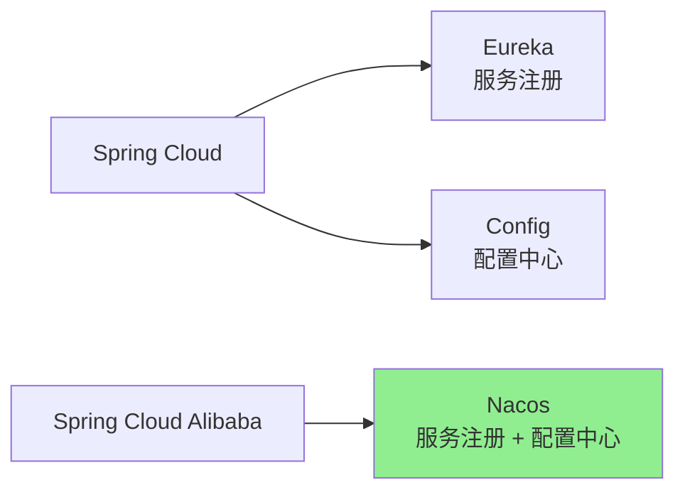

# Spring Cloud Alibaba 核心概念

> [!IMPORTANT] > **理解组件体系**: Spring Cloud Alibaba 是 Spring Cloud 规范的阿里巴巴实现，理解其与 Spring Cloud 的关系以及各组件的定位是学习的基础。

## 1. Spring Cloud Alibaba 简介

### 什么是 Spring Cloud Alibaba?

**Spring Cloud Alibaba** 是阿里巴巴提供的微服务开发一站式解决方案，包含开发分布式应用服务的必需组件，让开发者通过 Spring Cloud 编程模型轻松使用这些组件来开发分布式应用服务。

### 核心优势

- **经过生产验证** - 所有组件都经过阿里巴巴大规模生产环境验证
- **功能完善** - 覆盖微服务开发的各个方面
- **性能优秀** - 针对高并发场景优化
- **社区活跃** - 国内开发者社区活跃，文档完善

## 2. 组件体系

### 核心组件

| 组件     | 功能           | 对应 Spring Cloud 组件 |
| -------- | -------------- | ---------------------- |
| Nacos    | 服务注册与配置 | Eureka + Config        |
| Sentinel | 流量控制与熔断 | Hystrix                |
| Seata    | 分布式事务     | 无                     |
| RocketMQ | 消息队列       | Stream                 |
| Dubbo    | RPC 框架       | Feign                  |

### 组件对比

**Nacos vs Eureka + Config**



**Sentinel vs Hystrix**

| 特性     | Hystrix      | Sentinel     |
| -------- | ------------ | ------------ |
| 维护状态 | 停止维护     | 活跃开发     |
| 控制台   | 需要自己搭建 | 官方提供     |
| 规则配置 | 基于代码     | 支持多种方式 |
| 扩展性   | 较弱         | 强           |

## 3. 与 Spring Cloud 的关系

### 集成方式

Spring Cloud Alibaba 基于 Spring Cloud 标准：

```java
// 服务注册（Spring Cloud 标准）
@EnableDiscoveryClient

// 底层实现（Alibaba）
// 使用 Nacos 作为注册中心
```

### 可以混用

```yaml
spring:
  cloud:
    # 使用 Nacos 作为配置中心
    nacos:
      config:
        server-addr: localhost:8848
    # 使用 Gateway 作为网关（Spring Cloud 官方）
    gateway:
      routes:
        - id: user-service
          uri: lb://user-service
```

## 4. Nacos 核心概念

### 命名空间（Namespace）

用于隔离不同环境的配置和服务：

```
Namespace: dev（开发环境）
  ├─ 服务: user-service
  ├─ 配置: application.yml

Namespace: prod（生产环境）
  ├─ 服务: user-service
  ├─ 配置: application.yml
```

### 分组（Group）

用于隔离不同应用的配置和服务：

```
Group: DEFAULT_GROUP（默认分组）
Group: ORDER_GROUP（订单服务组）
Group: USER_GROUP（用户服务组）
```

### 配置层级

```
Namespace > Group > DataId
```

## 5. Sentinel 核心概念

### 资源

**资源**是 Sentinel 的关键概念，可以是：

- 接口
- 方法
- 代码块

```java
@SentinelResource(value = "getUser",
                  blockHandler = "handleBlock",
                  fallback = "handleFallback")
public User getUser(Long id) {
    return userService.getUser(id);
}
```

### 规则

| 规则类型     | 说明                       |
| ------------ | -------------------------- |
| 流量控制规则 | 限制 QPS 或线程数          |
| 熔断降级规则 | 根据响应时间或异常比例熔断 |
| 系统保护规则 | 根据系统负载进行保护       |
| 热点参数规则 | 对热点参数限流             |
| 授权规则     | 黑白名单控制               |

### 三种流控效果

- **快速失败** - 直接拒绝
- **Warm Up** - 预热
- **排队等待** - 匀速排队

## 6. Seata 核心概念

### 事务模式

**AT 模式（自动补偿）**

```java
@GlobalTransactional
public void createOrder() {
    orderService.create();    // 本地事务
    accountService.deduct();  // 远程事务
    stockService.reduce();    // 远程事务
}
```

**TCC 模式（手动补偿）**

```java
// Try - Confirm - Cancel
public interface AccountService {
    @TwoPhaseBusinessAction
    boolean prepare(Long userId, BigDecimal amount);

    boolean commit(BusinessActionContext context);

    boolean rollback(BusinessActionContext context);
}
```

### 三个角色

- **TC（Transaction Coordinator）** - 事务协调器，维护全局和分支事务的状态
- **TM（Transaction Manager）** - 事务管理器，定义全局事务的范围
- **RM（Resource Manager）** - 资源管理器，管理分支事务的资源

## 7. RocketMQ 核心概念

### 消息模型

**生产者 → Topic → 消费者**

```java
// 生产者
rocketMQTemplate.send("order-topic", order);

// 消费者
@RocketMQMessageListener(
    topic = "order-topic",
    consumerGroup = "order-consumer-group"
)
public class OrderConsumer implements RocketMQListener<Order> {
    @Override
    public void onMessage(Order order) {
        // 处理消息
    }
}
```

### 消息类型

| 类型     | 说明         | 使用场景     |
| -------- | ------------ | ------------ |
| 普通消息 | 最简单的消息 | 一般业务     |
| 顺序消息 | 保证消息顺序 | 订单状态变更 |
| 事务消息 | 支持事务     | 分布式事务   |
| 延迟消息 | 延迟投递     | 定时任务     |

## 8. Dubbo 核心概念

### RPC 调用

```java
// 服务提供者
@DubboService
public class UserServiceImpl implements UserService {
    public User getUser(Long id) {
        return userRepository.findById(id);
    }
}

// 服务消费者
@DubboReference
private UserService userService;

public void demo() {
    User user = userService.getUser(1L);
}
```

### 三大核心功能

- **面向接口的远程方法调用** - RPC
- **智能容错和负载均衡** - 自动负载均衡
- **服务自动注册与发现** - 与 Nacos 集成

## 9. 最佳实践

### 环境隔离

```yaml
spring:
  cloud:
    nacos:
      discovery:
        namespace: ${spring.profiles.active}
        group: DEFAULT_GROUP
      config:
        namespace: ${spring.profiles.active}
        group: ${spring.application.name}
```

### 配置管理

```
环境隔离: Namespace
应用隔离: Group
具体配置: DataId
```

### 流量保护

```java
// 限流
@SentinelResource(value = "api", blockHandler = "handleBlock")

// 熔断
@SentinelResource(value = "api", fallback = "handleFallback")

// 系统保护
// 在控制台配置系统规则
```

## 10. 总结

| 组件     | 核心功能               |
| -------- | ---------------------- |
| Nacos    | 服务注册发现、配置管理 |
| Sentinel | 流量控制、熔断降级     |
| Seata    | 分布式事务             |
| RocketMQ | 消息队列               |
| Dubbo    | 高性能 RPC             |

---

**关键要点**：

- Spring Cloud Alibaba 是 Spring Cloud 的阿里巴巴实现
- 各组件功能明确，可以按需选择
- 支持与 Spring Cloud 官方组件混用
- 经过阿里巴巴大规模生产验证

**下一步**：学习 [Nacos 服务注册与配置中心](./nacos.md)
