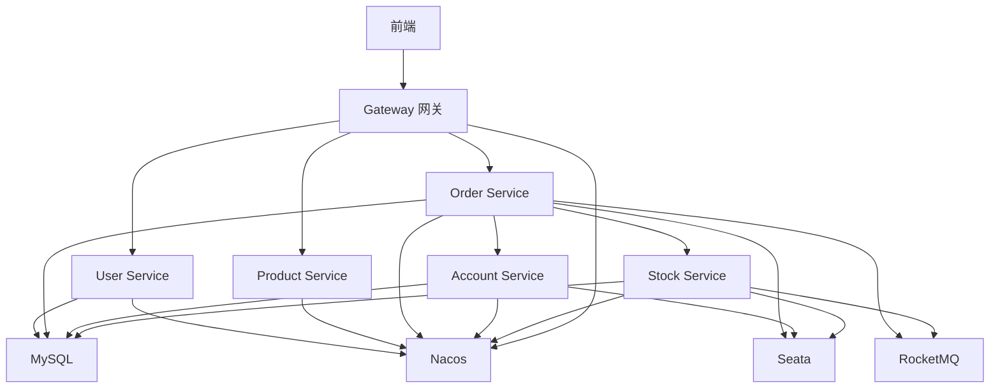

# Spring Cloud Alibaba 微服务实战案例

> [!NOTE]
> **完整示例**: 通过一个完整的电商系统案例,实践 Spring Cloud Alibaba 各组件的集成使用。

## 1. 项目概述

### 业务场景

构建一个简化的电商系统,包含以下功能:

- 用户注册登录
- 商品浏览
- 下单购买
- 库存扣减
- 账户余额管理

### 技术架构



### 服务列表

| 服务            | 端口 | 职责           |
| --------------- | ---- | -------------- |
| api-gateway     | 8080 | 统一网关       |
| user-service    | 8081 | 用户管理       |
| product-service | 8082 | 商品管理       |
| order-service   | 8083 | 订单管理       |
| account-service | 8084 | 账户管理       |
| stock-service   | 8085 | 库存管理       |

## 2. 项目结构

```
mall-microservices
├── pom.xml                    # 父 POM
├── mall-common                # 公共模块
├── api-gateway                # 网关
├── user-service               # 用户服务
├── product-service            # 商品服务
├── order-service              # 订单服务
├── account-service            # 账户服务
└── stock-service              # 库存服务
```

## 3. 公共模块 (mall-common)

### 统一返回类

```java
@Data
@AllArgsConstructor
@NoArgsConstructor
public class Result<T> {
    private Integer code;
    private String message;
    private T data;

    public static <T> Result<T> success(T data) {
        return new Result<>(200, "success", data);
    }

    public static <T> Result<T> fail(String message) {
        return new Result<>(500, message, null);
    }
}
```

### 统一异常类

```java
@Data
public class BusinessException extends RuntimeException {
    private Integer code;
    private String message;

    public BusinessException(Integer code, String message) {
        super(message);
        this.code = code;
        this.message = message;
    }
}
```

## 4. 订单服务 (核心业务)

### 实体类

```java
@Data
@TableName("orders")
public class Order {
    @TableId(type = IdType.AUTO)
    private Long id;
    private Long userId;
    private Long productId;
    private Integer count;
    private BigDecimal money;
    private Integer status;  // 0:创建中 1:已完成 2:已取消
    private LocalDateTime createTime;
    private LocalDateTime updateTime;
}
```

### 下单业务 (分布式事务)

```java
@Service
public class OrderService {

    @Autowired
    private OrderMapper orderMapper;

    @Autowired
    private AccountClient accountClient;

    @Autowired
    private StockClient stockClient;

    @Autowired
    private RocketMQTemplate rocketMQTemplate;

    @GlobalTransactional(name = "create-order", rollbackFor = Exception.class)
    public Long createOrder(CreateOrderDTO dto) {
        // 1. 创建订单
        Order order = new Order();
        order.setUserId(dto.getUserId());
        order.setProductId(dto.getProductId());
        order.setCount(dto.getCount());
        order.setMoney(dto.getMoney());
        order.setStatus(0);
        order.setCreateTime(LocalDateTime.now());
        
        orderMapper.insert(order);
        Long orderId = order.getId();

        // 2. 扣减库存 (远程调用)
        Result<Void> stockResult = stockClient.deduct(
            dto.getProductId(),
            dto.getCount()
        );
        
        if (stockResult.getCode() != 200) {
            throw new BusinessException(500, "库存不足");
        }

        // 3. 扣减账户余额 (远程调用)
        Result<Void> accountResult = accountClient.deduct(
            dto.getUserId(),
            dto.getMoney()
        );
        
        if (accountResult.getCode() != 200) {
            throw new BusinessException(500, "余额不足");
        }

        // 4. 更新订单状态
        order.setStatus(1);
        order.setUpdateTime(LocalDateTime.now());
        orderMapper.updateById(order);

        // 5. 发送订单创建消息
        rocketMQTemplate.convertAndSend(
            "order-topic",
            new OrderCreatedEvent(orderId, dto.getUserId())
        );

        return orderId;
    }
}
```

### Feign 客户端

```java
@FeignClient(
    name = "account-service",
    fallback = AccountClientFallback.class
)
public interface AccountClient {
    
    @PostMapping("/account/deduct")
    Result<Void> deduct(@RequestParam("userId") Long userId,
                        @RequestParam("money") BigDecimal money);
}

@Component
public class AccountClientFallback implements AccountClient {
    
    @Override
    public Result<Void> deduct(Long userId, BigDecimal money) {
        return Result.fail("账户服务降级");
    }
}
```

## 5. 账户服务

```java
@Service
public class AccountService {

    @Autowired
    private AccountMapper accountMapper;

    public void deduct(Long userId, BigDecimal money) {
        Account account = accountMapper.selectById(userId);
        
        if (account == null) {
            throw new BusinessException(404, "账户不存在");
        }

        if (account.getBalance().compareTo(money) < 0) {
            throw new BusinessException(500, "余额不足");
        }

        // 扣减余额
        account.setBalance(account.getBalance().subtract(money));
        accountMapper.updateById(account);
    }
}
```

## 6. 库存服务

```java
@Service
public class StockService {

    @Autowired
    private StockMapper stockMapper;

    public void deduct(Long productId, Integer count) {
        Stock stock = stockMapper.selectById(productId);
        
        if (stock == null) {
            throw new BusinessException(404, "商品不存在");
        }

        if (stock.getCount() < count) {
            throw new BusinessException(500, "库存不足");
        }

        // 扣减库存
        stock.setCount(stock.getCount() - count);
        stockMapper.updateById(stock);
    }
}
```

## 7. Gateway 配置

```yaml
spring:
  cloud:
    gateway:
      routes:
        # 用户服务
        - id: user-service
          uri: lb://user-service
          predicates:
            - Path=/api/users/**
          filters:
            - StripPrefix=1
            - name: Sentinel
              args:
                mode: response
                fallback-response: '{"code":429,"message":"Too Many Requests"}'

        # 商品服务
        - id: product-service
          uri: lb://product-service
          predicates:
            - Path=/api/products/**
          filters:
            - StripPrefix=1

        # 订单服务
        - id: order-service
          uri: lb://order-service
          predicates:
            - Path=/api/orders/**
          filters:
            - StripPrefix=1
```

## 8. 监控配置

### Prometheus

```yaml
management:
  endpoints:
    web:
      exposure:
        include: "*"
  metrics:
    export:
      prometheus:
        enabled: true
    tags:
      application: ${spring.application.name}
```

### 日志配置

```xml
<configuration>
    <appender name="JSON" class="ch.qos.logback.core.rolling.RollingFileAppender">
        <file>logs/${spring.application.name}.json</file>
        <encoder class="net.logstash.logback.encoder.LogstashEncoder">
            <customFields>{"app":"${spring.application.name}"}</customFields>
        </encoder>
    </appender>

    <root level="INFO">
        <appender-ref ref="JSON"/>
    </root>
</configuration>
```

## 9. 部署方案

### Docker Compose

```yaml
version: '3'

services:
  nacos:
    image: nacos/nacos-server:v2.3.0
    ports:
      - "8848:8848"
    environment:
      - MODE=standalone

  mysql:
    image: mysql:8.0
    ports:
      - "3306:3306"
    environment:
      - MYSQL_ROOT_PASSWORD=root

  seata-server:
    image: seataio/seata-server:1.7.0
    ports:
      - "8091:8091"
    environment:
      - SEATA_CONFIG_NAME=file:/root/seata-config/registry.conf

  rocketmq-namesrv:
    image: apache/rocketmq:5.1.4
    command: sh mqnamesrv
    ports:
      - "9876:9876"

  rocketmq-broker:
    image: apache/rocketmq:5.1.4
    command: sh mqbroker -n namesrv:9876
    ports:
      - "10911:10911"
      - "10909:10909"
```

### Kubernetes

```yaml
apiVersion: apps/v1
kind: Deployment
metadata:
  name: order-service
spec:
  replicas: 3
  selector:
    matchLabels:
      app: order-service
  template:
    metadata:
      labels:
        app: order-service
    spec:
      containers:
      - name: order-service
        image: mall/order-service:1.0.0
        ports:
        - containerPort: 8083
        env:
        - name: SPRING_PROFILES_ACTIVE
          value: "prod"
        - name: NACOS_SERVER_ADDR
          value: "nacos-service:8848"
        resources:
          limits:
            cpu: "1"
            memory: "1Gi"
          requests:
            cpu: "500m"
            memory: "512Mi"
        livenessProbe:
          httpGet:
            path: /actuator/health
            port: 8083
          initialDelaySeconds: 30
          periodSeconds: 10
        readinessProbe:
          httpGet:
            path: /actuator/health
            port: 8083
          initialDelaySeconds: 30
          periodSeconds: 10
```

## 10. 测试场景

### 正常下单

```bash
curl -X POST http://localhost:8080/api/orders \
  -H "Content-Type: application/json" \
  -d '{
    "userId": 1,
    "productId": 1001,
    "count": 2,
    "money": 199.00
  }'
```

**预期结果**: 订单创建成功,库存和余额正确扣减

### 库存不足

```bash
curl -X POST http://localhost:8080/api/orders \
  -H "Content-Type: application/json" \
  -d '{
    "userId": 1,
    "productId": 1001,
    "count": 999,
    "money": 199.00
  }'
```

**预期结果**: 提示库存不足,订单不创建

### 余额不足

```bash
curl -X POST http://localhost:8080/api/orders \
  -H "Content-Type: application/json" \
  -d '{
    "userId": 1,
    "productId": 1001,
    "count": 2,
    "money": 999999.00
  }'
```

**预期结果**: 提示余额不足,订单和库存回滚

## 11. 完整代码

完整项目代码已发布到 GitHub:

**仓库地址**: [mall-microservices](https://github.com/example/mall-microservices)

**目录结构**:

```
├── README.md
├── docker-compose.yml
├── kubernetes/
├── sql/
│   ├── init.sql
│   └── seata.sql
└── services/
    ├── api-gateway/
    ├── user-service/
    ├── product-service/
    ├── order-service/
    ├── account-service/
    └── stock-service/
```

## 12. 总结

### 技术要点

- ✅ Nacos 服务注册与配置管理
- ✅ Sentinel 限流熔断
- ✅ Seata 分布式事务
- ✅ RocketMQ 异步消息
- ✅ Gateway 统一网关
- ✅ Feign 服务调用
- ✅ Prometheus 监控
- ✅ Docker/K8s 部署

### 最佳实践

- 服务按业务领域拆分
- 使用分布式事务保证一致性
- 异步消息解耦服务
- 多级限流保护系统
- 完善的监控告警
- 自动化部署

---

**下一步**:

- 克隆项目代码
- 本地运行验证
- 阅读源码学习
- 根据需求定制

**参考资料**:

- [Spring Cloud Alibaba 官方示例](https://github.com/alibaba/spring-cloud-alibaba/tree/2022.x/spring-cloud-alibaba-examples)
