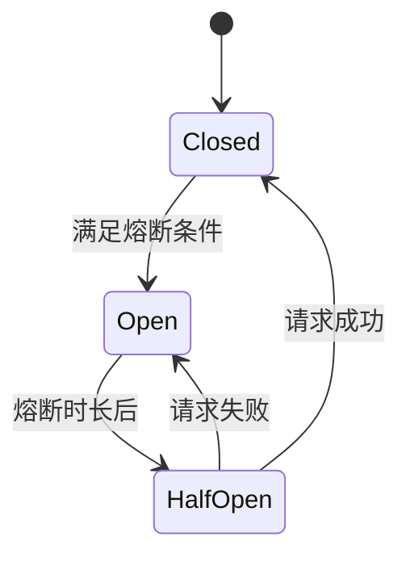

# Sentinel 流量控制与熔断降级

> [!TIP] > **生产级流量防护**: Sentinel 是阿里巴巴开源的流量控制组件，功能比 Hystrix 更强大且持续维护，是微服务流量防护的首选方案。

## 1. Sentinel 简介

**Sentinel** 以流量为切入点，提供流量控制、熔断降级、系统负载保护等多个维度来保障服务的稳定性。

### 核心优势

- **丰富的规则** - 流控、熔断、热点、系统、授权
- **实时监控** - 可视化控制台
- **多样化的流控策略** - QPS、并发线程数、关联、链路
- **熔断降级** - 慢调用比例、异常比例、异常数
- **系统自适应保护** - 根据系统负载动态调整流量

## 2. 快速开始

### 添加依赖

```xml
<dependency>
    <groupId>com.alibaba.cloud</groupId>
    <artifactId>spring-cloud-starter-alibaba-sentinel</artifactId>
</dependency>
```

### 配置

```yaml
spring:
  cloud:
    sentinel:
      transport:
        # Sentinel 控制台地址
        dashboard: localhost:8080
        # 与控制台通信的端口
        port: 8719
      # 饥饿加载
      eager: true
```

### 使用 @SentinelResource

```java
@Service
public class UserService {

    @SentinelResource(
        value = "getUser",
        blockHandler = "handleBlock",
        fallback = "handleFallback"
    )
    public User getUser(Long id) {
        if (id < 0) {
            throw new IllegalArgumentException("ID 不能为负数");
        }
        return userRepository.findById(id);
    }

    // 流控/熔断时调用
    public User handleBlock(Long id, BlockException ex) {
        return new User(id, "流量限制");
    }

    // 异常时调用
    public User handleFallback(Long id, Throwable throwable) {
        return new User(id, "服务降级");
    }
}
```

## 3. Sentinel 控制台

### 启动控制台

```bash
# 下载
wget https://github.com/alibaba/Sentinel/releases/download/1.8.6/sentinel-dashboard-1.8.6.jar

# 启动
java -Dserver.port=8080 -jar sentinel-dashboard-1.8.6.jar
```

访问：`http://localhost:8080`

默认账号密码：`sentinel/sentinel`

## 4. 流量控制

### 流控模式

**直接模式** - 直接限流

```java
// QPS 限流：每秒最多 10 个请求
@SentinelResource("api")
public String api() {
    return "success";
}
```

**关联模式** - 关联资源达到阈值时限流

```
资源 A 的流量达到阈值时，限制资源 B
使用场景：读写分离，写操作过多时限制读操作
```

**链路模式** - 只统计从指定入口进入的流量

```
入口 A → 资源 C
入口 B → 资源 C

只限制从入口 A 到资源 C 的流量
```

### 流控效果

**快速失败** - 直接拒绝

**Warm Up（预热）** - 逐渐增加到阈值

```
初始阈值 = threshold / coldFactor（默认 3）
预热时间内逐渐增加到 threshold
```

**排队等待** - 匀速排队

```
超过阈值的请求进入队列等待
超时时间内未处理则拒绝
```

## 5. 熔断降级

### 熔断策略

**慢调用比例**

```
统计时长内，调用时间超过阈值的比例 > 设定比例
触发熔断
```

**异常比例**

```
统计时长内，异常比例 > 设定比例
触发熔断
```

**异常数**

```
统计时长内，异常数 > 设定值
触发熔断
```

### 熔断状态



## 6. 热点参数限流

```java
@SentinelResource(value = "getProduct")
public Product getProduct(
    @SentinelParam Long productId,
    @SentinelParam String userId
) {
    return productService.get(productId, userId);
}
```

在控制台配置：

- 参数索引：0（productId）
- 普通 QPS 阈值：100
- 特殊参数：productId=1001，QPS=1000（热销商品）

## 7. 系统自适应保护

基于系统指标动态调整流量：

- **Load** - 系统负载
- **CPU 使用率**
- **平均 RT** - 响应时间
- **并发线程数**
- **入口 QPS**

```当任一指标达到阈值时，限制入口流量

```

## 8. 黑白名单

```java
// 授权规则
@SentinelResource(
    value = "api",
    blockHandlerClass = AuthorityHandler.class,
    blockHandler = "handleAuthority"
)
public String api() {
    return "success";
}

// 在控制台配置
// 白名单：允许来自 appA, appB 的请求
// 黑名单：拒绝来自 appC 的请求
```

## 9. 规则持久化

### Nacos 持久化

```xml
<dependency>
    <groupId>com.alibaba.csp</groupId>
    <artifactId>sentinel-datasource-nacos</artifactId>
</dependency>
```

```yaml
spring:
  cloud:
    sentinel:
      datasource:
        flow:
          nacos:
            server-addr: localhost:8848
            dataId: ${spring.application.name}-flow-rules
            groupId: SENTINEL_GROUP
            rule-type: flow
        degrade:
          nacos:
            server-addr: localhost:8848
            dataId: ${spring.application.name}-degrade-rules
            groupId: SENTINEL_GROUP
            rule-type: degrade
```

## 10. 与 OpenFeign 集成

```xml
<dependency>
    <groupId>org.springframework.cloud</groupId>
    <artifactId>spring-cloud-starter-openfeign</artifactId>
</dependency>
```

```yaml
feign:
  sentinel:
    enabled: true
```

```java
@FeignClient(
    name = "user-service",
    fallback = UserClientFallback.class
)
public interface UserClient {
    @GetMapping("/users/{id}")
    User getUser(@PathVariable Long id);
}

@Component
public class UserClientFallback implements UserClient {
    @Override
    public User getUser(Long id) {
        return new User(id, "降级用户");
    }
}
```

## 11. 与 Gateway 集成

```xml
<dependency>
    <groupId>com.alibaba.cloud</groupId>
    <artifactId>spring-cloud-alibaba-sentinel-gateway</artifactId>
</dependency>
```

```yaml
spring:
  cloud:
    sentinel:
      filter:
        enabled: true
      scg:
        fallback:
          mode: response
          response-status: 429
          response-body: '{"code":429,"message":"Too Many Requests"}'
```

## 12. 集群流控

适用于多实例部署场景：

```
实例 1 limit: 100
实例 2 limit: 100
总限流: 200

使用集群流控后：
总限流: 100（所有实例共享）
```

## 13. 最佳实践

### 资源定义

- 使用有意义的资源名
- 合理粒度：不要太细也不要太粗
- RESTful API：`GET:/api/users/{id}`

### 流控规则

- **QPS 模式** - 适合大部分场景
- **并发线程数** - 适合慢调用
- **预热模式** - 应对突发流量
- **排队等待** - 削峰填谷

### 熔断规则

- **慢调用** - 响应时间超过 1s 的调用
- **异常比例** - 异常率超过 50%
- **异常数** - 1 分钟内异常超过 10 次

## 14. 监控告警

- 实时 QPS、响应时间
- 流控、熔断触发次数
- 资源调用链
- 集成告警系统

## 15. 总结

| 功能     | 说明              |
| -------- | ----------------- |
| 流量控制 | 限制 QPS 或并发数 |
| 熔断降级 | 慢调用、异常熔断  |
| 系统保护 | 根据系统负载保护  |
| 热点参数 | 对热点参数限流    |
| 黑白名单 | 访问控制          |

---

**关键要点**：

- Sentinel 功能比 Hystrix 更强大
- 提供可视化控制台
- 支持多种流控和熔断策略
- 规则可以持久化到 Nacos

**下一步**：学习 [Seata 分布式事务](./seata.md)
