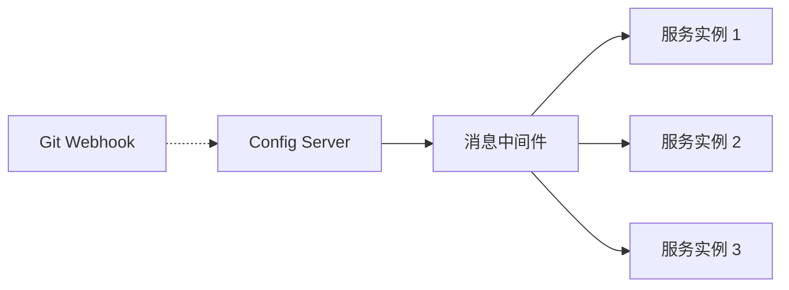

# Spring Cloud Bus 消息总线

> [!TIP]
> Spring Cloud Bus 将分布式系统的节点连接在一起，实现配置刷新广播、事件传播等功能。通常与 Config Server 配合使用，实现配置的自动刷新。

## 1. 简介

### 什么是 Spring Cloud Bus？

Spring Cloud Bus 使用轻量级消息代理（RabbitMQ 或 Kafka）连接分布式系统中的所有节点，用于：

- **配置刷新广播**: 一次刷新，所有实例更新
- **事件传播**: 自定义事件在服务间广播
- **状态同步**: 服务间状态同步

### 工作原理



## 2. 快速开始

### 添加依赖

**使用 RabbitMQ**:

```xml
<dependency>
    <groupId>org.springframework.cloud</groupId>
    <artifactId>spring-cloud-starter-bus-amqp</artifactId>
</dependency>
```

**使用 Kafka**:

```xml
<dependency>
    <groupId>org.springframework.cloud</groupId>
    <artifactId>spring-cloud-starter-bus-kafka</artifactId>
</dependency>
```

### 配置 RabbitMQ

```yaml
spring:
  rabbitmq:
    host: localhost
    port: 5672
    username: guest
    password: guest

management:
  endpoints:
    web:
      exposure:
        include: bus-refresh, bus-env
```

### 配置 Kafka

```yaml
spring:
  kafka:
    bootstrap-servers: localhost:9092

management:
  endpoints:
    web:
      exposure:
        include: bus-refresh, bus-env
```

## 3. 配置刷新广播

### 手动触发全局刷新

```bash
# 刷新所有服务的所有实例
curl -X POST http://config-server:8888/actuator/busrefresh

# 刷新指定服务的所有实例
curl -X POST http://config-server:8888/actuator/busrefresh/user-service:**

# 刷新指定实例
curl -X POST http://config-server:8888/actuator/busrefresh/user-service:8081
```

### 配合 Git Webhook 自动刷新

```
Git 仓库配置变更
       ↓
   Git Webhook
       ↓
POST /actuator/busrefresh
       ↓
   消息广播
       ↓
所有服务实例刷新配置
```

**Webhook URL**: `http://config-server:8888/actuator/busrefresh`

### 使用 @RefreshScope

```java
@RestController
@RefreshScope
public class ConfigController {

    @Value("${app.message}")
    private String message;

    @GetMapping("/message")
    public String getMessage() {
        return message;
    }
}
```

## 4. 刷新指定服务

### destination 参数

```bash
# 格式: /{destination}
# destination 格式: {serviceId}:{instanceId}

# 刷新 user-service 的所有实例
POST /actuator/busrefresh/user-service:**

# 刷新 user-service 端口为 8081 的实例
POST /actuator/busrefresh/user-service:8081
```

### 配置服务 ID

```yaml
spring:
  cloud:
    bus:
      id: ${spring.application.name}:${server.port}
```

## 5. 自定义事件

### 定义事件

```java
public class CustomEvent extends RemoteApplicationEvent {

    private String message;

    public CustomEvent() {}

    public CustomEvent(Object source, String originService,
                       String destinationService, String message) {
        super(source, originService, destinationService);
        this.message = message;
    }

    public String getMessage() {
        return message;
    }
}
```

### 发布事件

```java
@Service
public class EventPublisher {

    @Autowired
    private ApplicationContext context;

    @Autowired
    private BusProperties busProperties;

    public void publishEvent(String message) {
        CustomEvent event = new CustomEvent(
            this,
            busProperties.getId(),
            null,  // null 表示广播给所有服务
            message
        );
        context.publishEvent(event);
    }
}
```

### 监听事件

```java
@Component
public class CustomEventListener {

    @EventListener
    public void handleCustomEvent(CustomEvent event) {
        System.out.println("收到自定义事件: " + event.getMessage());
        // 处理事件...
    }
}
```

### 注册事件类型

```java
@Configuration
@RemoteApplicationEventScan(basePackages = "com.example.events")
public class BusConfig {
}
```

## 6. 刷新环境变量

### busenv 端点

```bash
# 更新环境变量并广播
curl -X POST http://localhost:8080/actuator/busenv \
  -H "Content-Type: application/json" \
  -d '{"name": "app.message", "value": "new value"}'
```

### 监听环境变更事件

```java
@Component
public class EnvChangeListener {

    @EventListener
    public void handleEnvChange(EnvironmentChangeRemoteApplicationEvent event) {
        Map<String, String> changes = event.getValues();
        changes.forEach((key, value) -> {
            System.out.println("环境变量变更: " + key + " = " + value);
        });
    }
}
```

## 7. 配置选项

```yaml
spring:
  cloud:
    bus:
      # 是否启用 Bus
      enabled: true
      # 服务标识
      id: ${spring.application.name}:${server.port}
      # traceId 配置
      trace:
        enabled: true
      # 刷新配置
      refresh:
        enabled: true
      # 环境变更配置
      env:
        enabled: true
      # ACK 配置
      ack:
        enabled: true
```

## 8. 监控与追踪

### 查看刷新状态

```bash
# 查看 trace 事件
GET /actuator/busenv?trace=true
```

### 刷新事件追踪

```java
@Component
public class RefreshEventListener {

    private static final Logger log = LoggerFactory.getLogger(RefreshEventListener.class);

    @EventListener
    public void onRefresh(RefreshRemoteApplicationEvent event) {
        log.info("收到配置刷新事件, 来源: {}", event.getOriginService());
    }

    @EventListener
    public void onAck(AckRemoteApplicationEvent event) {
        log.info("收到 ACK, 服务: {}, 事件: {}",
            event.getAckDestinationService(),
            event.getAckId());
    }
}
```

## 9. 最佳实践

### 生产环境配置

```yaml
spring:
  cloud:
    bus:
      enabled: true
      # 只刷新需要的实例，避免不必要的刷新
      refresh:
        enabled: true

management:
  endpoints:
    web:
      exposure:
        include: busrefresh
  endpoint:
    busrefresh:
      # 生产环境建议添加安全控制
      sensitive: true
```

### 安全控制

```java
@Configuration
@EnableWebSecurity
public class SecurityConfig {

    @Bean
    public SecurityFilterChain filterChain(HttpSecurity http) throws Exception {
        http
            .authorizeHttpRequests(auth -> auth
                // 保护 bus 端点
                .requestMatchers("/actuator/busrefresh").hasRole("ADMIN")
                .anyRequest().permitAll()
            );
        return http.build();
    }
}
```

### 高可用消息中间件

- **RabbitMQ**: 使用集群模式 + 镜像队列
- **Kafka**: 多 Broker 集群 + 副本

## 10. 常见问题

### 刷新不生效

**检查项**:

1. 确保添加了 `@RefreshScope`
2. 确保消息中间件连接正常
3. 检查服务是否订阅到正确的 topic/exchange

### 消息延迟

**解决方案**:

```yaml
spring:
  rabbitmq:
    listener:
      simple:
        prefetch: 1
        concurrency: 5
```

---

**相关文档**：

- [Config 配置中心](/docs/springcloud/config)
- [快速参考](/docs/springcloud/quick-reference)
