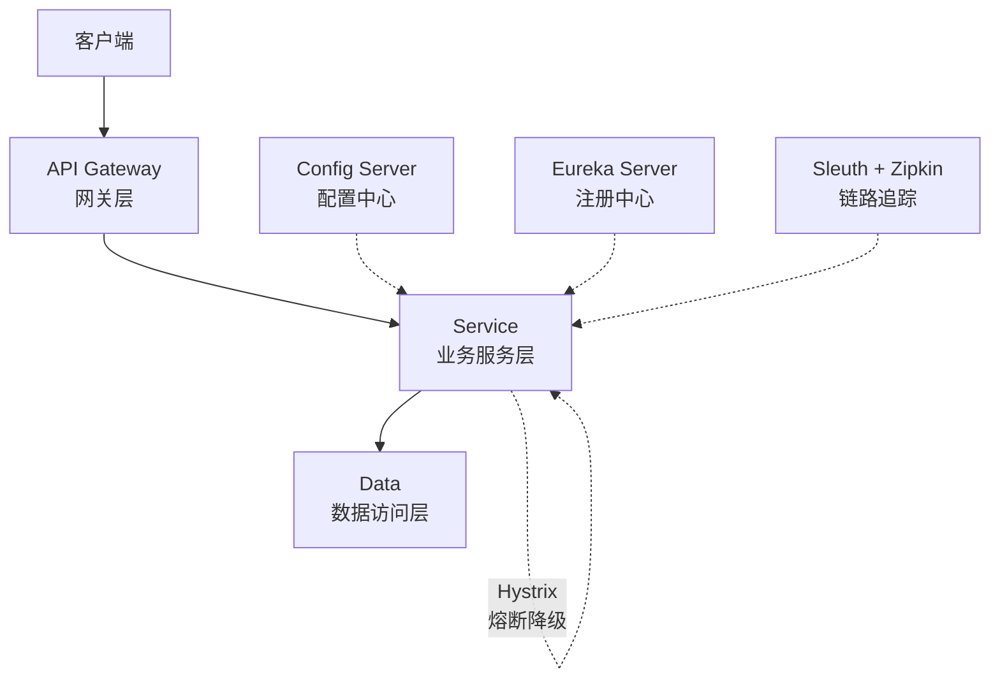

# Spring Cloud 核心概念

> [!IMPORTANT] > **微服务架构基础**: 理解微服务架构、服务治理、分布式系统的挑战是学习 Spring Cloud 的前提。Spring Cloud 提供了一整套微服务解决方案。

## 1. 什么是微服务架构

### 微服务定义

**微服务架构**是一种将单一应用程序开发为一组小型服务的方法，每个服务运行在自己的进程中，服务间通过轻量级机制（通常是 HTTP API）进行通信。

### 微服务 vs 单体应用

| 特性     | 单体应用         | 微服务架构   |
| -------- | ---------------- | ------------ |
| 部署     | 整体部署         | 独立部署     |
| 扩展     | 整体扩展         | 按需扩展     |
| 技术栈   | 统一技术栈       | 可异构       |
| 开发     | 团队协作困难     | 团队独立开发 |
| 故障隔离 | 一处故障影响全局 | 故障隔离     |
| 复杂度   | 代码复杂         | 架构复杂     |

### 微服务的优势

- **独立部署** - 服务可以独立部署和升级
- **技术多样性** - 不同服务可以使用不同技术栈
- **故障隔离** - 单个服务的故障不会影响整个系统
- **可扩展性** - 可以针对特定服务进行扩展
- **团队自治** - 小团队可以独立负责一个服务

### 微服务的挑战

- **分布式系统复杂性** - 网络延迟、故障、一致性等问题
- **服务治理** - 大量服务的管理和监控
- **数据一致性** - 分布式事务处理
- **测试复杂** - 集成测试和端到端测试困难

## 2. Spring Cloud 组件体系

Spring Cloud 为微服务架构提供了完整的解决方案：



### 核心组件

| 组件    | 功能         | 说明               |
| ------- | ------------ | ------------------ |
| Eureka  | 服务注册发现 | 服务注册中心       |
| Config  | 配置中心     | 集中配置管理       |
| Gateway | API 网关     | 统一入口、路由     |
| Feign   | 声明式调用   | HTTP 客户端        |
| Ribbon  | 负载均衡     | 客户端负载均衡     |
| Hystrix | 熔断器       | 服务容错保护       |
| Sleuth  | 链路追踪     | 分布式追踪         |
| Bus     | 消息总线     | 配置刷新、事件传播 |

## 3. 服务注册与发现

### 为什么需要服务注册发现？

在微服务架构中，服务实例是动态的：

- 服务实例的网络位置是动态分配的
- 服务实例可能会扩容或缩容
- 服务实例可能会因故障而重启

**服务注册与发现**解决了服务间如何相互感知和调用的问题。

### 工作原理

```java
// 1. 服务提供者启动时注册
@SpringBootApplication
@EnableEurekaClient
public class UserServiceApplication {
    public static void main(String[] args) {
        SpringApplication.run(UserServiceApplication.class, args);
    }
}

// 2. 服务消费者通过服务名调用
@FeignClient("user-service")
public interface UserClient {
    @GetMapping("/users/{id}")
    User getUser(@PathVariable Long id);
}
```

### 服务注册流程

```
1. 服务启动 → 向注册中心注册
2. 定期发送心跳 → 保持注册状态
3. 服务下线 → 从注册中心注销
4. 消费者 → 从注册中心获取服务列表
5. 消费者 → 缓存服务列表并定期更新
```

## 4. 配置管理

### 集中配置的必要性

传统方式的配置问题：

- 配置分散在各个服务中
- 配置修改需要重新部署
- 敏感信息容易泄露
- 多环境配置管理困难

### Spring Cloud Config

```yaml
# application.yml - 客户端配置
spring:
  cloud:
    config:
      uri: http://config-server:8888
      profile: dev
      label: main
```

```java
// 支持动态刷新
@RestController
@RefreshScope
public class ConfigController {
    @Value("${app.message}")
    private String message;

    @GetMapping("/message")
    public String getMessage() {
        return message;
    }
}
```

### 配置刷新机制

- 手动刷新：通过 `/actuator/refresh` 端点
- 自动刷新：通过 Spring Cloud Bus 广播刷新事件

## 5. API 网关

### 网关的作用

API 网关是微服务架构的统一入口，提供：

- **路由转发** - 根据请求路由到对应服务
- **负载均衡** - 分发请求到多个实例
- **认证授权** - 统一的安全控制
- **限流熔断** - 保护后端服务
- **监控日志** - 统一的监控和日志

### Gateway 路由配置

```yaml
spring:
  cloud:
    gateway:
      routes:
        - id: user-service
          uri: lb://user-service
          predicates:
            - Path=/api/users/**
          filters:
            - StripPrefix=1
            - name: RequestRateLimiter
              args:
                redis-rate-limiter.replenishRate: 10
                redis-rate-limiter.burstCapacity: 20
```

## 6. 服务调用与负载均衡

### Feign 声明式调用

```java
@FeignClient(name = "user-service", fallback = UserClientFallback.class)
public interface UserClient {
    @GetMapping("/users/{id}")
    User getUser(@PathVariable("id") Long id);

    @PostMapping("/users")
    User createUser(@RequestBody User user);
}
```

### Ribbon 负载均衡

Ribbon 提供多种负载均衡策略：

| 策略                     | 说明         |
| ------------------------ | ------------ |
| RoundRobinRule           | 轮询         |
| RandomRule               | 随机         |
| WeightedResponseTimeRule | 响应时间加权 |
| BestAvailableRule        | 最小并发     |
| RetryRule                | 重试         |

```java
@Configuration
public class RibbonConfig {
    @Bean
    public IRule ribbonRule() {
        return new RandomRule(); // 随机策略
    }
}
```

## 7. 服务容错保护

### 熔断降级

当服务调用失败率达到阈值时，熔断器打开，快速失败：

```java
@Service
public class UserService {
    @HystrixCommand(fallbackMethod = "getDefaultUser")
    public User getUser(Long id) {
        return restTemplate.getForObject(
            "http://user-service/users/" + id,
            User.class
        );
    }

    public User getDefaultUser(Long id) {
        return new User(id, "默认用户");
    }
}
```

### 熔断器状态

```
关闭(Closed) → 打开(Open) → 半开(Half-Open) → 关闭/打开
```

- **关闭**: 正常调用，统计失败率
- **打开**: 快速失败，返回降级结果
- **半开**: 尝试恢复，调用成功则关闭，失败则继续打开

## 8. 分布式链路追踪

### 为什么需要链路追踪？

微服务架构中，一个请求可能经过多个服务：

```
客户端 → Gateway → 订单服务 → 用户服务 → 数据库
                           ↓
                        库存服务
```

链路追踪可以：

- 追踪请求的完整链路
- 分析性能瓶颈
- 定位故障点

### Sleuth 集成

```xml
<dependency>
    <groupId>org.springframework.cloud</groupId>
    <artifactId>spring-cloud-starter-sleuth</artifactId>
</dependency>
```

日志输出：

```
[服务名,TraceId,SpanId,是否输出到追踪系统]
[user-service,abc123,def456,true]
```

## 9. 总结

| 概念         | 核心价值           |
| ------------ | ------------------ |
| 微服务架构   | 服务独立、灵活扩展 |
| 服务注册发现 | 动态感知、自动路由 |
| 配置中心     | 集中管理、动态刷新 |
| API 网关     | 统一入口、集中管控 |
| 服务调用     | 声明式、负载均衡   |
| 熔断降级     | 故障隔离、快速失败 |
| 链路追踪     | 性能分析、故障定位 |

---

**关键要点**：

- 微服务架构提供灵活性，但也带来复杂性
- Spring Cloud 提供了完整的微服务解决方案
- 服务注册发现是微服务的基础
- 熔断降级保证系统的可用性
- 链路追踪帮助理解系统行为

**下一步**：学习 [Eureka 服务注册与发现](./eureka)
