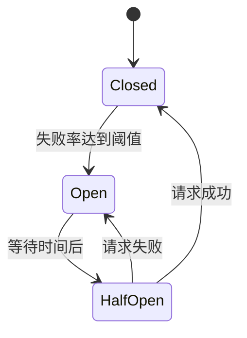

# Hystrix 熔断器

> [!WARNING] > **Hystrix 已进入维护模式**: Netflix 已宣布 Hystrix 进入维护模式，不再积极开发新功能。推荐使用 Resilience4j 或 Sentinel 作为替代方案。本文档仍然保留用于学习和维护现有系统。

> [!TIP] > **服务容错保护**: Hystrix 提供熔断、降级、限流、隔离等机制，保护微服务系统的稳定性。

## 1. Hystrix 简介

### 什么是 Hystrix？

**Hystrix** 是 Netflix 开源的容错管理工具，用于处理分布式系统的延迟和容错问题，防止级联故障。

### 核心功能

- **熔断** - 当失败率达到阈值时，快速失败
- **降级** - 提供备用响应
- **限流** - 控制并发请求数
- **隔离** - 线程池或信号量隔离
- **监控** - 实时监控和度量

### 解决的问题

```
服务A → 服务B → 服务C（故障）
        ↓
    大量请求堆积
        ↓
    服务B资源耗尽
        ↓
    服务A也受影响
        ↓
    级联故障
```

## 2. 快速开始

### 添加依赖

```xml
<dependency>
    <groupId>org.springframework.cloud</groupId>
    <artifactId>spring-cloud-starter-netflix-hystrix</artifactId>
</dependency>
```

### 启用 Hystrix

```java
@SpringBootApplication
@EnableCircuitBreaker
public class OrderServiceApplication {
    public static void main(String[] args) {
        SpringApplication.run(OrderServiceApplication.class, args);
    }
}
```

### 使用 @HystrixCommand

```java
@Service
public class UserService {

    @Autowired
    private RestTemplate restTemplate;

    @HystrixCommand(fallbackMethod = "getDefaultUser")
    public User getUser(Long id) {
        String url = "http://user-service/users/" + id;
        return restTemplate.getForObject(url, User.class);
    }

    // 降级方法
    public User getDefaultUser(Long id) {
        User user = new User();
        user.setId(id);
        user.setName("默认用户");
        return user;
    }
}
```

## 3. 熔断机制

### 熔断器状态



### 三种状态

- **关闭（Closed）** - 正常调用，统计失败率
- **打开（Open）** - 快速失败，返回降级结果
- **半开（Half-Open）** - 尝试恢复，发送少量请求测试

### 熔断配置

```java
@HystrixCommand(
    fallbackMethod = "getDefaultUser",
    commandProperties = {
        // 滑动窗口大小（请求数）
        @HystrixProperty(name = "circuitBreaker.requestVolumeThreshold", value = "20"),
        // 错误率阈值（百分比）
        @HystrixProperty(name = "circuitBreaker.errorThresholdPercentage", value = "50"),
        // 熔断后等待时间（毫秒）
        @HystrixProperty(name = "circuitBreaker.sleepWindowInMilliseconds", value = "5000"),
        // 启用熔断器
        @HystrixProperty(name = "circuitBreaker.enabled", value = "true")
    }
)
public User getUser(Long id) {
    // ...
}
```

## 4. 降级策略

### 基本降级

```java
@HystrixCommand(fallbackMethod = "getDefaultUser")
public User getUser(Long id) {
    return restTemplate.getForObject("http://user-service/users/" + id, User.class);
}

public User getDefaultUser(Long id) {
    return new User(id, "默认用户");
}
```

### 降级链

```java
@HystrixCommand(
    fallbackMethod = "fallback1",
    commandProperties = {
        @HystrixProperty(name = "execution.isolation.thread.timeoutInMilliseconds", value = "1000")
    }
)
public String getData() {
    // 主方法
    return "data";
}

@HystrixCommand(fallbackMethod = "fallback2")
public String fallback1() {
    // 第一级降级
    return "fallback1";
}

public String fallback2() {
    // 最终降级
    return "fallback2";
}
```

### 获取异常信息

```java
@HystrixCommand(fallbackMethod = "getDefaultUser")
public User getUser(Long id) {
    return restTemplate.getForObject("http://user-service/users/" + id, User.class);
}

public User getDefaultUser(Long id, Throwable throwable) {
    log.error("获取用户失败: {}", throwable.getMessage());
    return new User(id, "默认用户");
}
```

## 5. 隔离策略

### 线程池隔离（默认）

```java
@HystrixCommand(
    fallbackMethod = "getDefaultUser",
    threadPoolKey = "userServiceThreadPool",
    threadPoolProperties = {
        // 核心线程数
        @HystrixProperty(name = "coreSize", value = "10"),
        // 最大队列长度
        @HystrixProperty(name = "maxQueueSize", value = "100"),
        // 队列拒绝阈值
        @HystrixProperty(name = "queueSizeRejectionThreshold", value = "80"),
        // 线程存活时间（分钟）
        @HystrixProperty(name = "keepAliveTimeMinutes", value = "2")
    }
)
public User getUser(Long id) {
    return restTemplate.getForObject("http://user-service/users/" + id, User.class);
}
```

### 信号量隔离

```java
@HystrixCommand(
    fallbackMethod = "getDefaultUser",
    commandProperties = {
        // 使用信号量隔离
        @HystrixProperty(name = "execution.isolation.strategy", value = "SEMAPHORE"),
        // 信号量数量
        @HystrixProperty(name = "execution.isolation.semaphore.maxConcurrentRequests", value = "10")
    }
)
public User getUser(Long id) {
    return restTemplate.getForObject("http://user-service/users/" + id, User.class);
}
```

### 线程池 vs 信号量

| 特性     | 线程池隔离     | 信号量隔离 |
| -------- | -------------- | ---------- |
| 隔离性   | 强             | 弱         |
| 性能开销 | 高（线程切换） | 低         |
| 超时支持 | 支持           | 不支持     |
| 适用场景 | 网络请求       | 内存操作   |

## 6. 超时配置

```java
@HystrixCommand(
    fallbackMethod = "getDefaultUser",
    commandProperties = {
        // 启用超时
        @HystrixProperty(name = "execution.timeout.enabled", value = "true"),
        // 超时时间（毫秒）
        @HystrixProperty(name = "execution.isolation.thread.timeoutInMilliseconds", value = "3000")
    }
)
public User getUser(Long id) {
    return restTemplate.getForObject("http://user-service/users/" + id, User.class);
}
```

## 7. 请求合并

### 减少请求次数

```java
@HystrixCollapser(
    batchMethod = "getUsersBatch",
    collapserProperties = {
        // 合并时间窗口（毫秒）
        @HystrixProperty(name = "timerDelayInMilliseconds", value = "100"),
        // 最大合并请求数
        @HystrixProperty(name = "maxRequestsInBatch", value = "100")
    }
)
public Future<User> getUser(Long id) {
    return null;
}

@HystrixCommand
public List<User> getUsersBatch(List<Long> ids) {
    String url = "http://user-service/users?ids=" + String.join(",", ids.toString());
    return restTemplate.getForObject(url, List.class);
}
```

## 8. 请求缓存

```java
@Service
public class UserService {

    @CacheResult
    @HystrixCommand
    public User getUser(@CacheKey Long id) {
        return restTemplate.getForObject("http://user-service/users/" + id, User.class);
    }

    @CacheRemove(commandKey = "getUser")
    @HystrixCommand
    public void updateUser(@CacheKey Long id, User user) {
        restTemplate.put("http://user-service/users/" + id, user);
    }
}

// 使用
public void demo() {
    HystrixRequestContext context = HystrixRequestContext.initializeContext();
    try {
        User user1 = userService.getUser(1L); // 调用远程服务
        User user2 = userService.getUser(1L); // 使用缓存
    } finally {
        context.shutdown();
    }
}
```

## 9. 配置方式

### 全局配置

```yaml
hystrix:
  command:
    default:
      execution:
        isolation:
          strategy: THREAD
          thread:
            timeoutInMilliseconds: 3000
      circuitBreaker:
        enabled: true
        requestVolumeThreshold: 20
        errorThresholdPercentage: 50
        sleepWindowInMilliseconds: 5000

  threadpool:
    default:
      coreSize: 10
      maxQueueSize: 100
      queueSizeRejectionThreshold: 80
```

### 针对方法配置

```yaml
hystrix:
  command:
    getUser: # HystrixCommand 的 commandKey
      execution:
        isolation:
          thread:
            timeoutInMilliseconds: 5000
```

## 10. Dashboard 监控

### 添加依赖

```xml
<dependency>
    <groupId>org.springframework.cloud</groupId>
    <artifactId>spring-cloud-starter-netflix-hystrix-dashboard</artifactId>
</dependency>

<dependency>
    <groupId>org.springframework.boot</groupId>
    <artifactId>spring-boot-starter-actuator</artifactId>
</dependency>
```

### 启用 Dashboard

```java
@SpringBootApplication
@EnableHystrixDashboard
public class HystrixDashboardApplication {
    public static void main(String[] args) {
        SpringApplication.run(HystrixDashboardApplication.class, args);
    }
}
```

### 配置

```yaml
management:
  endpoints:
    web:
      exposure:
        include: hystrix.stream
```

访问：`http://localhost:8080/hystrix`

输入监控流地址：`http://localhost:8080/actuator/hystrix.stream`

## 11. Turbine 聚合监控

### 添加依赖

```xml
<dependency>
    <groupId>org.springframework.cloud</groupId>
    <artifactId>spring-cloud-starter-netflix-turbine</artifactId>
</dependency>
```

### 启用 Turbine

```java
@SpringBootApplication
@EnableTurbine
public class TurbineApplication {
    public static void main(String[] args) {
        SpringApplication.run(TurbineApplication.class, args);
    }
}
```

### 配置

```yaml
turbine:
  # 聚合的服务名
  app-config: user-service,order-service
  # 集群名称
  cluster-name-expression: "'default'"
  # 聚合同名指标
  combine-host-port: true

eureka:
  client:
    service-url:
      defaultZone: http://localhost:8761/eureka/
```

访问：`http://localhost:8080/turbine.stream`

## 12. 最佳实践

### 超时配置

```
Hystrix 超时 > Ribbon 超时 + 重试时间
```

```yaml
hystrix:
  command:
    default:
      execution:
        isolation:
          thread:
            timeoutInMilliseconds: 10000

ribbon:
  ConnectTimeout: 1000
  ReadTimeout: 3000
  MaxAutoRetries: 1
  MaxAutoRetriesNextServer: 1
```

### 降级策略

- 返回默认值
- 返回缓存数据
- 返回空数据或提示信息
- 降级逻辑要简单快速

### 隔离策略选择

- **网络请求** - 使用线程池隔离
- **内存操作** - 使用信号量隔离
- **高并发** - 适当增加线程池大小

### 监控告警

- 监控失败率
- 监控响应时间
- 监控熔断器状态
- 设置合理的告警阈值

## 13. 常见问题

### 降级方法不生效

**检查项**:

- 降级方法签名是否匹配
- 降级方法是否在同一个类中
- 是否抛出了 HystrixBadRequestException

### 超时时间设置

**注意**:

- Hystrix 超时要大于 Ribbon 超时
- 考虑重试次数
- 不同接口设置不同超时时间

### 线程池隔离导致 ThreadLocal 丢失

**解决**:

- 使用信号量隔离
- 或使用 HystrixRequestContext 传递上下文

## 14. 替代方案

### Resilience4j

```xml
<dependency>
    <groupId>io.github.resilience4j</groupId>
    <artifactId>resilience4j-spring-boot2</artifactId>
</dependency>
```

### Sentinel

```xml
<dependency>
    <groupId>com.alibaba.cloud</groupId>
    <artifactId>spring-cloud-starter-alibaba-sentinel</artifactId>
</dependency>
```

## 15. 总结

| 功能 | 说明                   |
| ---- | ---------------------- |
| 熔断 | 快速失败，防止级联故障 |
| 降级 | 提供备用响应           |
| 隔离 | 线程池或信号量隔离     |
| 限流 | 控制并发请求数         |
| 监控 | Dashboard 实时监控     |

---

**关键要点**：

- Hystrix 提供完整的容错解决方案
- 熔断器保护系统免受级联故障
- 合理配置超时和隔离策略
- 建议迁移到 Resilience4j 或 Sentinel

**下一步**：学习 [Sleuth 链路追踪](./sleuth.md)
