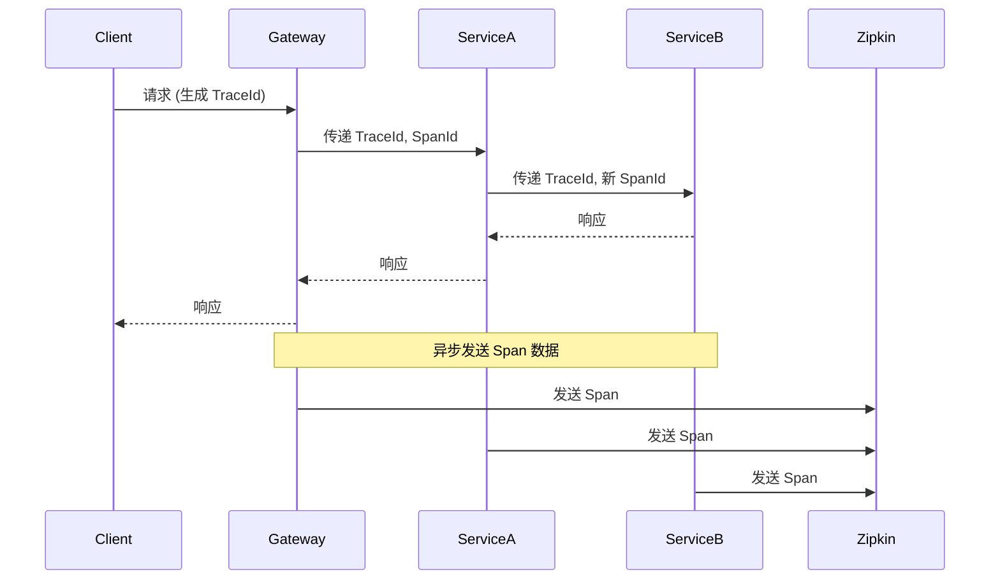

# Zipkin 链路追踪

> [!TIP]
> Zipkin 是一个分布式追踪系统，用于收集和可视化微服务架构中的调用链路。配合 Spring Cloud Sleuth 使用，可以实现完整的链路追踪和性能分析。

## 1. 简介

### 什么是 Zipkin？

Zipkin 是 Twitter 开源的分布式追踪系统，用于：

- **收集追踪数据**: 收集服务间调用的时序数据
- **可视化调用链**: 展示请求的完整调用路径
- **性能分析**: 分析服务延迟和瓶颈
- **故障定位**: 快速定位问题发生的位置

### 核心概念

| 概念           | 说明                              |
| -------------- | --------------------------------- |
| **Trace**      | 一次完整请求的追踪，包含多个 Span |
| **Span**       | 一个工作单元，如一次服务调用      |
| **TraceId**    | 追踪的唯一标识，贯穿整个调用链    |
| **SpanId**     | Span 的唯一标识                   |
| **ParentId**   | 父 Span 的 ID                     |
| **Annotation** | 事件标记 (cs, sr, ss, cr)         |

### 事件标记

- **cs (Client Send)**: 客户端发起请求
- **sr (Server Receive)**: 服务端收到请求
- **ss (Server Send)**: 服务端发送响应
- **cr (Client Receive)**: 客户端收到响应

## 2. 安装 Zipkin

### Docker 安装

```bash
# 快速启动（内存存储）
docker run -d --name zipkin \
  -p 9411:9411 \
  openzipkin/zipkin

# 使用 Elasticsearch 存储
docker run -d --name zipkin \
  -p 9411:9411 \
  -e STORAGE_TYPE=elasticsearch \
  -e ES_HOSTS=http://elasticsearch:9200 \
  openzipkin/zipkin
```

### Java 启动

```bash
# 下载并运行
curl -sSL https://zipkin.io/quickstart.sh | bash -s
java -jar zipkin.jar
```

### 访问 UI

打开浏览器访问: `http://localhost:9411`

## 3. Spring Cloud 集成

### Spring Boot 2.x (Sleuth)

**添加依赖**:

```xml
<dependency>
    <groupId>org.springframework.cloud</groupId>
    <artifactId>spring-cloud-starter-sleuth</artifactId>
</dependency>
<dependency>
    <groupId>org.springframework.cloud</groupId>
    <artifactId>spring-cloud-sleuth-zipkin</artifactId>
</dependency>
```

**配置**:

```yaml
spring:
  application:
    name: user-service
  sleuth:
    sampler:
      # 采样率 (0.0 - 1.0)
      probability: 1.0 # 开发环境 100%
  zipkin:
    base-url: http://localhost:9411
    sender:
      type: web # 或 rabbit, kafka
```

### Spring Boot 3.x (Micrometer Tracing)

> [!IMPORTANT]
> Spring Boot 3.x 使用 Micrometer Tracing 替代 Sleuth。

**添加依赖**:

```xml
<dependency>
    <groupId>io.micrometer</groupId>
    <artifactId>micrometer-tracing-bridge-brave</artifactId>
</dependency>
<dependency>
    <groupId>io.zipkin.reporter2</groupId>
    <artifactId>zipkin-reporter-brave</artifactId>
</dependency>
```

**配置**:

```yaml
management:
  tracing:
    sampling:
      probability: 1.0
  zipkin:
    tracing:
      endpoint: http://localhost:9411/api/v2/spans
```

## 4. 工作流程



## 5. 数据存储

### 内存存储（默认）

适合开发测试，重启后数据丢失。

### Elasticsearch 存储

```bash
docker run -d --name zipkin \
  -p 9411:9411 \
  -e STORAGE_TYPE=elasticsearch \
  -e ES_HOSTS=http://elasticsearch:9200 \
  -e ES_INDEX=zipkin \
  openzipkin/zipkin
```

### MySQL 存储

```bash
docker run -d --name zipkin \
  -p 9411:9411 \
  -e STORAGE_TYPE=mysql \
  -e MYSQL_HOST=localhost \
  -e MYSQL_USER=zipkin \
  -e MYSQL_PASS=zipkin \
  openzipkin/zipkin
```

**MySQL 初始化脚本**: [zipkin-storage/mysql-v1/src/main/resources/mysql.sql](https://github.com/openzipkin/zipkin/blob/master/zipkin-storage/mysql-v1/src/main/resources/mysql.sql)

## 6. 通过消息队列发送

### RabbitMQ

**Zipkin 配置**:

```bash
docker run -d --name zipkin \
  -p 9411:9411 \
  -e RABBIT_ADDRESSES=rabbitmq:5672 \
  -e RABBIT_USER=guest \
  -e RABBIT_PASSWORD=guest \
  openzipkin/zipkin
```

**服务配置**:

```yaml
spring:
  zipkin:
    sender:
      type: rabbit
  rabbitmq:
    host: localhost
    port: 5672
```

### Kafka

**Zipkin 配置**:

```bash
docker run -d --name zipkin \
  -p 9411:9411 \
  -e KAFKA_BOOTSTRAP_SERVERS=kafka:9092 \
  openzipkin/zipkin
```

**服务配置**:

```yaml
spring:
  zipkin:
    sender:
      type: kafka
  kafka:
    bootstrap-servers: localhost:9092
```

## 7. 采样策略

### 概率采样

```yaml
spring:
  sleuth:
    sampler:
      probability: 0.1 # 10% 采样
```

### 自定义采样器

```java
@Bean
public Sampler customSampler() {
    return new Sampler() {
        @Override
        public boolean isSampled(long traceId) {
            // 自定义采样逻辑
            // 例如：只采样特定用户的请求
            return shouldSample();
        }
    };
}
```

### 生产环境建议

```yaml
# 生产环境：低采样率，避免性能影响
spring:
  sleuth:
    sampler:
      probability: 0.01 # 1% 采样
```

## 8. 自定义 Span

### 创建自定义 Span

```java
@Service
public class OrderService {

    @Autowired
    private Tracer tracer;

    public void processOrder(Order order) {
        // 创建自定义 Span
        Span newSpan = tracer.nextSpan().name("processOrder");

        try (Tracer.SpanInScope ws = tracer.withSpan(newSpan.start())) {
            // 添加标签
            newSpan.tag("orderId", order.getId().toString());
            newSpan.tag("userId", order.getUserId().toString());

            // 业务逻辑
            doProcess(order);

        } catch (Exception e) {
            newSpan.error(e);
            throw e;
        } finally {
            newSpan.end();
        }
    }
}
```

### 使用注解

```java
@Service
public class PaymentService {

    @NewSpan("processPayment")
    public void processPayment(@SpanTag("paymentId") String paymentId) {
        // 自动创建 Span
        // paymentId 会作为 tag 添加到 Span
    }
}
```

## 9. 日志关联

Sleuth 自动在日志中添加追踪信息：

```
2024-01-15 10:30:45.123 INFO [user-service,abc123,def456] 12345 --- [nio-8080-exec-1] c.e.UserController : 处理用户请求
```

格式: `[应用名,TraceId,SpanId]`

### Logback 配置

```xml
<pattern>
    %d{yyyy-MM-dd HH:mm:ss.SSS} %5p [${spring.application.name},%X{traceId},%X{spanId}] %logger{36} - %msg%n
</pattern>
```

## 10. Zipkin UI 使用

### 查询追踪

1. 选择服务名
2. 设置时间范围
3. 可选：按 Span 名称、注解等筛选
4. 点击查询

### 分析调用链

- **调用链视图**: 查看请求的完整路径
- **时间线视图**: 分析各环节耗时
- **依赖关系**: 查看服务间依赖

### 性能分析

- 识别慢 Span
- 分析网络延迟
- 发现性能瓶颈

## 11. 最佳实践

### 生产环境配置

```yaml
spring:
  sleuth:
    sampler:
      probability: 0.01 # 1% 采样
    propagation-keys:
      - x-request-id
  zipkin:
    sender:
      type: kafka # 使用消息队列，降低延迟
```

### 自定义 Tag

为重要的业务数据添加 Tag，方便排查：

```java
@GetMapping("/orders/{id}")
public Order getOrder(@PathVariable Long id) {
    // 添加业务标签
    tracer.currentSpan().tag("order.id", id.toString());
    return orderService.getOrder(id);
}
```

### 敏感信息脱敏

```yaml
spring:
  sleuth:
    keys:
      http:
        headers:
          # 不记录敏感头
          - Authorization
          - Cookie
```

---

**相关文档**：

- [Sleuth 链路追踪](/docs/springcloud/sleuth)
- [快速参考](/docs/springcloud/quick-reference)
